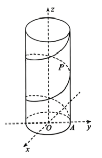

## 19.（17分）

某学校天文社团设计了一种航天伴飞卫星，大致原理为：如图建立直角坐标系，在原点$O$处沿$z$轴正方向发射一枚火箭，火箭升空速度为每秒$1$单位。在点$A(0,1,0)$处放置一枚伴飞卫星$P$（视作质点），当火箭升空时，伴飞卫星随火箭同时升空，且逆时针匀速绕火箭螺旋转动，运行一圈所需时间为$2\pi$秒，其沿$z$轴正方向的速度与火箭相同。

（1）求经过$5$秒，此时伴飞卫星$P$的坐标；

（2）在伴飞卫星$P$运行过程中，求直线$AP$与平面$xOy$所成角的取值范围；

（3）若在$y$轴上点$B(0,a,0)$处同时发射一枚监测卫星$Q$（视作质点），其速度大小和运行方向与火箭相同，若监测卫星$Q$和伴飞卫星$P$在运行过程中所成直线$OQ$与$AP$不垂直，求实数$a$的取值范围。
