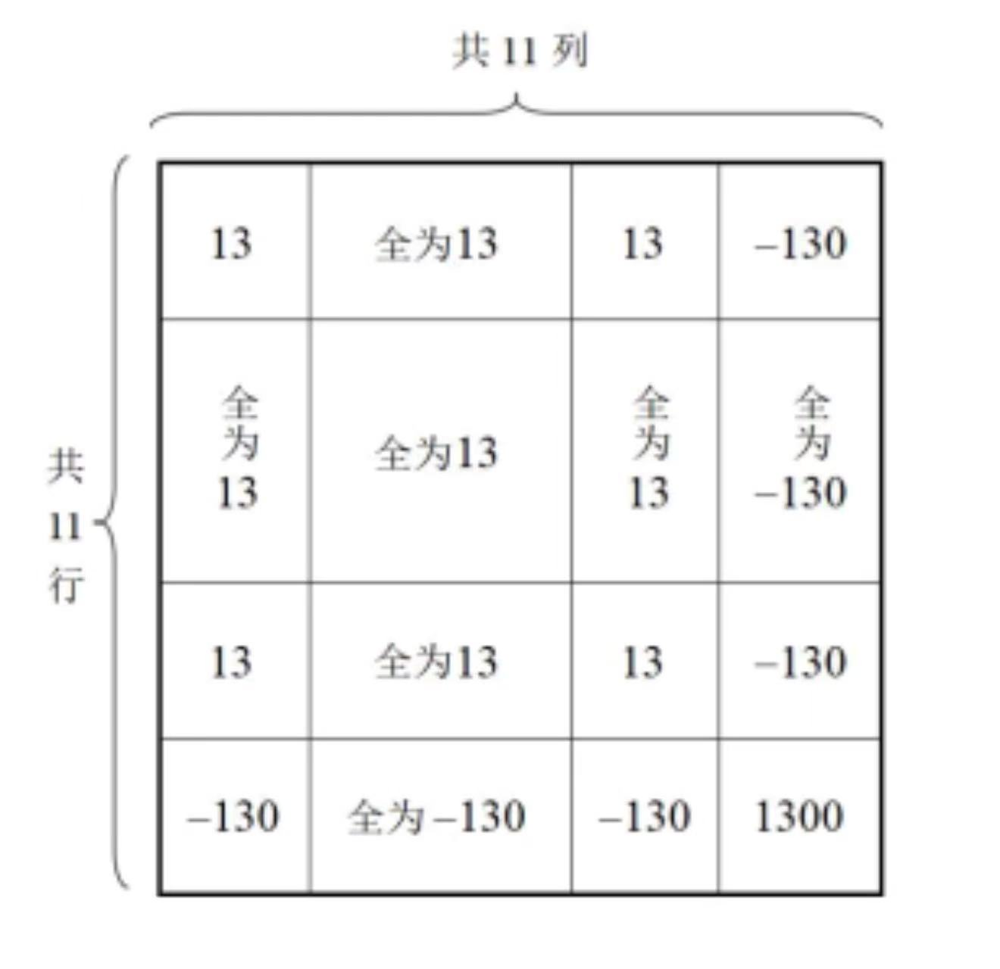

## 19.（17分）

在$n$行$n$列的数表中填$n^2$个数字$0(n\geqslant 2)$，每一格有且只有一个数字。定义$T(i,j)$变换$(i=1,2,\dots,n, j=1,2,\dots,n)$：将第$i$行与第$j$列的所有格子中的数字同时加上1或减去1，其余格子中的数字不变。

（1）$n=5$时，直接写出该数表先后经过$T(3,2)$，$T(5,2)$变换后数表中所有数字之和；

（2）该数表能否经过$k$次$T(i,j)$变换得到每格均为数字1的数表。若能，请求出$k$的最小值；若不能，请说明理由。

（3）$n=11$时，该数表能否经过$k$次$T(i,j)$变换得到如图数表（数表特征：前10行前10列全为13，前10行第11列为-130，第11行前10列为-130，第11行第11列为1300）。若能，请求出$k$的最小值；若不能，请说明理由。

