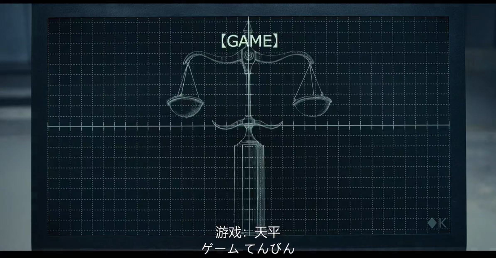

# 《弥留之国的爱丽丝》S2E06:方块K——天平

在《弥留之国的爱丽丝》第二季第六集中，方块K带来了一个“烧脑”游戏——天平，这背后蕴藏着许多有趣的博弈论知识。

本文中，我们不仅要从剧情出发，更要**建立完整的数学模型**，用数学表达式严格求解单次博弈和无限次重复博弈的纳什均衡。即使你从未接触过博弈论，跟着我的推导一步步走，也能看懂这场死亡游戏背后的数学逻辑。

## 1. 游戏规则回顾

先快速回顾一下规则：

- **玩家**：5人（4名参赛者+方块K九头龙慧一）
- **每回合行动**：5人同时选择一个0~100之间的整数
- **目标数**：
  $$ T = 0.8 \times \frac{1}{5} \sum_{i=1}^{5} x_i = 0.16 \sum_{i=1}^{5} x_i $$
- **胜负判定**：所选数字最接近$T$的玩家该回合胜出，其余玩家各扣1分
- **扣分机制**：满10分出局
- 隐藏机制：每有一名玩家出局会增添一条新规则。

## 2. 数学模型的建立

为了严谨分析，我们先定义这个博弈的数学结构。

### 2.1 基本设定

令玩家集合为 $I = \{1, 2, 3, 4, 5\}$。对于每个玩家 $i \in I$：

- **策略空间**：$S_i = \{0, 1, 2, ..., 100\}$，即0到100的整数
- **纯策略**：$s_i \in S_i$ 表示玩家 $i$ 选择的数字
- **策略组合**：$\mathbf{s} = (s_1, s_2, s_3, s_4, s_5)$

### 2.2 目标数与收益函数

给定策略组合 $\mathbf{s}$，**平均数的0.8倍**（即目标数）为：

$$ T(\mathbf{s}) = 0.8 \times \frac{1}{5} \sum_{j=1}^{5} s_j = 0.16 \sum_{j=1}^{5} s_j $$

对于玩家 $i$，定义**距离函数**：

$$ d_i(\mathbf{s}) = |s_i - T(\mathbf{s})| $$

玩家 $i$ 的**收益函数**（得分变化）为：

$$
u_i(\mathbf{s}) = 
\begin{cases} 
0 & \text{如果$d_i(\mathbf{s})=min\{d_1(\mathbf{s}), d_2(\mathbf{s}), d_3(\mathbf{s}), d_4(\mathbf{s}), d_5(\mathbf{s})\}$} \\
-1 & \text{如果存在某个 } j \neq i \text{ 使得 } d_j(\mathbf{s}) < d_i(\mathbf{s})
\end{cases}
$$

## 3. 单次博弈的纳什均衡求解

**纳什均衡**（Nash Equilibrium)的定义：一个策略组合 $\mathbf{s}^* = (s_1^*, s_2^*, ..., s_5^*)$ 是纳什均衡，如果对于每个玩家 $i$ 和每个可选策略 $s_i \in S_i$，都有：

$$ u_i(s_i^*, \mathbf{s}_{-i}^*) \geq u_i(s_i, \mathbf{s}_{-i}^*) $$

其中 $\mathbf{s}_{-i}^*$ 表示其他玩家的策略。即固定对手的行动时，玩家当前的行动是最优的。

### 3.1 第一步推理：剔除劣势策略

假设所有玩家都是理性的，且都知道彼此理性。

考虑玩家 $i$ 的决策。他需要预测其他玩家的选择。最直观的起点：如果其他玩家随机选择，那么他们的平均值可能在50附近。但理性玩家不会停留在这一层。

**引理1**：任何大于0的数字都有可能不是最优反应(best response)。

**证明**：
假设其他四人的平均数为 $\bar{s}_{-i} = \frac{1}{4}\sum_{j \neq i} s_j$。那么五人总平均为：

$$ \bar{s} = \frac{s_i + 4\bar{s}_{-i}}{5} $$

目标数为：

$$ T = 0.8\bar{s} = 0.8 \times \frac{s_i + 4\bar{s}_{-i}}{5} = 0.16 s_i + 0.64 \bar{s}_{-i} $$

玩家 $i$ 希望自己的选择 $s_i$ 尽可能接近 $T$。但 $T$ 本身依赖于 $s_i$,这是一个**不动点问题**。

### 3.2 一阶最优条件

假设玩家 $i$ 想要精确命中目标数，即令：

$$ s_i = T = 0.16 s_i + 0.64 \bar{s}_{-i} $$

解这个方程：

$$ s_i - 0.16 s_i = 0.64 \bar{s}_{-i} $$
$$ 0.84 s_i = 0.64 \bar{s}_{-i} $$
$$ s_i = \frac{0.64}{0.84} \bar{s}_{-i} = \frac{64}{84} \bar{s}_{-i} = \frac{16}{21} \bar{s}_{-i} \approx 0.762 \bar{s}_{-i} $$

所以，**如果玩家 $i$ 想要精确命中目标数，他应该选择约等于其他四人平均数0.762倍的数字**。

### 3.3 迭代剔除劣势策略（Iterated Elimination of Dominated Strategies）

这是求解这个博弈纳什均衡的核心方法。

**第1轮**：
- 最大可能的目标数：如果所有人都选100，则平均数=100，目标数=80
- 因此，任何大于80的数字都不可能是最优的，因为即使其他人全选100，你选81也会离80更远
- 所以，策略空间缩减为 $S_i^{(1)} = [0, 80]$

**第2轮**：
- 现在所有人都知道别人会在0~80之间选
- 最大可能的目标数：如果所有人选80，平均数=80，目标数=64
- 因此，任何大于64的数字都不可能是最优的
- 策略空间缩减为 $S_i^{(2)} = [0, 64]$

**第3轮**：
- 最大可能目标数：64×0.8 = 51.2 → 策略空间 $[0, 51]$

**第4轮**：
- 51×0.8 = 40.8 → $[0, 41]$

**第5轮**：
- 41×0.8 = 32.8 → $[0, 33]$

**第6轮**：
- 33×0.8 = 26.4 → $[0, 26]$

**第7轮**：
- 26×0.8 = 20.8 → $[0, 21]$

**第8轮**：
- 21×0.8 = 16.8 → $[0, 17]$

**第9轮**：
- 17×0.8 = 13.6 → $[0, 14]$

**第10轮**：
- 14×0.8 = 11.2 → $[0, 11]$

继续这个过程：

$$40 \to 32 \to 26 \to 21 \to 17 \to 14 \to 11 \to 9 \to 7 \to 6 \to 5 \to 4 \to 3 \to 2 \to 1 \to 0$$

当所有人都选0时：

- 平均数 = 0
- 目标数 T = 0.8 × 0 = 0
- 每个玩家的距离 = |0 - 0| = 0
- 所有人都平局

### 3.4 数学归纳证明

我们可以用数学语言严格证明：唯一的纳什均衡是所有人选0。

**定理1**：在5人0~100整数选数，目标数为平均数的0.8倍的博弈中，唯一的纯策略纳什均衡是 $(0,0,0,0,0)$。

**证明**：
设均衡策略为 $(s_1^*, s_2^*, ..., s_5^*)$。令 $A = \frac{1}{5}\sum_{i=1}^5 s_i^*$ 为均衡时的平均数，则目标数 $T^* = 0.8A$。

在均衡中，对于每个玩家 $i$，$s_i^*$ 必须是最优反应。特别地，如果所有玩家都选同一个数 $x$，那么平均数 $A = x$，目标数 $T = 0.8x$。玩家选 $x$ 的距离是 $|x - 0.8x| = 0.2x$。

如果 $x > 0$，考虑玩家 $i$ 单方面偏离到0：
- 新平均数：$A' = \frac{0 + 4x}{5} = 0.8x$
- 新目标数：$T' = 0.8 \times 0.8x = 0.64x$
- 玩家 $i$ 选0的距离：$|0 - 0.64x| = 0.64x$
- 其他玩家选x的距离：$|x - 0.64x| = 0.36x$

因为 $0.36x < 0.64x$，其他玩家更接近目标数，所以玩家 $i$ 偏离后会输。因此选 $x>0$ 不是最优反应。

现在检查所有玩家选0的情况：
- 平均数 = 0，目标数 = 0
- 任何单方面偏离到 $s_i > 0$：
  - 新平均数：$A' = \frac{s_i + 0}{5} = 0.2s_i$
  - 新目标数：$T' = 0.8 \times 0.2s_i = 0.16s_i$
  - 偏离者距离：$|s_i - 0.16s_i| = 0.84s_i$
  - 其他玩家（选0）距离：$|0 - 0.16s_i| = 0.16s_i$

因为 $0.16s_i < 0.84s_i$，其他玩家更接近目标数，所以偏离会输。因此没有人愿意单方面偏离。

综上，$(0,0,0,0,0)$ 是纳什均衡，且是唯一的。 

**证毕**。

## 4. 层次思维（Level-k Reasoning）与有限理性

虽然理论均衡是0，但在现实中，很少有人第一轮就选0。为什么？因为**共同知识**（common knowledge）的假设不成立——我们不知道别人是否理性，也不知道别人是否知道我们理性。

这就引出了**层次思维模型**：

- **Level 0**：随机选择，或凭直觉（剧中大门第一轮选40）
- **Level 1**：假设别人都是Level 0，那么平均≈50，目标≈40，所以选40
- **Level 2**：假设别人都是Level 1，那么大家会选40，目标=32，所以选32（剧中苣屋第一轮）
- **Level 3**：假设别人都是Level 2，那么大家会选32，目标≈26，所以选26或29（剧中九头龙第一轮）

数学上，Level-k的策略可以表示为：

$$ s^{(k)} = 0.8^k \times 50 $$

当 $k \to \infty$ 时，$s^{(k)} \to 0$。这正是迭代剔除劣势策略的数学表达。

当然，这些都是局限于单次博弈的分析，事实上正如剧中苣屋会做的，在相同博弈重复有限次的动态博弈（dynamic game）过程中，他会不断观察对手的行为和策略进而调整自己的策略。这本质还是一个心理战。

## 5. 有限次重复博弈：合作能否出现？

游戏中玩家有10条命，因此游戏最多进行若干轮（但可能提前结束）。这是一个**有限次重复博弈**。我们需要分析，在知道游戏会在有限轮后结束的情况下，均衡会发生什么变化。

### 5.1 逆向归纳与连锁店悖论

对于有限次重复博弈，常用的解法是**逆向归纳**（backward induction）。假设游戏一共进行 $N$ 轮（$N$ 已知且有限），且不出现新的规则左右博弈的进行。从最后一轮开始分析：

- **最后一轮**：没有任何未来惩罚或合作的激励，每个人都会选择单次博弈的纳什均衡——**选0**。因为无论之前发生过什么，最后一轮的最佳反应就是选0。
- **倒数第二轮**：既然知道最后一轮大家都会选0，那么倒数第二轮的选择不会影响最后一轮的结果。因此，倒数第二轮也等同于单次博弈，大家仍然会选0。
- 以此类推，**每一轮都会选0**。

这个逻辑导致了一个令人沮丧的结论：**在有限次重复博弈中，如果所有人都理性且知道彼此理性，那么从第一轮开始就会选0，合作永远不会出现**。

这就是博弈论中著名的**连锁店悖论**的变体：理论上，只要游戏次数有限且共同知识成立，合作无法在最后一期之前维持。

### 5.2 现实中的合作：有限理性的作用

然而，现实中我们往往观察到了合作。为什么？因为**共同知识不成立**，或者玩家并非完全理性。在剧中，苣屋和大門的结盟就是一种**试图建立合作**的行为。他们通过交替选择极端值（如100和0）来扰乱对手的预测，实际上是在进行一种**信号传递**，试图告诉对方“我们可以合作”。

从博弈论角度看，有限次重复博弈中合作可能通过以下机制出现：

1. **不完全信息**：如果玩家不确定对手的类型（例如，对手可能是“合作型”或“理性型”），那么合作可能作为信号出现。这属于**克瑞普斯-威尔逊声誉模型**的范畴。
2. **有限理性**：玩家可能不会进行无限层次的逆向归纳，而是采用简单的启发式策略（如“以牙还牙”）。
3. **不确定结束时间**：如果玩家不知道游戏何时结束（或者有概率继续），则博弈等价于无限次重复。

---

事实上，如果其他三名玩家保持选0的均衡决策，而另外两位玩家达成合作，他们交替地进行选择100和23,那么他们能在10轮后一起淘汰其他3名玩家。所以苣屋选100的做法扰乱了正常收敛到全0纳什均衡的局面，实在机智。

## 6. Stage 2: 两名玩家淘汰后
### 6.1 规则更新
增添两条新规则：
- 如果有2名或3名玩家选择一样的数字，则选择无效，直接视为这轮失败；
- 如果有一名玩家选择的数字正好是目标数$T$，则其余玩家本轮-2分。

### 6.2 模型重建
玩家集合 $I = \{1,2,3\}$，策略空间 $S_i = \{0,1,\dots,100\}$。策略组合 $\mathbf{s} = (s_1,s_2,s_3)$。

目标数：
$$ T(\mathbf{s}) = 0.8 \times \frac{s_1+s_2+s_3}{3} = \frac{0.8}{3}(s_1+s_2+s_3) $$

收益函数 $u_i(\mathbf{s})$ 需分情况定义：

- **情况A**：存在至少两人数字相同。
  - 若三人全相同：$u_i = -1$ 对所有 $i$。
  - 若两人相同（设 $s_i = s_j \neq s_k$）：则 $u_i = u_j = -1$，$u_k = 0$。

- **情况B**：三人数字互异。
  - 若存在某 $i$ 使得 $|s_i - T| \leq 0.5$（精确命中），则 $u_i = 0$，其余两人 $u = -2$。
  - 否则，比较距离 $d_i = |s_i - T|$，最接近者得0，其余得-1（若有并列最接近，则并列者均得0，其余得-1，但为简化可假设概率0）。

---

### 6.3 单次博弈的纳什均衡

由于策略空间离散且规则复杂，纯策略纳什均衡存在多个，以下分类列举。

#### 6.3.1 类型I：三个连续整数
取三个连续整数 $(k, k+1, k+2)$，例如 $(0,1,2)$。计算目标数：
$$ T = 0.8 \times \frac{3k+3}{3} = 0.8(k+1) $$
最接近的是 $k+1$（距离0），因此中间数胜出，得0，两边各得-1。

**验证均衡性**：
- 对于选 $k$ 的玩家，他面对的是 $(k+1, k+2)$，这是一对相邻整数。根据相邻整数性质，任何其他整数 $c$ 在此对下均无法成为最接近（因为最佳反应 $c^* = \frac{4}{11}(2k+3)$ 落在 $k+1$ 与 $k+2$ 之间，且其他整数均输）。因此他改选任何数都得-1，无改善。
- 同理，选 $k+2$ 的玩家面对 $(k, k+1)$ 相邻，也无改善。
- 选 $k+1$ 的玩家面对 $(k, k+2)$，相差2，而 $k+1$ 正是此对的最佳反应（因为 $c^* = \frac{4}{11}(2k+2) = \frac{8}{11}(k+1) \approx 0.727(k+1)$，整数 $k+1$ 唯一得0）。他若改选其他数，均会输。因此无改善。

故 $(k, k+1, k+2)$ 构成一个纯策略纳什均衡，收益为 $(-1, 0, -1)$。

#### 6.3.2 类型II：两个相同加一个相邻整数
取 $(k, k, k+1)$ 或 $(k, k+1, k+1)$。例如 $(0,0,1)$：
- 两个0相同，各得-1；1唯一，得0。

**验证**：
- 选0的玩家面对 $(0,1)$，这是一对相邻整数。他改选任何 $c \neq 0,1$ 都会进入新组合 $(c,0,1)$，由于0和1相邻，任何 $c$ 均输（得-1），故无改善。改选1则导致重复，也得-1。
- 选1的玩家面对 $(0,0)$，他改选任何 $c \neq 0$ 都会进入 $(0,0,c)$，此时两个0重复得-1，c得0，因此他改选任何 $c \neq 0$ 均得0，与当前收益相同，无严格改善。改选0则三人全0，得-1，更差。

故 $(0,0,1)$ 也是纳什均衡，收益为 $(-1,-1,0)$。类似地，$(k, k+1, k+1)$ 对称成立。

## 7. Stage 3: 最终单挑

虽然剧里苣屋放弃了最后一层的博弈，选择固定100，让九头龙来决定他的生死，但最后一层的单挑博弈模型非常精彩。

### 7.1 为什么苣屋会说只有“0,1,100”三种选择？

当场上只剩两名玩家时，规则再次更新，增加了一条特殊规则：

- **如果一名玩家选0，另一名玩家选100，则选100的玩家直接获胜**（而非按原规则计算）。

在原有规则下，两人游戏的目标数为 $T = 0.4(x+y)$，比较各自与T的距离。但新规则改变了(0,100)这一特殊组合的结果。现在，我们需要分析这个两人博弈的纳什均衡。

首先，考虑所有可能的数字。通过理性推理，我们可以逐步排除大多数数字。例如，任何大于0的数字在面对0时都会输（因为原规则下，0总是更接近目标），而面对100时可能赢或输。但经过类似之前的迭代剔除，会发现只有三个数字——0、1、100——构成了一个循环克制的关系：

- **0 战胜 1**：在(0,1)组合中，$T=0.4$，0距离0.4，1距离0.6，0胜。
- **1 战胜 100**：在(1,100)组合中，$T=40.4$，1距离39.4，100距离59.6，1胜。
- **100 战胜 0**：在(0,100)组合中，新规则直接判100胜。

而其他任何非0,100的数字其实效果和选1是一样的，所以可以把1~99合并到同一个策略选项中，统称为“1”。

### 7.2 单次博弈的纯策略和混合策略纳什均衡

我们构造一个3×3的博弈矩阵，其中玩家的策略集为 $$\{0,1,100\}$$。定义收益：赢=0，输=-1。则收益矩阵（行玩家1，列玩家2）为：

| 玩家1 \ 玩家2 | 0    | 1    | 100  |
|----------------|------|------|------|
| 0              | -1,-1  | 0,-1 | -1,0 |
| 1              | -1,0 | -1,-1  | 0,-1 |
| 100            | 0,-1 | -1,0 | -1,-1   |

这是一个经典的“石头-剪刀-布”型循环博弈。

#### 纯策略纳什均衡
是否存在纯策略纳什均衡？考虑任一组合，例如(0,0)。玩家1若改选100，则得到(100,0)，根据新规则100胜，玩家1收益从0变为1，所以有改善。因此(0,0)不是均衡。类似地，(1,1)中，玩家1改选0可得1；(100,100)中，玩家1改选1可得1。任何对称组合都不是均衡。

考虑非对称组合，如(0,1)：玩家1得1，玩家2得-1。玩家2可以改选100得到(0,100)，此时玩家2得1，改善。或者改选0得到平局，也得0 > -1。因此(0,1)不是均衡。其他非对称组合同理。因此，**不存在纯策略纳什均衡**。

#### 混合策略纳什均衡
设玩家1以概率 $p_0, p_1, p_{100}$ 分别选择0、1、100，且 $p_0+p_1+p_{100}=1$。由对称性，混合策略均衡应该是每个策略等概率，即 $p_0=p_1=p_{100}=1/3$。验证：若玩家2选择0，则玩家1的期望收益为：
$$ \frac{1}{3} \times 0 + \frac{1}{3} \times (-1) + \frac{1}{3} \times 1 = 0 $$
同理，若玩家2选择1或100，玩家1的期望收益也是0。因此，任何纯策略对玩家1无差异，且没有动机偏离。所以混合策略 $(1/3,1/3,1/3)$ 构成一个纳什均衡。(准确的表达是分别以1/3的概率选择0,1,100)

因此，**唯一的纳什均衡是混合策略均衡，每个玩家以1/3的概率随机选择0、1、100**。

至此，我们完成了从五人局到三人局再到最终单挑的完整博弈论分析。数学给出了均衡的形态，而人性让游戏永远充满悬念。

## 8. 结论：数学告诉我们什么？

通过严格的数学推导，我们得出：

1. **单次博弈的纳什均衡**：所有人选0。这是通过迭代剔除劣势策略得到的唯一结果。

2. **均衡的数学表达**：
   $$ s_i^* = 0, \quad \forall i \in \{1,2,3,4,5\} $$

3. **层次思维的收敛性**：
   $$ \lim_{k \to \infty} s^{(k)} = \lim_{k \to \infty} (50 \times 0.8^k) = 0 $$

4. **重复博弈的可能性**：理论上可以通过触发策略维持合作，但在有限回合和信息不完全的现实条件下难以实现。

## 结语
正如凯恩斯所说：“选美比赛，你要选的不是你认为最美的那个，而是别人认为最美的那个。”在金融市场、拍卖、价格战等无数现实场景中，我们都在玩着同样的游戏。

