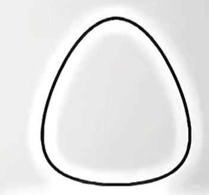

## 19.（17分）

已知曲线 $\Gamma$：$x^2 + (\ln y)^2 = \left(\frac{\mathrm{e}}{\mathrm{e}+1}\right)^2$，直线 $l$ 交 $\Gamma$ 于 $A$，$B$ 两点。其形状如下图：

（1）求 $\Gamma$ 最高点和最低点的坐标；

（2）记 $\Gamma$ 的最高点为 $P$。

（i）若 $l$ 的斜率为 $0$，求 $\triangle PAB$ 面积的最大值；

（ii）求 $\triangle PAB$ 面积的最大值。

