这一章学习temporal-difference(TD) 方法，类似于Monte Carlo(MC) learning, TD learning也是一个model-free的算法。

### 算法描述
给定一个policy $\pi$，我们的目标是估计每一个state对应的state value $v_\pi(s)$ . 假设我们遵循$\pi$得到了一些样本$(s_0,r_1,s_1,\cdots,s_t,r_{t+1},s_{t+1},\cdots)$ ，下述的TD算法能够用这些样本估计state values。
$$\begin{align}

v_{t+1}(s_t) &= v_t(s_t) - \alpha_t(s_t)[v_t(s_t) - \left(r_{t+1} + \gamma v_t(s_{t+1})\right)]\\
v_{t+1}(s) &= v_t(s),\quad \forall s \neq s_t
\end{align}$$
其中$t = 0,1,2,\cdots$，$v_t(s_t)$就是在时间步t对$v_\pi(s_t)$的估计，$\alpha_t (s_t)$是学习率。
上式中，time t时只更新了访问状态$s_t$的state value。

TD algorithm可以使用Robbins-Monro 算法求解Bellman方程得到。
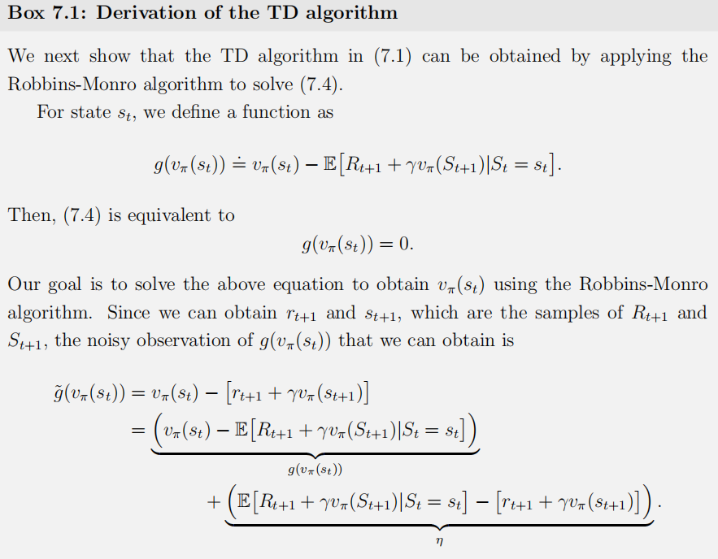
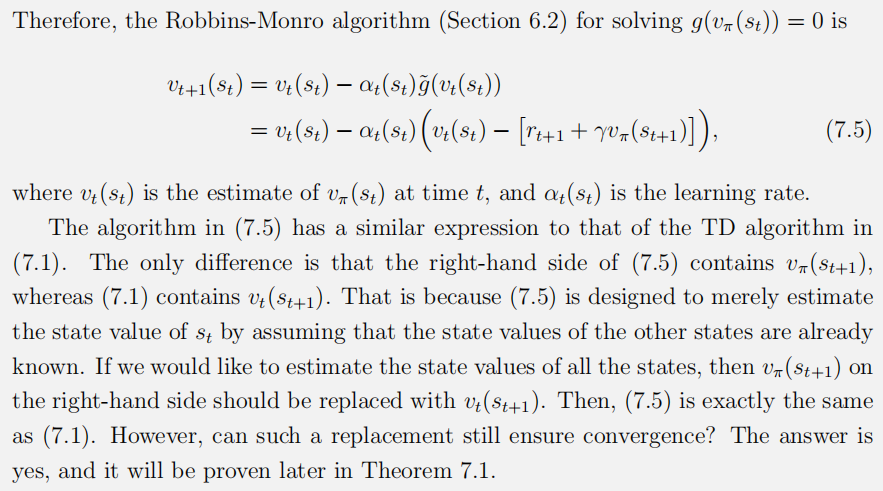

### 性质分析
再视TD算法的表达式
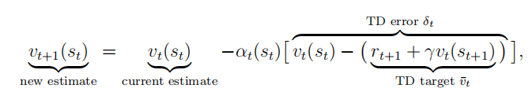
其中TD target定义为
$$
\bar{v}_t \overset{.}{=} r_{t+1} + \gamma v_t(s_{t+1})
$$
TD error定义为：
$$
\delta_t \overset{.}{=} v(s_t) - \bar{v}_t = v_t(s_t) - \left( r_{t+1} + \gamma v_t(s_{t+1}) \right)
$$
$\bar{v_t}$被称为TD target因为它是我们的target value, 
$$
\begin{align}
v_{t+1}(s_t) - \bar{v}_t &= \left[ v_t(s_t) - \bar{v}_t \right] - \alpha_t(s_t) \left[ v_t(s_t) - \bar{v}_t \right] \\
&= \left[ 1 - \alpha_t(s_t) \right] \left[ v_t(s_t) - \bar{v}_t \right].
\end{align}
$$
Thus, 
$$
\begin{align}
|v_{t+1}(s_t) - \bar{v}_t| &= |1 - \alpha_t(s_t)| |v_t(s_t) - \bar{v}_t|.
\end{align}
$$
由于学习率是一个小的正数，我们有：
$$
\begin{align}
|v_{t+1}(s_t) - \bar{v}_t| &< |v_t(s_t) - \bar{v}_t|.
\end{align}
$$
这个不等式表明新的value $v_{t+1}(s_t)$比$v_t(s_t)$更接近$\bar{v_t}$。

$$
\begin{align}
\mathbb{E}[\delta_t | S_t = s_t] &= \mathbb{E} \left[ v_\pi(S_t) - \left( R_{t+1} + \gamma v_\pi(S_{t+1}) \right) | S_t = s_t \right] \\
&= v_\pi(s_t) - \mathbb{E} \left[ R_{t+1} + \gamma v_\pi(S_{t+1}) | S_t = s_t \right] \\
&= 0. \quad \text{(due to }v_\pi(s)=\mathbb{E} \left[ R_{t+1} + \gamma v_\pi(S_{t+1}) | S_t = s\right] \text{)}
\end{align}
$$
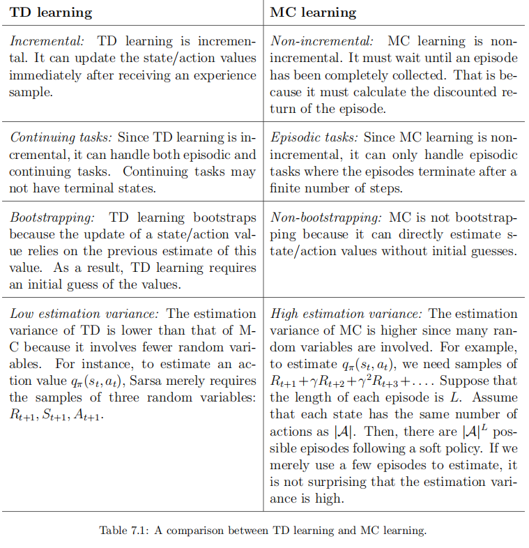

### TD learning of action values: Sarsa
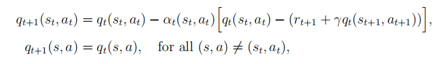
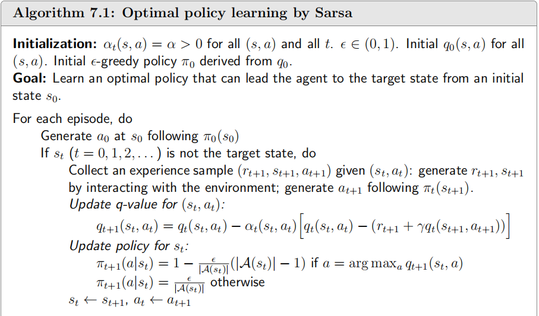

#### n-steps Sarsa
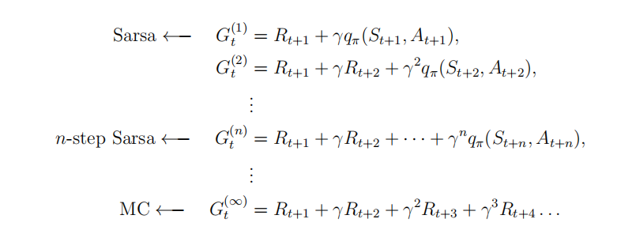

### TD learning of optimal action values: Q-learning
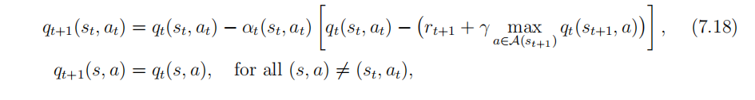
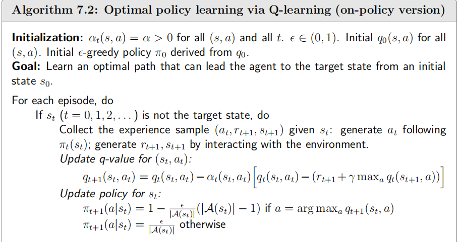
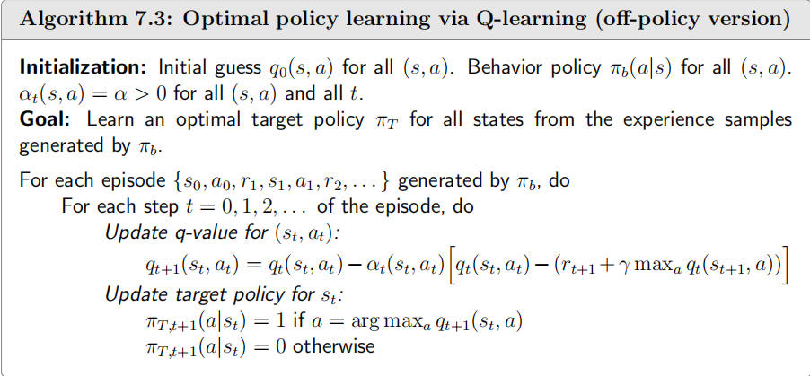

### A unifed viewpoint
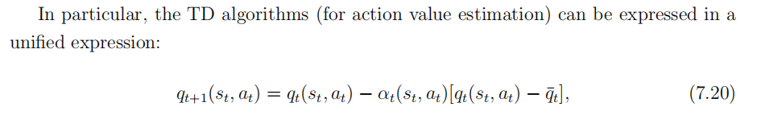
