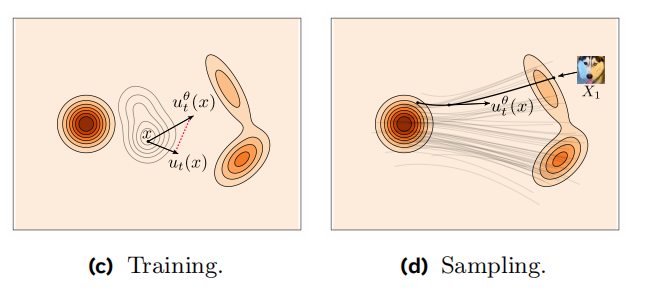
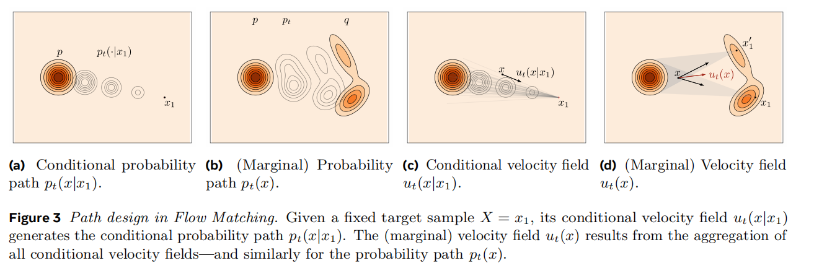

本文参考讲义：https://arxiv.org/pdf/2412.06264
如果发现错误会标注出勘误

Flow matching(FM) 是一种生成模型，想法是通过某种flow，从一个源分布$p(x)$映射到另一个目标分布$q(x)$，通过学习映射的“速度场”，我们就能用flow的方式把源分布的样本$X_0 \sim p$映射到$X_1 := \psi_1(X_0)\sim q$，使其满足我们想要的分布。

### Quick Tour and Key concepts
给定训练d维数据集采样自目标分布$q$，我们构造一个概率路径(probability path) $(p_t)_{(0\leq t\leq 1)}$ ，从一个已知的源分布（比如高斯）$p_0 =p$，经过连续时间过程达到目标分布$p_1 = q$，路径上每一个$p_t$是$\mathbb{R}^d$的分布。 

当我们训练得到“速度场”之后，就能通过解ODE的方式从$X_0\sim p$算到$X_1 \sim q$。

注：（为什么是解ODE呢，因为flow matching的想法最早来自于Neural ODE solver的那套理论，我们这里的速度场说的就是ODE $\frac{dp}{dt} = v_\theta(x,t)$ 的右侧，现在我们用网络来近似这个场随着空间和时间的分布。）

更严谨形式化地刻画：我们说的time-dependent vector field（速度场）就是一个映射：$u: [0,1] \times \mathbb{R}^d \to \mathbb{R}^d$,其决定了一个time-dependent flow $\psi:[0,1]\times\mathbb{R}^d \to \mathbb{R}^d$, defined as:

$$\frac{d}{dt}\psi_t(x) = u_t(\psi_t(x))$$

Or equivalently, 

$$\frac{d}{dt}\psi(t,x) = u(t,\psi(t,x))$$

如此生成了我们所需要的probability path $p_t$：

$$X_t := \psi_t(X_0)\sim p_t \quad for\quad X_0\sim p_0$$

由于速度场最后会被网络参数化，我们将其标记为：$u_t^{\theta}$

更具体一些：
第一步——构建概率路径
我们把源分布取为高斯分布，$p := p_0 = \mathcal{N}(x|0,I)$，概率路径选为条件在目标分布的一个训练样本$x_1$上：

$p_{t|1}(x|x_1)=\mathbb{N}(x|tx_1,(1-t^2)I$, so that:

$$p_t(x)=\int p_{t|1}(x|x_1)q(x_1)dx_1,$$

如此定义的路径也成条件最优传输/线性路径，由此我们可以定义每一时刻的R.V. 

$$X_t = t X_1+(1-t)X_0 \sim p_t $$

第二步——定义flow matching loss——目标速度场$u_t$和当前模型速度场$u_t^\theta$之间的loss

$$\mathcal{L}_{FM}(\theta)=\mathbb{E}_{t,X_t}||u_t^\theta(X_t)-u_t(X_t)||^2$$

其中$t\sim \mathcal{U}[0,1], X_t \sim p_t$

虽然上式很自然地定义了两个速度场之间的残差，但这样定义的loss我们是无法使用的，因为我们并不知道目标速度场$u_t(\cdot)$的取值。

好消息是，当我们把loss 条件在某个训练样本$x_1$上时，会有巨大的简化：
Let: $X_{t|1}=t X_1+(1-t)X_0 \sim p_{t|1}(\cdot|x_1)=\mathbb{N}(\cdot|tx_1,(1-t^2)I$ 
solve:

$$\frac{d}{dt}X_{t|1}=u_t(X_{t|1}|x_1)$$

得到条件速度场：

$$u_t(x|x_1) = \frac{x_1-x}{1-t}$$

相应的conditional Flow Matching loss:

$$\mathcal{L}_{CFM}(\theta)=\mathbb{E}_{t,X_t,X_1}||u_t^\theta(X_t)-u_t(X_t|X_1)||^2$$

且容易发现无条件和有条件的loss对参数的梯度是一样的：

$$\nabla_\theta\mathcal{L}_{FM}(\theta) = \nabla_\theta\mathcal{L}_{CFM}(\theta)$$

代入$u_t(x|x_1)$的形式后，我们得到了最简单的一种implementation

$$\mathcal{L}_{CFM}^{OT,Gauss}(\theta)=\mathbb{E}_{t,X_0,X_1}||u_t^\theta(X_t)-(X_1-X_0)||^2$$

