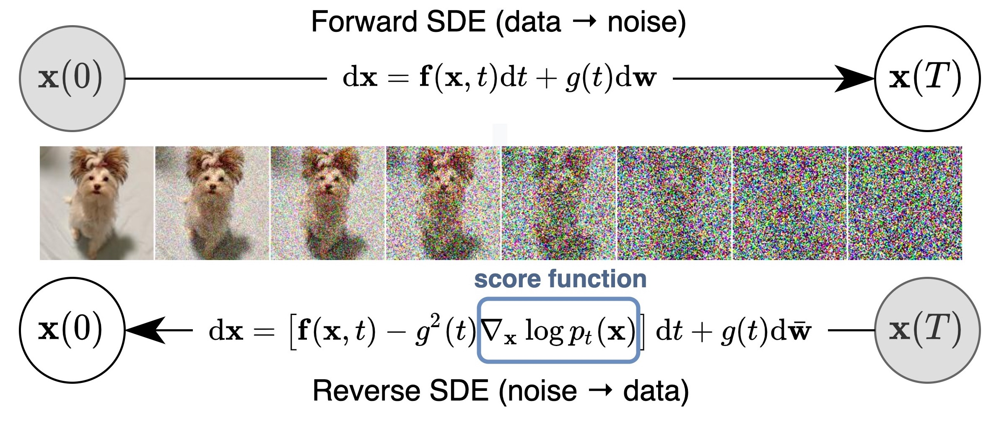

# 生成模型学习——Following Yang Song's blog
本文参考Yang Song的博客https://yang-song.net/blog/2021/score/

其中会夹杂我的一些个人思考。请原谅我的语言表达习惯，我并不喜欢把一些专业的术语翻译成中文，我认为这会导致混淆和误解，因此我会在表述中保留其原样。
### 引言
现有的生成模型可以根据其表征概率分布的方式大致分为两类：
- likelihood-based models 通过极大似然方法来直接学习密度函数，比如Normalizing flow, VAE, EBMs, autoregressive
- implicit generative models 概率分布由其模型中的隐空间采样过程表征，比如GANs
而两者都存在明显的limitations

Yang Song's work提出的另一种表征概率分布的想法是模型化对数概率密度函数的梯度——也称score function， 这样的score-based models可以通过score matching将生成转化为某个trivial的回归问题。
### score function
给定一个数据集$\{x_1,x_2,\cdots,x_N\}$，每一个数据都独立地采样与某个真实分布$p(x)$。
对这个数据集，生成模型的目标就是去用模型尽可能地逼近这个真实分布$p_{\theta}(x)\approx p(x)$，使得我们能通过$p_{\theta}(x)$的采样生成新的数据点。

对此第一步我们需要找到某种表征概率分布的方式。自然地，我们可以直接模拟其概率密度函数(p.d.f.)或者分布函数(p.m.f.)。对某个未归一化的概率模型或者说energy-based 模型$f_\theta(x)$，其密度函数可以定义为：

$$p_\theta(x)=\frac{e^{-f_\theta(x)}}{Z_\theta}$$

其中，$Z_\theta$是归一化常数。

我们可以通过极大似然估计来训练$p_\theta(x)$, by:

$$max_{\theta}\sum_{i=1}^N log (p_\theta(x_i))$$

但这并不可取，因为很难估计归一化常数$Z_\theta$

但模拟score function就可以规避这一问题。对分布$p(x)$, score function定义为：

$$\nabla_xlogp(x)$$

用于模拟score function的模型就称score-based model——$s_\theta(x) \approx \nabla_xlogp(x)$。

for example, 上面定义的概率模型的score function即：

$$s_\theta(x) = \nabla_xlogp_\theta(x)=-\nabla_xf_\theta(x)$$

我们可以通过最小化模型和数据分布的Fisher divergence来训练：

$$E_{p(x)}||\nabla_x log p(x)-s_\theta(x)||_2^2$$

显然，式中直接计算真实数据分布$p(x)$的score function是不可能的，因此会采用score matching的方法来规避这个问题。

通过分部积分，原目标函数可改写为仅依赖于数据样本的形式：

$$J(\theta)=E_{p(x)}[Tr(\nabla_x s_\theta(x))+\frac{1}{2}||s_\theta(x)||^2]+Const$$

### 郎之万动力学
这段描述的是当我们训练好一个score-based model$s_\theta(x)$之后如何进行采样。
郎之万动力学提供的是一种MCMC的（马氏链+蒙特卡洛）采样过程。

具体而言，先从任意的初分布采样$x_0\sim \pi(x)$，然后迭代地进行：

$$x_{i+1}\leftarrow x_i+\epsilon\nabla_xlogp(x)+\sqrt{2\epsilon}z_i, \quad i=0,1,\cdots,K$$

其中$z_i\sim \mathcal{N}(0,I)$ 。一定条件下，当$\epsilon \to 0, K\to +\infty$，$x_K$的分布就会收敛到$p(x)$

### Score-based Generative Modeling

#### Multiple noise perturbations
一些Naive的score-based model并没有得到预期效果，原因是其score function的估计在低密度区的估计不准确，因为那些区域的样本点很少。

Yang Song的加噪策略可以有效解决这一问题（很直观，对数据集加噪可以使得低密度区的样本点出现的更多。）
但不易控制噪声水平在污染数据和扩散到低密度区样本之间的权衡。因此Yang Song提出同时添加不同水平的噪声：

Assume $\sigma_1<\sigma_2<\cdots<\sigma_L$，用不同水平的高斯噪声扰动真实数据分布得到：

$$p_{\sigma_i}(x)=\int p(y)\mathcal{N}(x;y,\sigma_i^2I)dy$$

这可以通过采样$x\sim p(x)$再加上噪声$x\leftarrow x+\sigma_i z, z\sim \mathcal{N}(0,I)$ 实现。

下一步，估计每一个加噪数据分布的score function, 然后训练一个条件于噪声水平的score-based model$s_\theta(x,i)\approx \nabla_xlog p_{\sigma_i}(x)$ (Noise Conditional Score Network, NCSN)

目标函数可选为:

$$\sum_{i=1}^L\lambda(i)E_{p_{\sigma_i}(x)}[||\nabla_x log p_{\sigma_i}(x)-s_\theta(x,i)||_2^2]$$

其中$\lambda(i)$是正权重，通常可取为$\sigma_i^2$

当得到训练完的模型$s_\theta(x,i)$后，可以通过Annealed Langevin dynamics方法进行采样（按照i=L,L-1,...,1的顺序进行郎之万动力学采样）

有更多的实用的技术改进细节在此不赘述。

#### 随机微分方程角度(SDEs)
当不同噪声水平的数量趋于无穷时，我们实际上在做一个连续时间随机过程，可以通过随机微分方程(SDE)来刻画：

$$dx = f(x,t)dt+g(t)dw$$

其中$f(\cdot,t): \mathbb{R}^d \to \mathbb{R}^d$是漂移(drift)项的向量值函数，$g(t)\in \mathbb{R}$是扩散项的系数，$w$代表标准布朗运动，$dw$可视为一个无穷小的白噪音。

上述方程的解是一个轨道$\{x(t)\}_{t\in[0,T]}$ ,$x(t)$有密度$p_t(x)$，且$p_0(x)=p(x)$是真实数据分布，因为t=0时还没有添加任何噪声。经过充分长时间T后，$p_T(x)$会充分接近某个先验分布$\pi(x)$。这样建模的好处是SDE可以hand designed。

当我们把SDE反向之后就得到了采样的过程,类比annealed Langevin Dynamics

$$dx = [f(x,t)-g^2(t)\nabla_x log p_t(x)]dt+g(t)dw$$

这里dt是一个负的无限小的时间步，而逆向采样过程中需要用的score function恰好就是模型训练的目标。相应于先前多个噪声水平的score-based model $s_\theta(x,i)$，我们在这训练一个依赖于时间t的score-based model $s_\theta(x,t)\approx \nabla_x log p_t(x)$，相应的目标函数也改为连续时间版本：

$$E_{t\in \mathcal{U}(0,T)}E_{p_t(x)}[\lambda(t)||\nabla_x log p_t(x)-s_\theta(x,t)||_2^2]$$

通常权重因子选为

$$\lambda(t)\propto 1/E[||\nabla_{x(t)}log p(x(t)|x(0))||_2^2]$$

将训练得到的$s_\theta(x,t)$代入Reverse SDE中的score function中，即可得到采样。

当$\lambda(t)$取为$g^2(t)$时，称为likelihood weighting function，因为可以与likelihood那套方法中的minimizing KL divergence相联系。

### 与扩散模型等的关系
the ELBO used for training diffusion probabilistic models is essentially equivalent to the weighted combination of score matching objectives used in score-based generative modeling.

这些模型都能归类到由SDE控制的生成模型，这里笔者知识有限，不作展开。