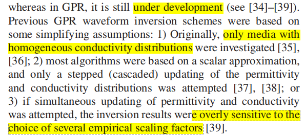

---
layout: page
permalink: /notes/fwi/old-vault/old-vault-001/index.html
title: 2010 Meles New Vector WI
---

> Imported from old Obsidian vault on 2026-07-06. Source: `2010 Meles New Vector WI.md`
## Introduction
GPR 20-1000 MHz high-freq EM waves  dominant wavelengths 5-0.1 m

The resolving power and depth range of GPR are limited by the frequency content of the pulse and the electrical conductivity of the ground.

高频-分辨率高，但更容易 rapidly attenuated. 穿透深度小

最小特征可分辨大小，by ray tomography, is on the order of the first Fresnel-zone width

## Forward Problem
本文：new inversion scheme based on both a vectorial approach and simultaneous updating of the permittivity and conductivity distributions 

assume permeability $\mu \equiv \mu_0$ 
Maxwell equations:
$$
\mathbf{M}(\varepsilon,\sigma)
\begin{bmatrix}
\mathbf{E}^s(\mathbf{x}, t) \\
\mathbf{H}^s(\mathbf{x}, t)
\end{bmatrix}
=
\begin{bmatrix}
-\varepsilon(\mathbf{x})\partial_t - \sigma(\mathbf{x}) & \nabla \times \\
\nabla \times & \mu_0 \partial_t
\end{bmatrix}
\begin{bmatrix}
\mathbf{E}^s(\mathbf{x}, t) \\
\mathbf{H}^s(\mathbf{x}, t)
\end{bmatrix}
=
\begin{bmatrix}
\mathbf{J}^s(\mathbf{x}, t) \\
\mathbf{0}
\end{bmatrix} \tag{1}$$
where $\mathbf{E}^s=\{\mathbf{E}^s(\mathbf{x},t),\forall t\in T, \forall \mathbf{x}\in V\}$
将方程组中的磁场量消掉得到
$$\mathbf{E}^s = \hat{\mathbf{G}} \mathbf{J}^s \tag{4}$$
其中$\hat{\mathbf{G}}$ is the Green's operator of $M$ 。
Explicit representation:
$$\mathbf{E}^s(\mathbf{x}, t) = \int_V dV(\mathbf{x}') \int_0^T dt' \mathbf{G}(\mathbf{x}, t, \mathbf{x}', t') \mathbf{J}^s(\mathbf{x}', t') \tag{5}$$
or equivalently
$$E_i^s(\mathbf{x}, t) = \int_V dV(\mathbf{x}') \int_0^T dt' G_{ik}(\mathbf{x}, t, \mathbf{x}', t') J_k^s(\mathbf{x}', t') \tag{6}$$
(其中包含爱因斯坦求和约定)
notation: $[\mathbf{E}^s]_{d,\tau}$ is the projection of $\mathbf{E}^s$ on detector(receiver) position $d$ at observation time $\tau$ .

## Inverse Problem
目标函数：
$$S(\varepsilon, \sigma) = \frac{1}{2} \sum_s \sum_d \sum_\tau \left[ \mathbf{E}^s(\varepsilon, \sigma) - \mathbf{E}_{\text{obs}}^s \right]_{d,\tau}^\text{T} \cdot \delta(\mathbf{x} - \mathbf{x}_d, t - \tau) \left[ \mathbf{E}^s(\varepsilon, \sigma) - \mathbf{E}_{\text{obs}}^s \right]_{d,\tau} \tag{7}$$

gradient-type scheme:

### 正演问题线性化
改写为扰动形式：
$$\mathbf{M}(\varepsilon + \delta \varepsilon, \sigma + \delta \sigma) \begin{bmatrix} \mathbf{E}^s + \delta \mathbf{E}^s \\ \mathbf{H}^s + \delta \mathbf{H}^s \end{bmatrix} = \begin{bmatrix} \mathbf{J}^s \\ \mathbf{0} \end{bmatrix}. \tag{8}$$
减去原来的方程：
$$
\mathbf{M}(\varepsilon, \sigma) \begin{bmatrix} \delta \mathbf{E}^s \\ \delta \mathbf{H}^s \end{bmatrix} = \begin{bmatrix} \mathbf{P}^s \\ \mathbf{0} \end{bmatrix}. \tag{9}$$
where the source term:
$$\mathbf{P}^s = \partial_t \mathbf{E}^s \delta \varepsilon + \mathbf{E}^s \delta \sigma \tag{10}$$
(9)代入(4)
$$\delta \mathbf{E}^s = \hat{\mathbf{G}} (\partial_t \mathbf{E}^s \delta \varepsilon + \mathbf{E}^s \delta \sigma). \tag{11}$$

Linearize operator $\mathbf{L}^s$
$$\mathbf{E}^s(\varepsilon + \delta \varepsilon, \sigma + \delta \sigma) - \mathbf{E}^s(\varepsilon, \sigma) = \delta \mathbf{E}^s = [\mathbf{L}_\varepsilon^s \quad \mathbf{L}_\sigma^s] \begin{bmatrix} \delta \varepsilon \\ \delta \sigma \end{bmatrix}. \tag{12}$$
比较(11)(12)：
$$\begin{align}
\mathbf{L}_\varepsilon^s(\mathbf{x}') &= \hat{\mathbf{G}} \delta(\mathbf{x} - \mathbf{x}') \partial_t \mathbf{E}^s \tag{13} \\
\mathbf{L}_\sigma^s(\mathbf{x}') &= \hat{\mathbf{G}} \delta(\mathbf{x} - \mathbf{x}') \mathbf{E}^s \tag{14}
\end{align}$$
operator $\mathbf{F}^s$ linearizes the electric field at all the receivers and observation time combinations for each source:
$$\sum_d \sum_\tau \left[ \delta \mathbf{E}^s \right]_{d,\tau} = \left[ \mathbf{F}_\varepsilon^s \quad \mathbf{F}_\sigma^s \right] \begin{bmatrix} \delta \varepsilon \\ \delta \sigma \end{bmatrix} \tag{15}$$
where:
$$\left[ \delta \mathbf{E}^s \right]_{d,\tau} = \left[ \mathbf{E}^s(\varepsilon + \delta \varepsilon, \sigma + \delta \sigma) - \mathbf{E}^s(\varepsilon, \sigma) \right]_{d,\tau} \tag{16}$$

### 计算梯度
consider a first-order approximation:
$$S(\varepsilon + \delta \varepsilon, \sigma + \delta \sigma) = S(\varepsilon, \sigma) + \nabla S^\text{T} \begin{bmatrix} \delta \varepsilon \\ \delta \sigma \end{bmatrix} + O(\delta \varepsilon^2, \delta \sigma^2)\tag{18}$$
利用（15）式中的线性化：
$$\nabla S = \sum_s \sum_d \sum_\tau \mathbf{F}^{sT} [\Delta \mathbf{E}^s]_{d,\tau} \tag{19}$$
where the residual wavefield is:
$$[\Delta \mathbf{E}^s]_{d,\tau} = \delta(\mathbf{x} - \mathbf{x}_d, t - \tau) [\mathbf{E}^s(\varepsilon, \sigma) - \mathbf{E}_{\text{obs}}^s]_{d,\tau} \tag{20}$$
the two operators have relations:
$$\mathbf{F}^{sT} [\Delta \mathbf{E}^s]_{d,\tau} = \mathbf{L}^{sT} [\Delta \mathbf{E}^s]_{d,\tau} \tag{21}$$
Thus, we will have the gradients:
$$\begin{bmatrix} \nabla S_\varepsilon(\mathbf{x}') \\ \nabla S_\sigma(\mathbf{x}') \end{bmatrix} = \sum_s \sum_d \sum_\tau \begin{pmatrix}\left( \delta(\mathbf{x} - \mathbf{x}') \partial_t \mathbf{E}^s \right)^\text{T} \hat{\mathbf{G}}^\text{T} [\Delta \mathbf{E}^s]_{d,\tau} \\
\left( \delta(\mathbf{x} - \mathbf{x}') \mathbf{E}^s \right)^\text{T} \hat{\mathbf{G}}^\text{T} [\Delta \mathbf{E}^s]_{d,\tau}\end{pmatrix} \tag{22}$$
which can be expressed as:
$$\begin{bmatrix} \nabla S_\varepsilon(\mathbf{x}') \\ \nabla S_\sigma(\mathbf{x}') \end{bmatrix} = \sum_s \sum_d \sum_\tau \begin{pmatrix}\left( \delta(\mathbf{x} - \mathbf{x}') \partial_t \mathbf{E}^s \right)^\text{T} \hat{\mathbf{G}}^\text{T} \mathbf{R}^s \\
\left( \delta(\mathbf{x} - \mathbf{x}') \mathbf{E}^s \right)^\text{T} \hat{\mathbf{G}}^\text{T} \mathbf{R}^s\end{pmatrix} \tag{23}$$
where the generalized residual wavefield is given by
$$\mathbf{R}^s = \sum_d \sum_\tau [\Delta \mathbf{E}^s]_{d,\tau}. \tag{24}$$
Note $\mathbf{E}^s$ indicates the solution of Maxwell's equation in the medium, $\hat{\mathbf{G}}^\text{T} \mathbf{R}^s$ can be interpreted as a backward-propagated vectorial field in the same medium.

see Appendix I-A for more details

### 计算迭代步长
Theoretically,
$$\begin{bmatrix} \varepsilon_{\text{upd}} \\ \sigma_{\text{upd}} \end{bmatrix} = \begin{bmatrix} \varepsilon \\ \sigma \end{bmatrix} - \zeta \cdot \begin{bmatrix} \nabla S_\varepsilon \\ \nabla S_\sigma \end{bmatrix}. \tag{25}$$
寻找最优步长 searching for a minimum of the objective fct along the gradient
$$S(\varepsilon + \zeta \nabla S_\varepsilon, \sigma + \zeta \nabla S_\sigma). \tag{26}$$
Solve FOC:
$$\frac{\partial S(\varepsilon + \zeta \nabla S_\varepsilon, \sigma + \zeta \nabla S_\sigma)}{\partial \zeta} = 0. \tag{27}$$
which is:
$$\zeta = \kappa \frac{\sum_s \sum_d \sum_\tau \left[ \mathbf{E}^s(\varepsilon + \kappa \nabla S_\varepsilon, \sigma + \kappa \nabla S_\sigma) - \mathbf{E}^s(\varepsilon, \sigma) \right]_{d,\tau}^\text{T} \delta(\mathbf{x} - \mathbf{x}_d, t - \tau) \left[ \mathbf{E}^s(\varepsilon, \sigma) - \mathbf{E}_{\text{obs}}^s \right]_{d,\tau}}{\sum_s \sum_d \sum_\tau \left[ \mathbf{E}^s(\varepsilon + \kappa \nabla S_\varepsilon, \sigma + \kappa \nabla S_\sigma) - \mathbf{E}^s(\varepsilon, \sigma) \right]_{d,\tau}^\text{T} \delta(\mathbf{x} - \mathbf{x}_d, t - \tau) \left[ \mathbf{E}^s(\kappa \nabla S_\varepsilon, \sigma + \kappa \nabla S_\sigma) - \mathbf{E}^s(\varepsilon, \sigma) \right]_{d,\tau}}$$
$\kappa$ is an 经验预设的小数

作者研究了单独对conductivity 和 permittivity的perturbation和联合的combined perturbations的区别， 是一个二阶量

本文提出的同时反演方法：
单独对两个参数搜索critical points 
$$S(\varepsilon + \zeta_\varepsilon \nabla S_\varepsilon, \sigma) \tag{31}$$
$$S(\varepsilon, \sigma + \zeta_\sigma \nabla S_\sigma). \tag{32}$$
两式搜索到的解分别表示为：
$$\zeta_\varepsilon = \kappa_\varepsilon \frac{\sum_s \sum_d \sum_\tau \left[ \mathbf{E}^s(\varepsilon + \kappa_\varepsilon \nabla S_\varepsilon, \sigma) - \mathbf{E}^s(\varepsilon, \sigma) \right]_{d,\tau}^\text{T} \delta(\mathbf{x} - \mathbf{x}_d, t - \tau) \left[ \mathbf{E}^s(\varepsilon, \sigma) - \mathbf{E}_{\text{obs}}^s \right]_{d,\tau}}{\sum_s \sum_d \sum_\tau \left[ \mathbf{E}^s((\varepsilon + \kappa_\varepsilon \nabla S_\varepsilon, \sigma) - \mathbf{E}^s(\varepsilon, \sigma) \right]_{d,\tau}^\text{T} \delta(\mathbf{x} - \mathbf{x}_d, t - \tau) \left[ \mathbf{E}^s(\varepsilon + \kappa_\varepsilon \nabla S_\varepsilon, \sigma) - \mathbf{E}^s(\varepsilon, \sigma) \right]_{d,\tau}}$$
$$\zeta_\sigma = \kappa_\sigma \frac{\sum_s \sum_d \sum_\tau \left[ \mathbf{E}^s(\varepsilon, \sigma + \kappa_\sigma \nabla S_\sigma) - \mathbf{E}^s(\varepsilon, \sigma) \right]_{d,\tau}^\text{T} \delta(\mathbf{x} - \mathbf{x}_d, t - \tau) \left[ \mathbf{E}^s(\varepsilon, \sigma) - \mathbf{E}_{\text{obs}}^s \right]_{d,\tau}}{\sum_s \sum_d \sum_\tau \left[ \mathbf{E}^s(\varepsilon, \sigma + \kappa_\sigma \nabla S_\sigma) - \mathbf{E}^s(\varepsilon, \sigma) \right]_{d,\tau}^\text{T} \delta(\mathbf{x} - \mathbf{x}_d, t - \tau) \left[ \mathbf{E}^s(\varepsilon, \sigma + \kappa_\sigma \nabla S_\sigma) - \mathbf{E}^s(\varepsilon, \sigma) \right]_{d,\tau}}$$

## 附录中的数学推导
A. Transpose of $\tilde{\mathbf{G}}$

