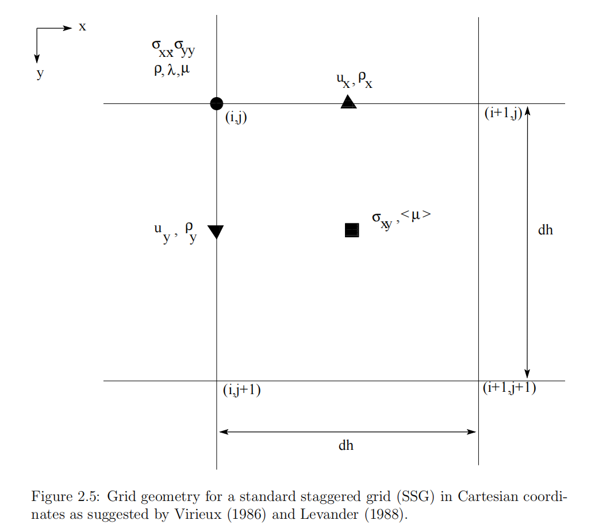
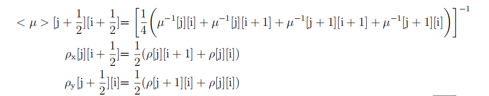
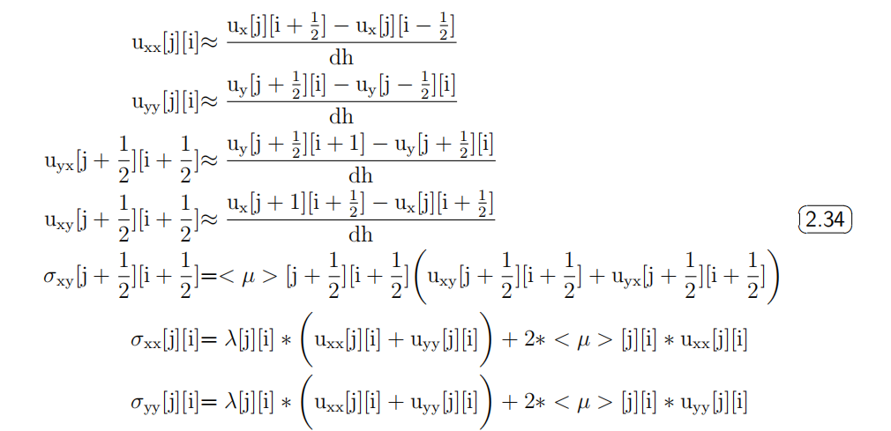
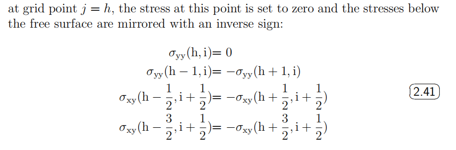
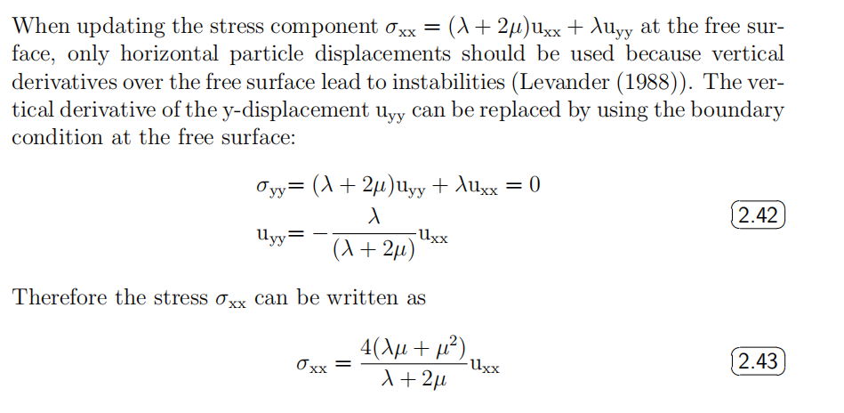
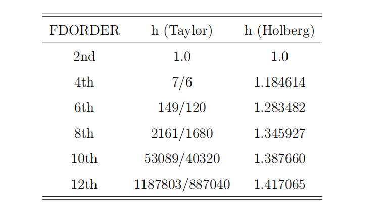
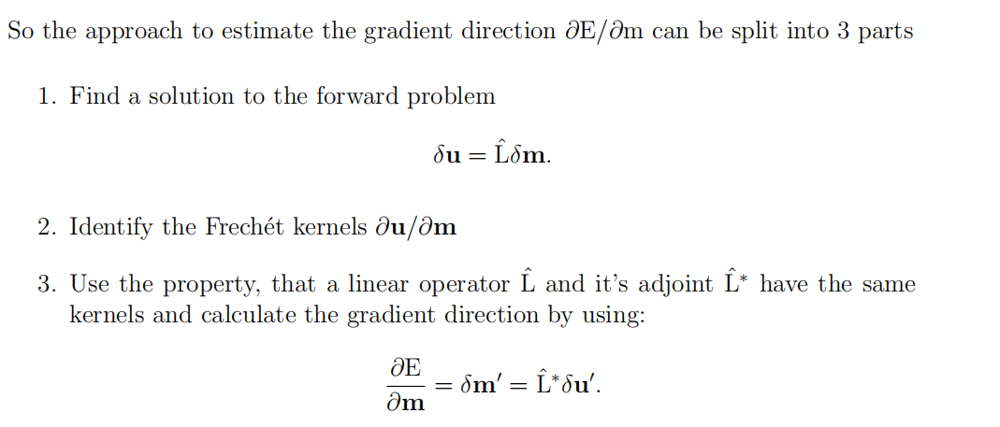

---
layout: page
permalink: /notes/fwi/old-vault/old-vault-005/index.html
title: FWI原理学习
---

> Imported from old Obsidian vault on 2026-07-06. Source: `FWI原理学习.md`
### 地震正演问题
##### 波动方程
应力-位移形式
$$\begin{align}
\rho\frac{\partial^2u_i}{\partial t^2}=\frac{\partial\sigma_{ij}}{\partial x_j}+f_i \\
\sigma_{ij}=\lambda\theta\delta_{ij}+2\mu\epsilon_{ij}\\
\epsilon_{ij}=\frac{1}{2}(\frac{\partial u_i}{\partial x_j}+\frac{\partial u_j}{\partial x_i})
\end{align}$$
应力速度形式：
$$\begin{align}
\rho\frac{\partial v_i}{\partial t}=\frac{\partial\sigma_{ij}}{\partial x_j}+f_i \\
\frac{\partial \sigma_{ij}}{\partial t}=\lambda\frac{\partial \theta}{\partial t}\delta_{ij}+2\mu\frac{\partial \epsilon_{ij}}{\partial t}\\
\frac{\partial \epsilon_{ij}}{\partial t}=\frac{1}{2}(\frac{\partial v_i}{\partial x_j}+\frac{\partial v_j}{\partial x_i})
\end{align}$$

#### 有限差分解
取交错网格划分：如Virieux(1986) and Levander(1988)提出如下图所示的排列

为保证标准交错网格（SSG）的稳定性，Lame系数和密度$\rho$必须分别作调和平均和算术平均

对空间微分算子用时间步n的差分算子代替：

$$\begin{align}
    utt_x^n[j][i + \frac{1}{2}] &= \left( \sigma_{xx}[j][i + 1] - \sigma_{xx}[j][i] + \sigma_{xy}[j + \frac{1}{2}][i] - \sigma_{xy}[j - \frac{1}{2}][i] \right) \\
    utt_y^n[j + \frac{1}{2}][i] &= \left( \sigma_{xy}[j][i + \frac{1}{2}] - \sigma_{xy}[j][i - \frac{1}{2}] + \sigma_{yy}[j + 1][i] - \sigma_{yy}[j][i] \right) \\
    u_x^{n+1}[j][i + \frac{1}{2}] &= 2 \cdot u_x^n[j][i + \frac{1}{2}] - u_x^{n-1}[j][i + \frac{1}{2}] + \frac{dt^2}{dh \cdot \rho_x[j][i + \frac{1}{2}]} \cdot utt_x^n[j][i + \frac{1}{2}] \\
    u_y^{n+1}[j + \frac{1}{2}][i] &= 2 \cdot u_y^n[j + \frac{1}{2}][i] - u_y^{n-1}[j + \frac{1}{2}][i] + \frac{dt^2}{dh \cdot \rho_y[j + \frac{1}{2}][i]} \cdot utt_y^n[j + \frac{1}{2}][i]
\end{align}$$

#### 初始和边界条件
initial conditions:
$$\begin{align}
u_i(x,t)=0 \\
\frac{\partial u_i(x,t)}{\partial t}=0
\end{align}$$
for all $x \in V$ at $t=0$
两种边界条件：
**Horizontal Free Surface**
自由边界面上：$\sigma_{xy}=\sigma_{yy}=0.0$
一种隐式定义是在模型顶部放一层很小的声波参数层（Vp 300m/s, Vs 0.0m/s $\rho=1.25 kg/m^3$
优势是渐变，但为了得到精确结果模型在靠近自由边界处需要精细的空间采样。
显式的定义是利用mirroring technique by Levander, 对平面界面可以生成稳定精确的解。
对自由边界上的格点$j=h$，应力被设为0，下方的应力被调整为反射像

**吸收边界条件**
数值网格被一些格点在各方向扩大 通常“FW=30 gridpoints” 
该段的应力和速度值被乘上了一个吸收因子 factor "damp"
$$damp = exp(-a^2x^2)$$
where $a=\sqrt{-log(amp)/FW}$ and $amp=0.92$ 这样该处的地震波就被吸收而不能反射回模型。但不能完全吸收所有反射波

更有效的方法是利用**PMLs(Pefectly Matched Layers)**
PML只有对精确的波动方程解呈现无反射性，而对一半的含有噪声的数值解不适用这一性质，调整为一下的吸收函数：
$$c = -V_{pml}*\frac{log(\alpha)}{L}$$
其中$V_{pml}$指在吸收边界介质中典型的P波速度，$\alpha=10^{-4}$ ，L是吸收边界层的厚度。

#### 数值假象和不稳定性

##### grid dispersion
Question: What is the maximum spatial grid point distance $dh$ for a correct sampling of the wavefield?
to satisfy:
$$dh\leq \frac{\lambda_{min}}{n}=\frac{V_{min}}{n f_{max}}$$
$lambda_{min}$指最小波长，$V_{min}$是最小波速，$f_{max}$是最大频率。

##### The Courant Instability
对时间步dt的约束，比如2D弹性波网格要求**Courant-Friedrichs-Lewy criterion**：
$$dt\leq \frac{dh}{h\sqrt{2}V_{max}}$$
The factor $h$ 依赖于FD算子的阶数，可以通过计算权重系数得到（？）
$$h=\sum_i \beta_i$$

### The adjoint problem 伴随
Loss Func with L2-norm:
$$E=|L|_2=\frac{1}{2}\delta u^T\delta u$$
特殊的物理意义：residual elastic energy contained in the data residuals $\delta u$

迭代寻找最优解
$$\begin{align}
E(\mathbf{m}_1 + \delta \mathbf{m}_1) &\approx E(\mathbf{m}_1) + \delta \mathbf{m}_1 \left( \frac{\partial E}{\partial \mathbf{m}} \right)_1 + \frac{1}{2} \delta \mathbf{m}_1 \left( \frac{\partial^2 E}{\partial \mathbf{m}^2} \right)_1 \delta \mathbf{m}_1^\mathrm{T} \\
\frac{\partial E(\mathbf{m}_1 + \delta \mathbf{m}_1)}{\partial \delta \mathbf{m}_1} &= \left( \frac{\partial E}{\partial \mathbf{m}} \right)_1 + \delta \mathbf{m}_1 \left( \frac{\partial^2 E}{\partial \mathbf{m}^2} \right)_1 = 0  \\
\delta \mathbf{m}_1 &= - \left( \frac{\partial^2 E}{\partial \mathbf{m}^2} \right)_1^{-1} \left( \frac{\partial E}{\partial \mathbf{m}} \right)_1 = - \mathbf{H}_1^{-1} \left( \frac{\partial E}{\partial \mathbf{m}} \right)_1 
\end{align}$$
由于Hessian matrix的逆求解需要大量计算成本，通常用一个preconditioning operator$P$来近似，thus：
$$\delta \mathbf{m}_1 \approx -\mathbf{P}_1 \left(\frac{\partial E}{\partial \mathbf{m}} \right)_1$$
$$\begin{align}
    \mathbf{m}_2 &= \mathbf{m}_1 - \mu_1 \mathbf{P}_1 \left( \frac{\partial E}{\partial \mathbf{m}} \right)_1,  \\
    \mathbf{m}_{n+1} &= \mathbf{m}_n - \mu_n \mathbf{P}_n \left( \frac{\partial E}{\partial \mathbf{m}} \right)_n. 
\end{align}$$
#### 梯度的计算
改写E为：
$$E = \frac{1}{2} \delta \mathbf{u}^\mathrm{T} \delta \mathbf{u} = \frac{1}{2} \sum_\text{sources} \int \mathrm{d}t \sum_\text{receiver} \delta \mathbf{u}^2(\mathbf{x}_r, \mathbf{x}_s, t)$$
对参数m求导后得到：
$$\frac{\partial E}{\partial \mathbf{m}} = \sum_\text{sources} \int \mathrm{d}t \sum_\text{receiver} \frac{\partial (\mathbf{u}^\text{mod}(\mathbf{m}) - \mathbf{u}^\text{obs})}{\partial \mathbf{m}} \delta \mathbf{u} = \sum_\text{sources} \int \mathrm{d}t \sum_\text{receiver} \frac{\partial \mathbf{u}^\text{mod}(\mathbf{m})}{\partial \mathbf{m}} \delta \mathbf{u}$$
如果$\frac{\partial \mathbf{u}^{mod}(\mathbf{m})}{\partial \mathbf{m}}$已知，small perturbations in model space可以对整个model做体积分得到total change in data space：
$$\delta \tilde{\mathbf{u}}(\mathbf{x}_s, \mathbf{x}_r, t) =\hat{L}\delta m= \int_V \mathrm{d}V \frac{\partial \mathbf{u}}{\partial \mathbf{m}} \delta \mathbf{m}$$
where $\hat{L}$ is the linear operator
类似的，small changes in the data space can be integrated to calculate the total change in model space $\delta m'$
$$\delta \mathbf{m}' = \hat{L}^*\delta\tilde{\mathbf{u}}'=\sum_\text{sources} \int \mathrm{d}t \sum_\text{receiver} \left[ \frac{\partial \mathbf{u}}{\partial \mathbf{m}} \right]^* \delta \tilde{\mathbf{u}}'$$
where $\hat{L}^*$ is an operator
其中Frechet 导数项$\frac{\partial \mathbf{u}}{\partial \mathbf{m}}$被替换成了它的共轭；又由于线性算子$\hat{L}$的kernel和 adjoint counterpart是相同的（？），就有
$$\frac{\partial \mathbf{u}}{\partial \mathbf{m}}=\frac{\partial \mathbf{u}}{\partial \mathbf{m}}^*$$
Thus we have:
$$\delta \mathbf{m}'=\frac{\partial E}{\partial \mathbf{m}}$$

