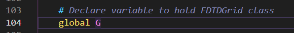
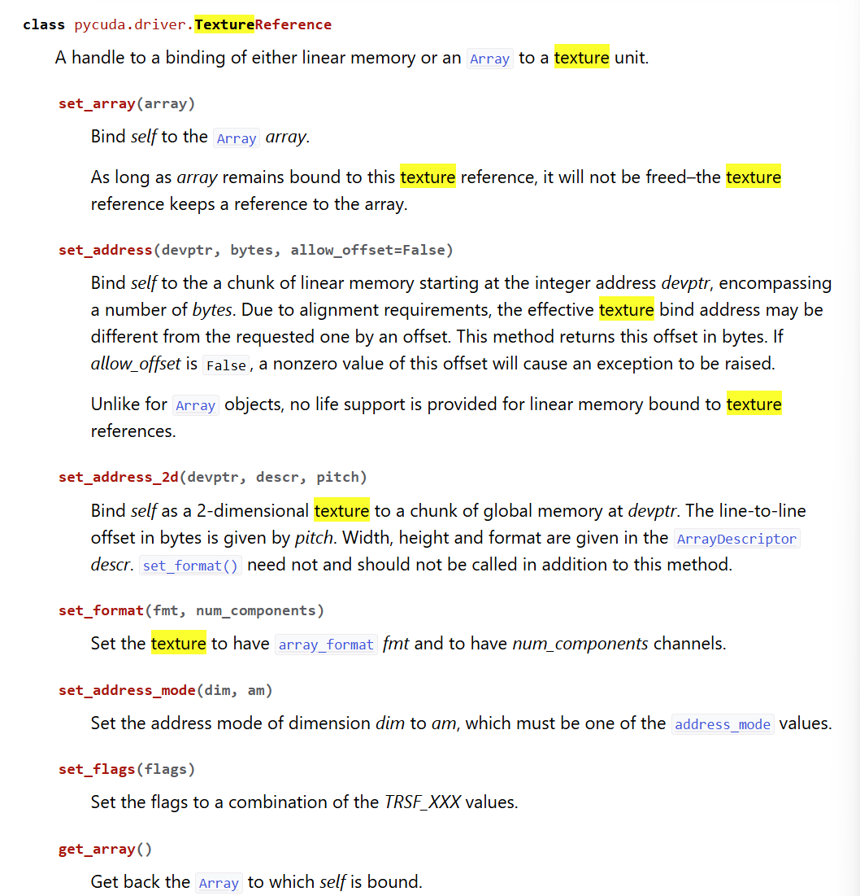
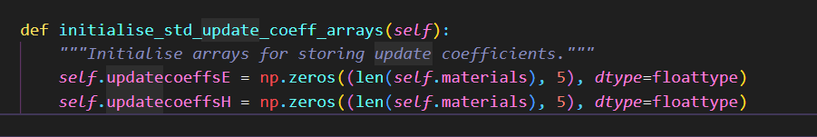
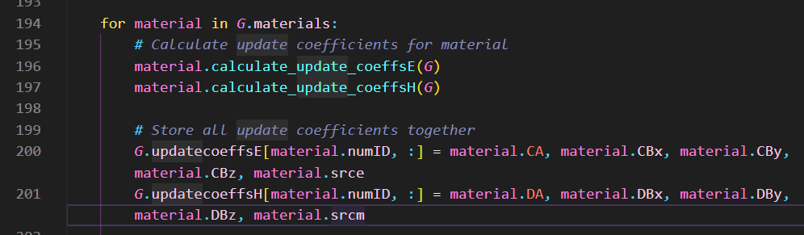
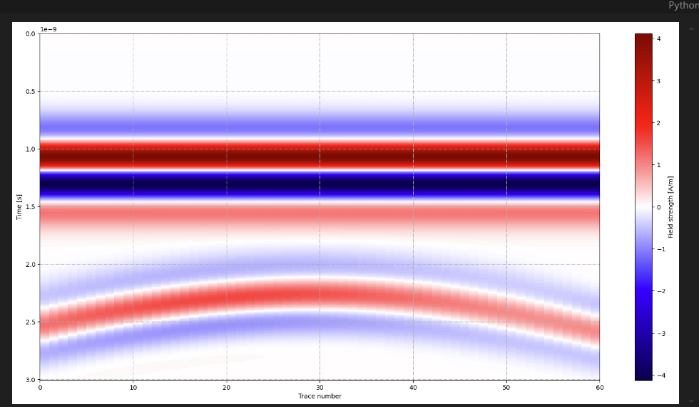
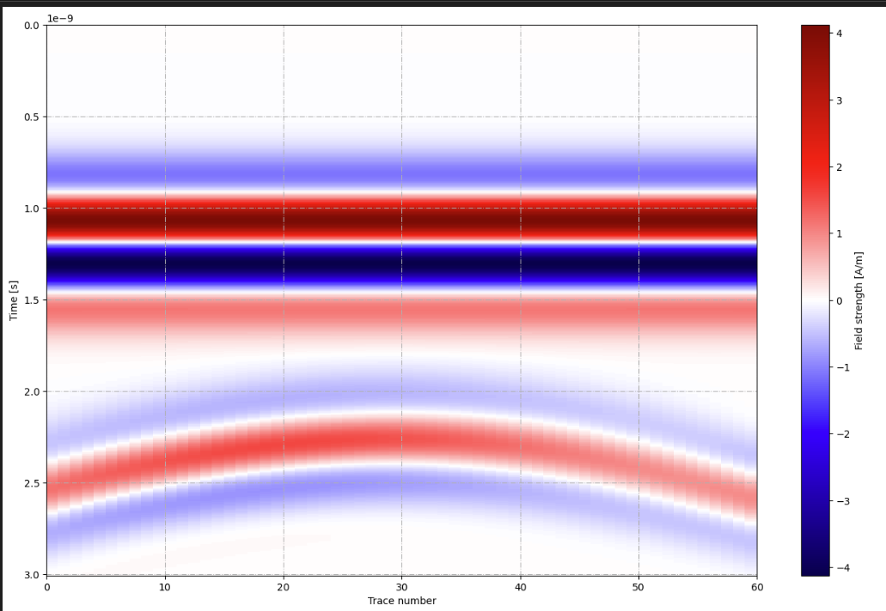

---
layout: page
permalink: /notes/fwi/old-vault/old-vault-006/index.html
title: gprMax00 主程序学习
---

> Imported from old Obsidian vault on 2026-07-06. Source: `gprMax00 主程序学习.md`
python -m gprMax xxxx 
传入后进入gprMax.gprMax.main()函数
main()函数读取相关的命令行参数传入args 至run_main(args)

## run_main()
正常检查完gpu设备后，我调用mpi时
会进入run_mpi_sim(args,inputfile,usernamespace)

## run_mpi_sim(args,inputfile,usernamespace,optparams=None)
tsolve=run_model(args, currentmodelrun, modelend - 1, numbermodelruns, inputfile, modelusernamespace)

## model_build_run.run_model

似乎找到了问题所在

## Pycuda

测试

