---
layout: page
permalink: /notes/fwi/old-vault/old-vault-007/index.html
title: GPRMax01 InputFile commands
---

> Imported from old Obsidian vault on 2026-07-06. Source: `GPRMax01 InputFile commands.md`
#gpr [[GPRMax02 输出数据]][[GPRMax05 Iraklis 2016]][[GPRMax04 Basic principles of GPR]][[GPRMax03 EMFWI理论推导]]

Input File传进去的是一个ASCII 文本文件，每行由"#"打头指定一个变量
变量类型如下定义：
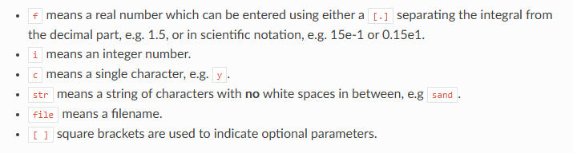

单位制：统一用SI system of units 米、秒、赫兹 坐标系原点(0,0)设定在模型左下角

### Essential commands
1. 模型大小：``` #domain: f1 f2 f3  ``` 其中f1,f2,f3分别指x,y,z方向模型尺寸
2. 空间步长： ```#dx_dy_dz: f1 f2 f3``` 按照稳定性要求（CFL Condition)：$$\Delta t \leq \frac{1}{c\sqrt{\frac{1}{(\Delta x)^2}+\frac{1}{(\Delta y)^2}+\frac{1}{(\Delta z)^2}}}$$
其中c是光速
3. 时间窗 ```#time_window: f1``` 其中f1指定的是总模拟时间 比如20纳秒 20e-9
或者用```#time_window: i1``` 其中i1指定的是总的迭代次数 两者有如下关系：$$t_w=\Delta t \times N_{it}$$

### General Commands
1. Python代码块： ```#python xxx #end_python``` 
2. 插入文件中的commands：```#includ_file: file1``` 其中file1可以是同input file目录下的文件名或者是文件的路径
3. 修改时间步长dt：```time_step_stability_factor: f1``` 其中f1是一个修正因子：$0\leq f1\leq 1$，则实际gprMax采用的时间步长会是$f1\times \Delta t$。其中$\Delta t$是通过CFL条件计算得到的。
4. 项目名：```#title: str1``` 
5. 是否在运行期间输出信息：``` #messages: c1``` c1可取y or n； 默认y。
6. 输出文件夹：``` #output_dir: str1``` 需要输的是路径
7. CPU核数设定：```#num_threads: i1``` 

### Material commands
1. 内嵌材料：2种——完美导电体($\epsilon_r=1,\sigma=0$)和真空 使用的identifiers标签是pec和free_space
2. 设定材料：```#material: f1 f2 f3 f4 str1``` 
$f1:\epsilon_r \quad 相对介电常数$ $f2:\sigma\quad电导率$ $f3:\mu_r\quad 相对磁导率$ $f4:\sigma_* 磁损耗，单位\Omega / m$ $str1:$identifier for the material 可以自己设定比如my_sand, my_water
3. 添加dispersion
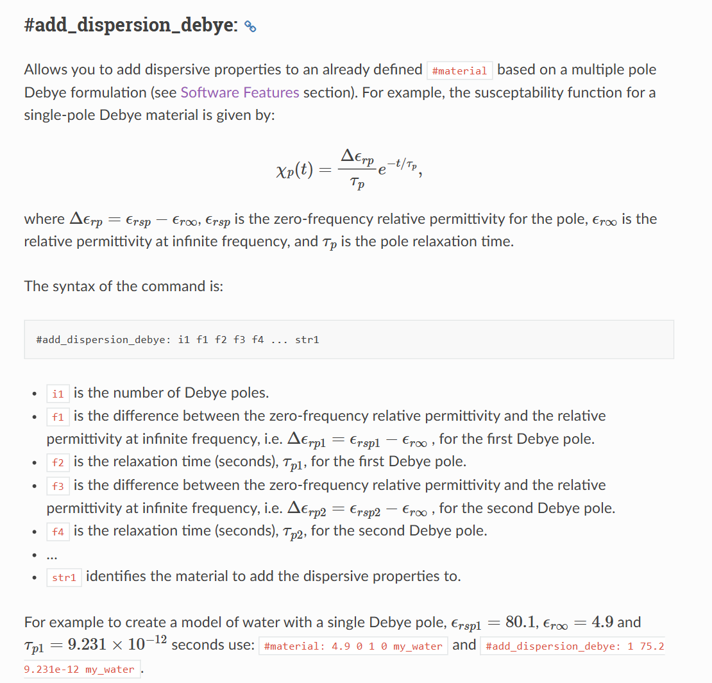

4. Lorentz dispersion
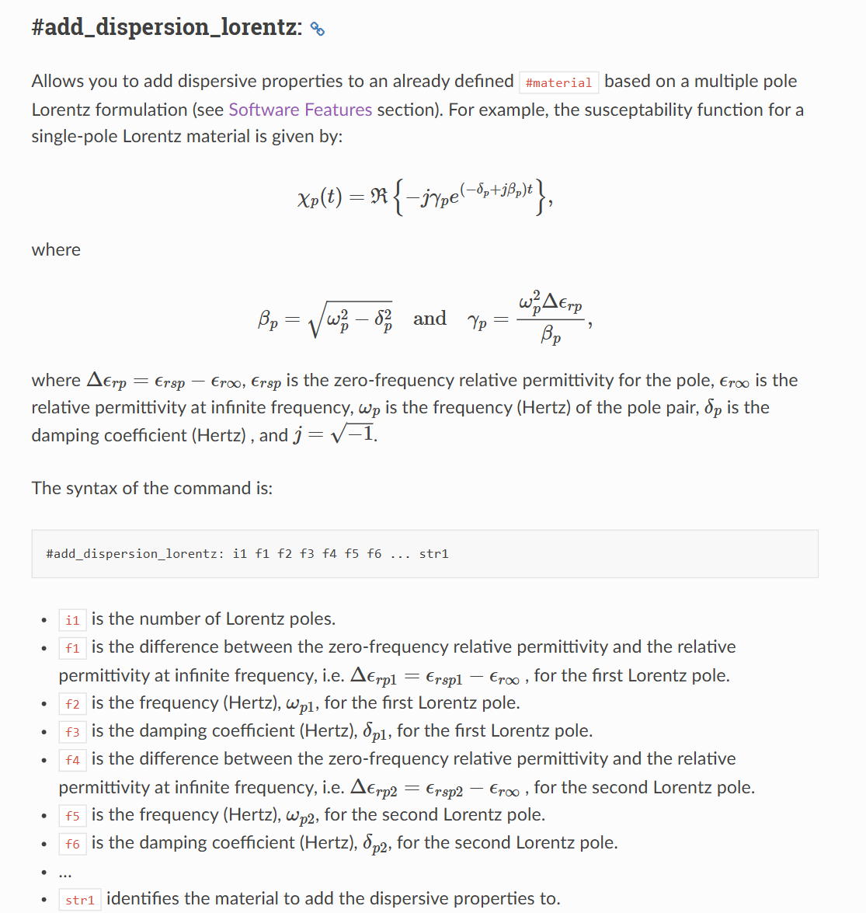
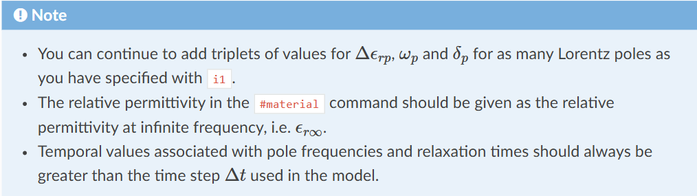
5. drude_dispersion
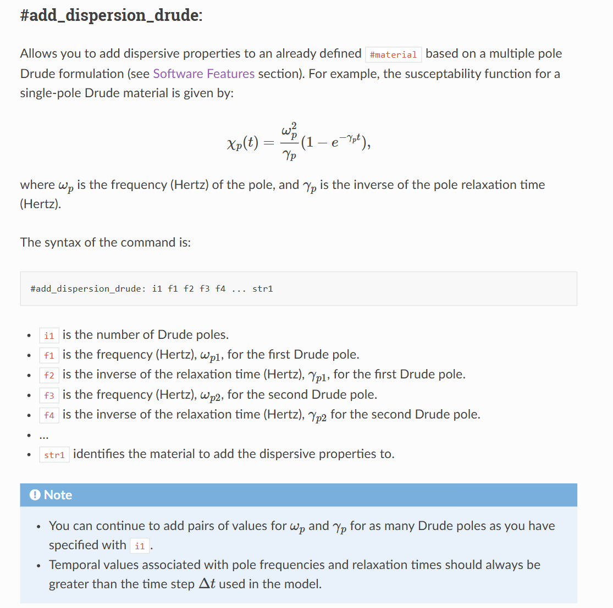
6. 混合模型 soils
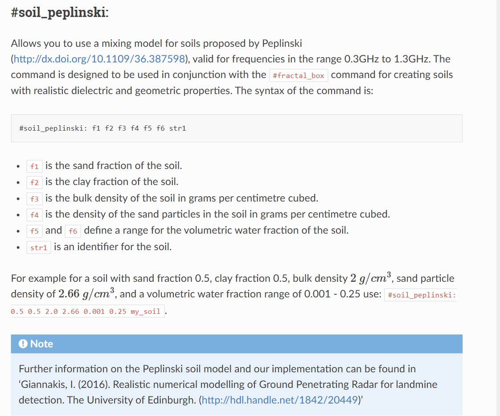

### Object construction commands
1. 各向异性设置 Anisotropy
每个体积对象构建可以用三个material 标识符依次单独定义x,y,z方向的属性。
例如要在x,y,z方向上创建具有不同材料属性的长方体：
```
#material: 41 10 1 0 matX
#material: 35 10 1 0 matY
#material: 33 1 1 0 matZ
#box: 0 0 0 0.1 0.1 0.1 matX matY matZ
``` 
2. 介电平滑 Dielectric smoothing
定义区域时```#sphere:0.5 0.5 0.5 0.1 sand n``` 最后有一个可选参数y or n选择是否开启
默认开启
3. geometry_view
指令输出有关几何图形的信息vtk文件
```#geometry_view: f1 f2 f3 f4 f5 f6 f7 f8 f9 file1 c1``` 
其中f1,f2,f3指定视图体积左下角坐标，f4,f5,f6指定右上角坐标，f7 f8 f9是几何视图的空间离散化，通常与模型空间离散化相同。file1是文件名 c1可以是N(正常)或F(精细)，保留fine模式用于查看占用小体积的几何体的详细部分。
等效操作时加上--geometry-only 运行gprMax
4. 导线
```#edge: f1 f2 f3 f4 f5 f6 str1``` 
f1 f2 f3是边的起始坐标，f4 f5 f6是终点坐标。定义一条线段。str1是material的标识符
5. 平板
```#plate: f1 f2 f3 f4 f5 f6 str1```
f1 f2 f3指定左下角，f4 f5 f6指定右上角，坐标定义一个surface。str1是material标识符
6. 三角形
```#triangle: f1 f2 f3 f4 f5 f6 f7 f8 f9 f10 str1 [c1]``` 
f1 f2 f3, f4 f5 f6, f7 f8 f9分别是三个顶点的坐标，f10是三棱柱的厚度，str1是材料标识符；c1是可选参数，仅在创建三棱柱时使用来选择打开或关闭电介质平滑
7. 长方体
```#box: f1 f2 f3 f4 f5 f6 str1 [c1]```
f1 f2 f3,f4 f5 f6指定左下角和右上角的坐标，str1指定材料，c1选择是否开启平滑
8. 球体
```#sphere: f1 f2 f3 f4 str1 [c1]``` 
f1 f2 f3是球心坐标，f4是半径，str1材料，c1平滑指令
9. 圆形圆柱体
```#cylinder: f1 f2 f3 f4 f5 f6 f7 str1 [c1]``` 
f1 f2 f3,f4 f5 f6分别是上下底面两圆的中心坐标；f7是圆柱体半径
10. 圆柱形扇区
```#cylinder_sector:c1 f1 f2 f3 f4 f5 f6 f7 str1 [c1]``` 
c1是定义扇区的圆柱体轴的方向，可以是x,y,z。f1 f2是扇区中心的坐标； f3 f4 are the lower and higher coordinates of the axis of the cylinder from which the sector is defined 定义了扇区的厚度；f5 是半径，f6是扇区的起始角度，以°为单位，在圆柱形扇形平面的positive first axis定义0度数。f7是扫描的角度，逆时针旋转的度数。
11. 分形box
允许引入具有分形分布的正交平行六面体。
```#fractal_box: f1 f2 f3 f4 f5 f6 f7 f8 f9 f10 i1 str1 str2 [i2] [c1]``` 
f1 f2 f3, f4 f5 f6分别是体的左下和右上坐标。f7是分形维度，介于0~3，f8 f9 f10是x,y,z方向上的分形加权。 i1 用于分形分布的材质数量，根据关联的混合模型定义。普通材料应该定义为1；str1是材料标识符，str2是分形框本身的标识符,c1是介电平滑参数，i2是随机数种子参数。
12. 添加粗糙表面
```#add_surface_roughness: f1 f2 f3 f4 f5 f6 f7 f8 f9 f10 f11 str1 [i1]``` 
f1 f2 f3, f4 f5 f6分别是上表面的左下和右上坐标。坐标必须定位fractal_box的六个表面之一，但不必延伸到整个表面。 f7是分形维度，介于0~3之间。f8 f9用于对表面的第一和第二个方向上的分形加权。f10 f11定义粗糙度可以变化的下限和上限。i1是可选参数，用于控制用于创建分形的随机数生成器的种子。
13. 插入预定义几何体
```#geometry_objects_read: f1 f2 f3 file1 file2``` 
f1 f2 f3是geometry数组左下角应放置的域中左下角的坐标
file1是HDF5文件的路径和文件名，包含定义几何图形的整数数组
file2是包含```#material```命令的文本文件的路径和文件名
c1是电介质平滑参数
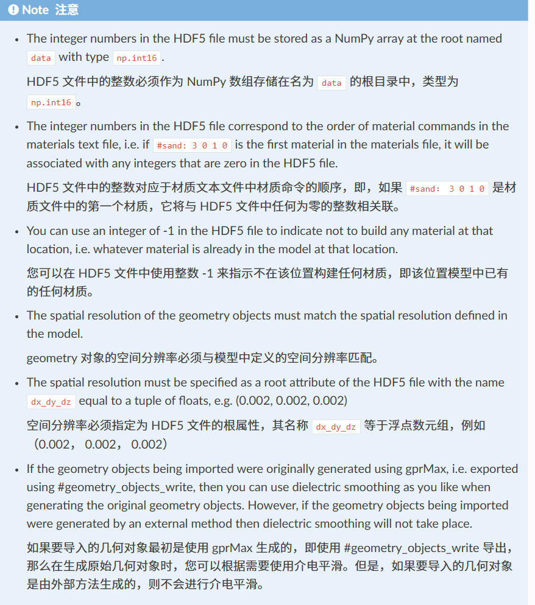
14. 将模型生成的几何写入文件
```#geometry_objects_write: f1 f2 f3 f4 f5 f6 file1```
f1 f2 f3,f4 f5 f6是几何体的左下角和右上角坐标，file1是文件基本名
### Source and output commands
1. 震源波形选择 ```#waveform: str1 f1 f2 str2```
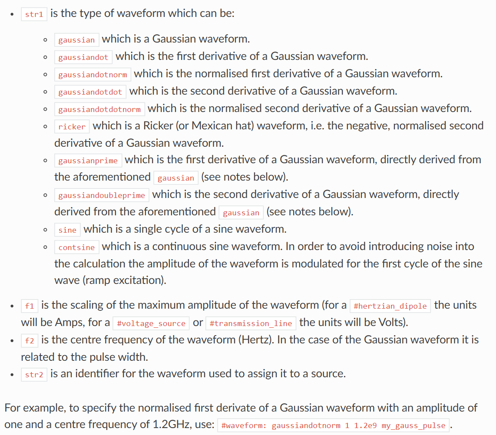
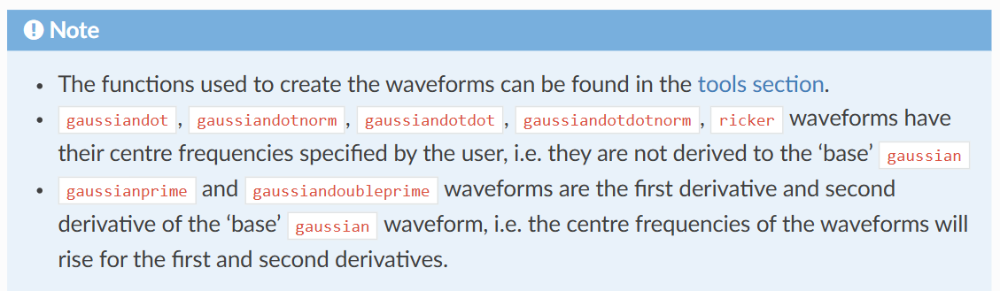
2. 自定义源：```#excitation_file: file1 [str1 str2]``` 
file1 是一个波形描述文件，要求至少大于等于迭代次数的振幅值数据。 str1 str2是可选的参数对，将kind fill_value值传给插值函数(scipy.interpolate.interp1d)
ASCII文件包含振幅值，每列的第一行必须以标识符字符串开头，用作波形名称。
文件的第一列中，可以指定自己的时间向量，用标识符time，振幅值将使用上述时间向量对应的波形进行插值。
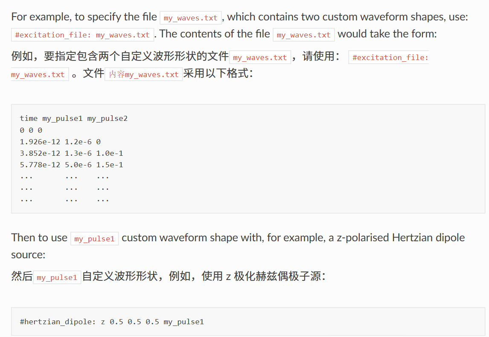
3. 电流密度源
允许在电场位置指定电流密度项——最简单的激发，通常称为an additive or soft source
$$J_s=\frac{I\Delta l}{\Delta x \Delta y \Delta z}$$
其中$J_s$是电流密度，I是电流，$\Delta l$是无穷小电偶极子的长度，分母是网格的空间分辨率
Note：$\Delta l$ is set equal to $\Delta x,\Delta y,or\quad \Delta z$ depending on the specified polarisation
```#hertzian_dipole:c1 f1 f2 f3 str1 [f4 f5]``` 
其中c1是源的极化方向，可以取x,y,z；f1,f2,f3是源的坐标参数(x,y,z)，str1是源的标识符，f4,f5是可选参数：f4是启动源的时间延迟，f5是删除源的时间。如果时间窗长于源删除时间，则源将在源删除时间之后停止。
For example, to use a x-polarised Hertzian dipole with unit amplitude and a 600 MHz centre frequency Ricker waveform, use: `#waveform: ricker 1 600e6 my_ricker_pulse` and `#hertzian_dipole: x 0.05 0.05 0.05 my_ricker_pulse`.
注：当此源用于2D仿真时，极化方向选取的是不变几何方向。
4. 无穷小磁偶极子源 additive or soft source
```#magnetic_dipole: c1 f1 f2 f3 str1 [f4 f5]```
c1是源的极化方向，f1,f2,f3是源的坐标，f4,f5是可选参数
5. 电压源
如果其电阻为0，即规定了指定电场分量的时间变化，it can be a hard source
如果电阻不为0，表现为电阻电压源。 useful for exciting antennas
```#voltage_source: c1 f1 f2 f3 f4 str1 [f5 f6]``` 
其中c1是源的极化方向，f1,f2,f3是源坐标，f4是源的内阻，单位欧姆，f5,f6是可选参数
6. 一维传输线源
传输线的指定电阻可以大于0且小于自由空间阻抗（376.73欧姆） useful for exciting antennas
```#transmission_line: c1 f1 f2 f3 f4 str1 [f5 f6]``` 
其中c1是源的极化方向，f1,f2,f3是源坐标，f4是传输线的特征内阻，单位欧姆，f5,f6是可选参数
7. 接收器设置 ```#rx: f1 f2 f3 [str1 str2]``` 
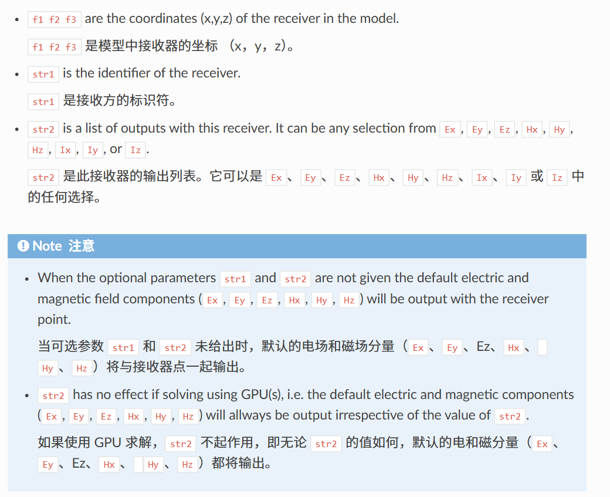
8. 定义多个输出点: ```#rx_array: f1 f2 f3 f4 f5 f6 f7 f8 f9``` 
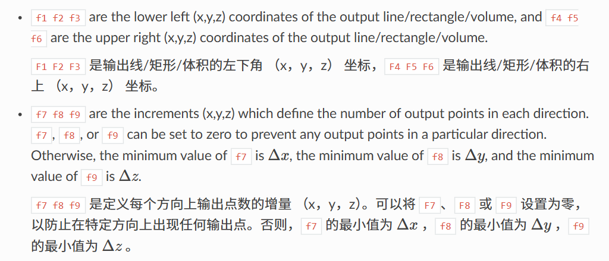
9. 模型运行之间简单易懂所有简单元或接收器位置 
	```#src_steps: f1 f2 f3 ``` 
	```#rx_steps: f1 f2 f3 ``` 
	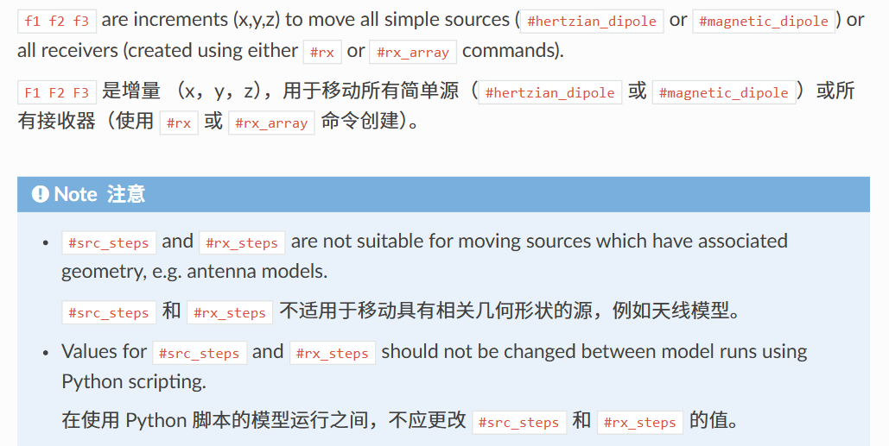
10. 波场快照 ```#snapshot:f1 f2 f3 f4 f5 f6 f7 f8 f9 f10 file1 ``` 或者
用```#snapshot:f1 f2 f3 f4 f5 f6 f7 f8 f9 i1 file1 ``` 
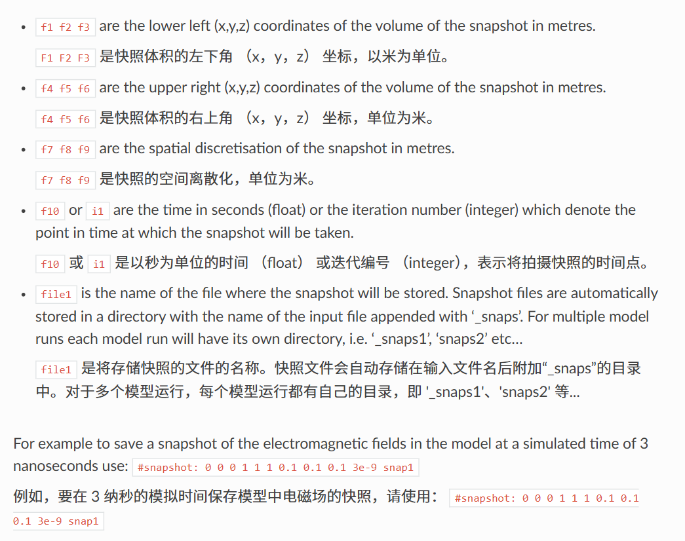

### PML commands
吸收边界条件（ABC）默认行为是一阶复频移（CFS)完美匹配层(PML),6个边上厚度10个单元。可以自定义修改
1. 厚度：```  #pml_cells: i1 [i2 i3 i4 i5 i6]```
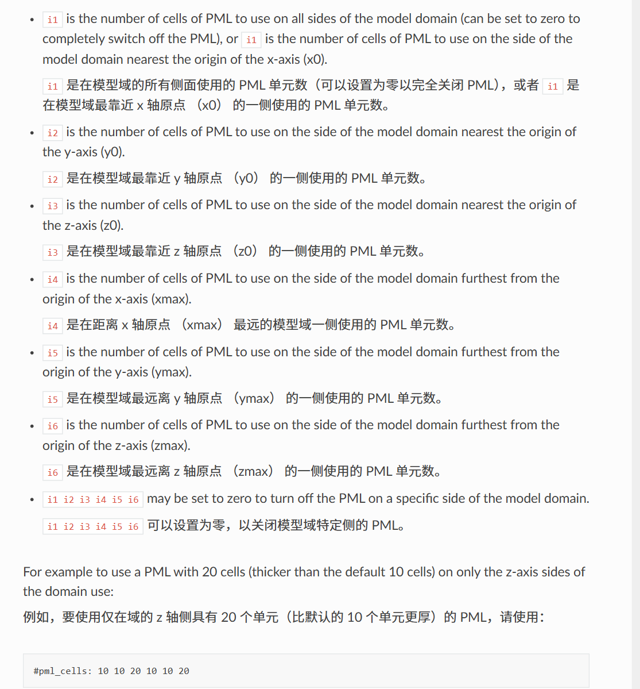
2. PML更改 ： ```#pml_formulation: str``` str可以是 HORIPML or MRIPML
3. 高级控制PML参数：```#pml_cfs: str1 str2 f1 f2 str3 str4 f3 f4 str5 str6 f5 f6``` 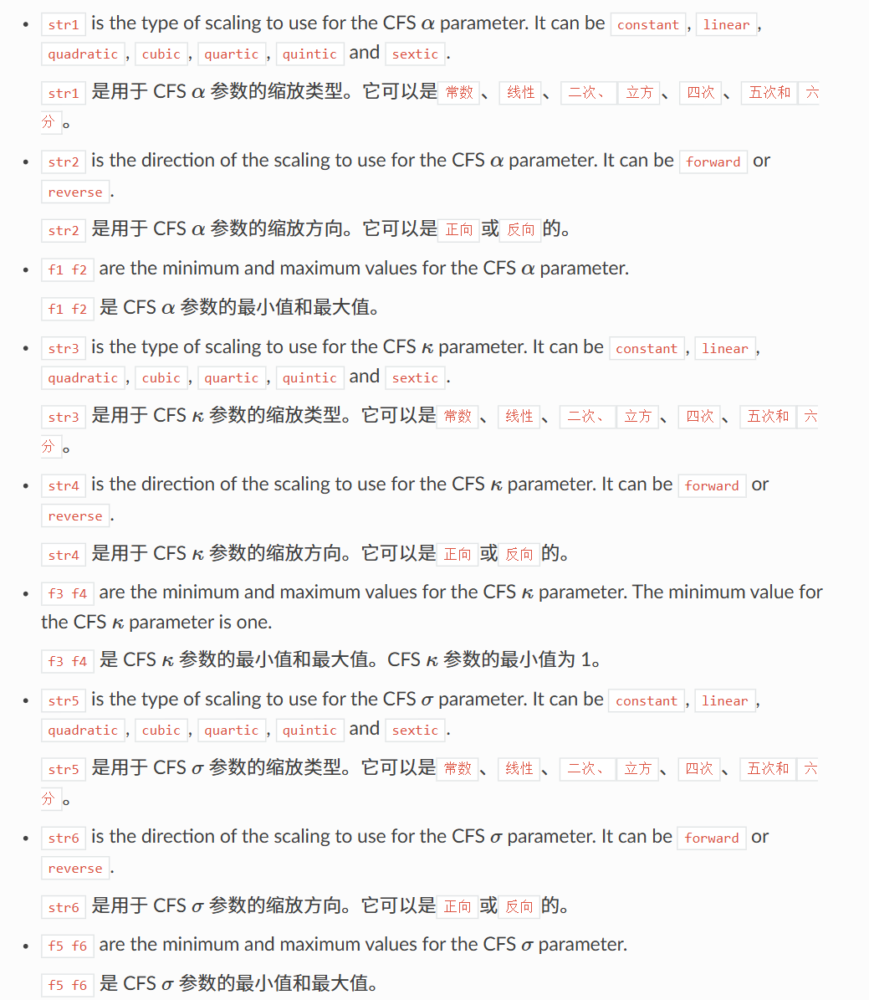
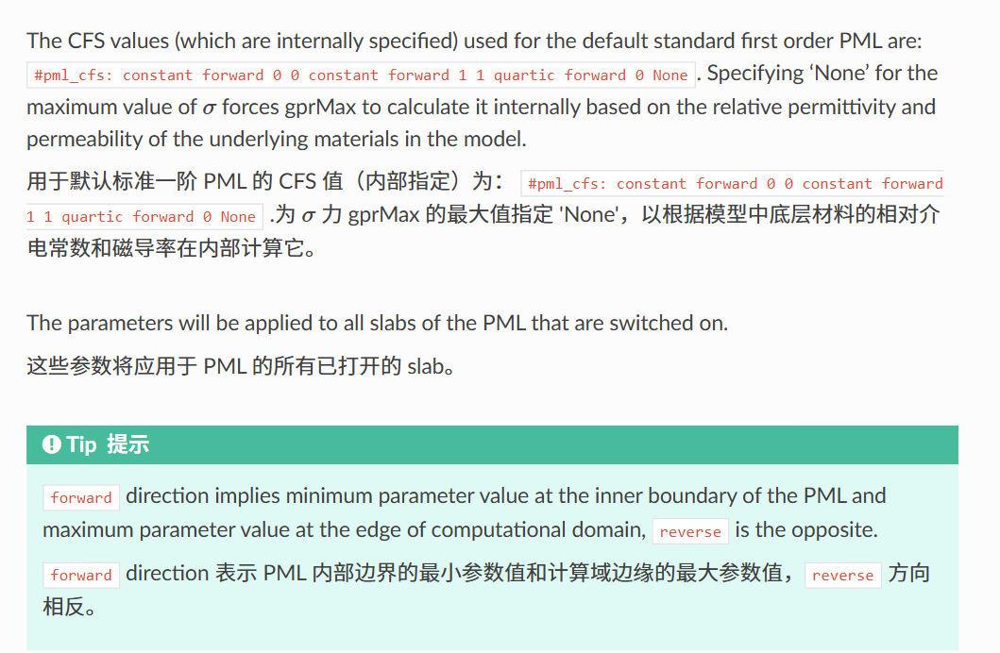

