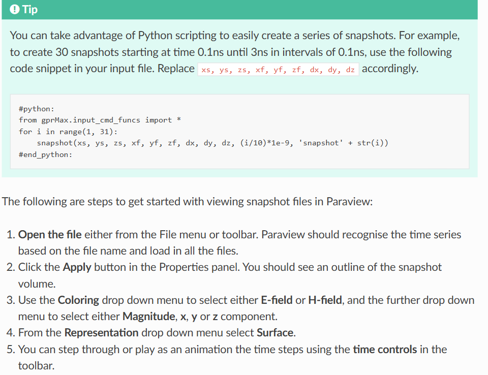

---
layout: page
permalink: /notes/fwi/old-vault/old-vault-008/index.html
title: GPRMax02 输出数据
---

> Imported from old Obsidian vault on 2026-07-06. Source: `GPRMax02 输出数据.md`
### Field output
gprMax 会生成一个输出文件，该文件与输入文件同名，但附加了 `.out`。输出文件使用广泛支持的 [HDF5](https://www.hdfgroup.org/HDF5/) 格式，该格式旨在存储和组织大量数值数据。有许多免费工具可用于读取 HDF5 文件。此外，MATLAB 具有用于读取和写入 HDF5 文件的高级和低级函数，即 `h5info` 和 `h5disp` 分别用于返回信息和显示 HDF5 文件的内容。gprMax 包含一些 Python 模块（在`tools`中），以帮助您查看输出数据。这些工具记录在 [tools 部分](https://docs.gprmax.com/en/latest/plotting.html#plotting)。
### File structure
HDF5属性：
`gprMax` 是用于创建输出的 gprMax 的版本号
`Title` 是模型的标题
`Iterations` 是模型时间窗口的迭代次数
`nx_ny_nz` 是一个元组，其中包含模型每个方向上的单元格数
`dx_dy_dz` 是包含空间离散化的元组，即$dx,dy,dz$
`dt` 是模型的时间步长
`srcsteps` 是用于在模型运行之间移动所有源的空间增量
`rxsteps` 是用于在模型运行之间移动所有接收器的空间增量。
`NSRC` 是模型中的源总数
`nrx` 是模型中的接收者总数

还有HDF5 groups for sources（srcs）, transmission lines(tls), receivers(rxs)

##### rx
Name
Position x,y,z坐标
Ex,Ey,Ez,Hx,Hy,Hz,Ix,Iy,Iz 的array containing the time history for the model time window

##### src
Type 源类型
Position
##### tl
Position
Resistance 传输线的resistance
dl 空间离散
- `Vinc` is an array containing the time history (for the model time window) of the values of the incident voltage in the transmission line.
    
- `Iinc` is an array containing the time history (for the model time window) of the values of the incident current in the transmission line.
    
- `Vtotal` is an array containing the time history (for the model time window) of the values of the total (field) voltage in the transmission line.
    
- `Itotal` is an array containing the time history (for the model time window) of the values of the total (field) current in the transmission line.
#### 波场快照Snapshots vtk格式

#### Geometry output

