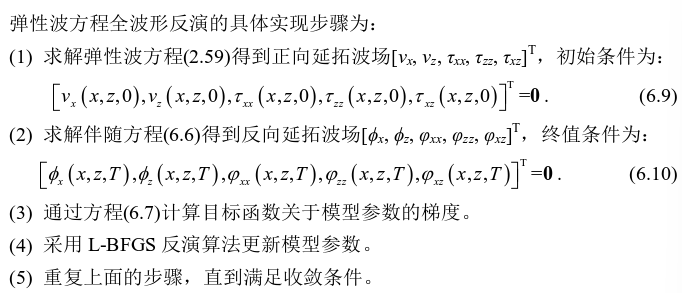
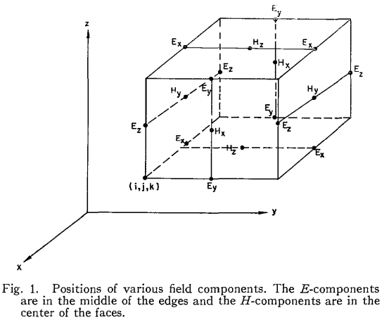

---
layout: page
permalink: /notes/fwi/old-vault/old-vault-009/index.html
title: GPRMax03 EMFWI理论推导
---

> Imported from old Obsidian vault on 2026-07-06. Source: `GPRMax03 EMFWI理论推导.md`
## 弹性波FWI理论推导
一阶弹性波速度-应力方程：
$$\begin{align}
\rho \frac{\partial v_x}{\partial t} &= \frac{\partial \tau_{xx}}{\partial x} + \frac{\partial \tau_{xz}}{\partial z}, \\
\rho \frac{\partial v_z}{\partial t} &= \frac{\partial \tau_{xz}}{\partial x} + \frac{\partial \tau_{zz}}{\partial z}, \\
\frac{\partial \tau_{xx}}{\partial t} &= (\lambda + 2\mu) \frac{\partial v_x}{\partial x} + \lambda \frac{\partial v_z}{\partial z}, \\
\frac{\partial \tau_{xz}}{\partial t} &= \lambda \frac{\partial v_x}{\partial x} + (\lambda + 2\mu) \frac{\partial v_z}{\partial z}, \\
\frac{\partial \tau_{zz}}{\partial t} &= \mu \left( \frac{\partial v_z}{\partial x} + \frac{\partial v_x}{\partial z} \right)
\end{align}$$
目标函数：
$$min_{v_p, v_s, \rho} E(v_p, v_s, \rho) = \frac{1}{2} \int_{(x,z) \in H} \int_0^T \left( (v_x - v_x^{obs})^2 + (v_z - v_z^{obs})^2 \right) dt dx dz$$
利用拉格朗日乘子法：
$$\begin{align}
\min_{v_p, v_s, \rho} J(v_p, v_s, \rho) &= \min_{v_p, v_s, \rho} E(v_p, v_s, \rho) + \int_{(x,z) \in H} \int_0^T \left( \phi_x e_1 + \phi_z e_2 + \varphi_{xx} e_3 + \varphi_{zz} e_4 + \varphi_{xz} e_5 \right) \mathrm{d}t \mathrm{d}x \mathrm{d}z, \\
e_1 &= \rho \frac{\partial v_x}{\partial t} - \frac{\partial \tau_{xx}}{\partial x} - \frac{\partial \tau_{xz}}{\partial z}, \\
e_2 &= \rho \frac{\partial v_z}{\partial t} - \frac{\partial \tau_{xz}}{\partial x} - \frac{\partial \tau_{zz}}{\partial z}, \\
e_3 &= \frac{\partial \tau_{xx}}{\partial t} - (\lambda + 2\mu) \frac{\partial v_x}{\partial x} - \lambda \frac{\partial v_z}{\partial z} \\
e_4 &= \frac{\partial \tau_{zz}}{\partial t} - \lambda \frac{\partial v_x}{\partial x} - (\lambda + 2\mu) \frac{\partial v_z}{\partial z}, \\
e_5 &= \frac{\partial \tau_{xz}}{\partial t} - \mu \left( \frac{\partial v_z}{\partial x} + \frac{\partial v_x}{\partial z} \right)\end{align}$$
其中$[\phi_x,\phi_z,\varphi_{xx},\varphi_{xz},\varphi_{zz}]$是拉格朗日乘子函数
对拉格朗日项做分部积分得到：
$$
\begin{align}
\min_{v_p, v_s, \rho} J(v_p, v_s, \rho) &= \min_{v_p, v_s, \rho} E(v_p, v_s, \rho)- \int_{(x,z) \in H} \int_0^T \left( v_x e_6 + v_z e_7 + \tau_{xx} e_8 + \tau_{zz} e_9 + \tau_{xz} e_{10} \right) \mathrm{d}t \mathrm{d}x \mathrm{d}z, \tag{6.4} \\
e_6 &= \rho \frac{\partial \phi_x}{\partial t} - (\lambda + 2\mu) \frac{\partial \varphi_{xx}}{\partial x} - \lambda \frac{\partial \varphi_{zz}}{\partial x} - \mu \frac{\partial \varphi_{xz}}{\partial z}, \tag{6.5a} \\
e_7 &= \rho \frac{\partial \phi_z}{\partial t} - (\lambda + 2\mu) \frac{\partial \varphi_{zz}}{\partial z} - \lambda \frac{\partial \varphi_{xx}}{\partial z} - \mu \frac{\partial \varphi_{xz}}{\partial x}, \tag{6.5b} \\
e_8 &= \frac{\partial \varphi_{xx}}{\partial t} - \frac{\partial \phi_x}{\partial x}, \tag{6.5c} \\
e_9 &= \frac{\partial \varphi_{zz}}{\partial t} - \frac{\partial \phi_z}{\partial z}, \tag{6.5d} \\
e_{10} &= \frac{\partial \varphi_{xz}}{\partial t} - \frac{\partial \phi_z}{\partial x} - \frac{\partial \phi_x}{\partial z}. \tag{6.5e}
\end{align}$$
令$\partial J/\partial[v_x,v_z,\tau_{xx},\tau_{xz},\tau_{zz}]^T=0$得到相应的伴随方程：
$$\begin{align*}
\rho \frac{\partial \phi_x}{\partial t} &= (\lambda + 2\mu) \frac{\partial \varphi_{xx}}{\partial x} + \lambda \frac{\partial \varphi_{zz}}{\partial x} + \mu \frac{\partial \varphi_{xz}}{\partial z} + (v_x - v_x^{\text{obs}}), \\
\rho \frac{\partial \phi_z}{\partial t} &= (\lambda + 2\mu) \frac{\partial \varphi_{zz}}{\partial z} + \lambda \frac{\partial \varphi_{xx}}{\partial z} + \mu \frac{\partial \varphi_{xz}}{\partial x} + (v_z - v_z^{\text{obs}}), \\
\frac{\partial \varphi_{xx}}{\partial t} &= \frac{\partial \phi_x}{\partial x}, \\
\frac{\partial \varphi_{zz}}{\partial t} &= \frac{\partial \phi_z}{\partial z}, \\
\frac{\partial \varphi_{xz}}{\partial t} &= \frac{\partial \phi_z}{\partial x} + \frac{\partial \phi_x}{\partial z}.
\end{align*}$$
相应的梯度公式为：
$$\begin{align}
\frac{\partial J}{\partial \rho} &= \int_0^T \phi_x \frac{\partial v_x}{\partial t} + \phi_z \frac{\partial v_z}{\partial t} \, \mathrm{d}t, \\
\frac{\partial J}{\partial \lambda} &= -\int_0^T \left( \varphi_{xx} + \varphi_{zz} \right) \left( \frac{\partial v_x}{\partial x} + \frac{\partial v_z}{\partial z} \right) \, \mathrm{d}t \\
\frac{\partial J}{\partial \mu} &= -\int_0^T 2 \varphi_{xx} \frac{\partial v_x}{\partial x} + 2 \varphi_{zz} \frac{\partial v_z}{\partial z} + \varphi_{xz} \left( \frac{\partial v_z}{\partial x} + \frac{\partial v_x}{\partial z} \right) \, \mathrm{d}t, 
\end{align}$$
根据链式法则得到目标函数关于速度和密度的导数公式：
$$\begin{align}
\frac{\partial J}{\partial \rho} &= \left( v_p^2 - 2 v_s^2 \right) \frac{\partial J}{\partial \lambda} + v_s^2 \frac{\partial J}{\partial \mu} + \frac{\partial J}{\partial \rho}, \\
\frac{\partial J}{\partial v_p} &= 2 \rho v_p \frac{\partial J}{\partial \lambda}, \\
\frac{\partial J}{\partial v_s} &= -4 \rho v_s \frac{\partial J}{\partial \lambda} + 2 \rho v_s \frac{\partial J}{\partial \mu}.
\end{align}$$

## 电磁场FWI
### 正演
各向同性介质中的Maxwell方程组：
$$\begin{align}
\frac{\partial \mathbf{B}}{\partial t}+\nabla\times\mathbf{E}+\mathbf{M}=0\\
\frac{\partial \mathbf{D}}{\partial t}-\nabla\times\mathbf{H}=\mathbf{J}\\
\nabla\cdot \mathbf{D}=\rho_e \\
\nabla\cdot\mathbf{B}=\rho_m \\
\mathbf{B}=\mu\mathbf{H}\\
\mathbf{D}=\epsilon\mathbf{E}
\end{align}$$
where $\mathbf{J},\mu,\epsilon$ are assumed to be given functions of space and time
其中E是电场强度，D是电位移矢量，H是磁场强度，B是磁感应强度（磁通量密度），J是电流密度，M是磁流密度，$\rho_e$是电荷密度，$\rho_m$是磁荷密度，$\epsilon$是介质介电常数，$\mu$是磁导率。
自由空间中：
$$\begin{align}
\epsilon &=\epsilon_0=8.854\times10^{-12}F/m \\
\mu &=\mu_0=4\pi\times10^{-7}H/m
\end{align}$$
电流密度$\mathbf{J}=\mathbf{J}_c+\mathbf{J}_i$ ,其中$\mathbf{J}_c=\sigma\mathbf{E},\sigma是电导率(S/m)$，$J_i$是施加电流密度
磁流密度$\mathbf{M}=\mathbf{M}_c+\mathbf{M}_i$,其中$\mathbf{M}_c=\sigma^* H,\sigma_*是磁导率(H/m)$
重写Maxwell方程得到：
$$\begin{align}
\nabla\times\mathbf{H}=\epsilon\frac{\partial \mathbf{E}}{\partial t}+\sigma\mathbf{E}+\mathbf{J} \\
\nabla\times\mathbf{E}=-\mu\frac{\partial \mathbf{H}}{\partial t}-\sigma^*\mathbf{H}-M
\end{align}$$

标量形式：
$$\begin{align}
    \frac{\partial E_x}{\partial t} &= \frac{1}{\epsilon} \left( \frac{\partial H_z}{\partial y} - \frac{\partial H_y}{\partial z} - J_{Sx} - \sigma E_x \right) \\
    \frac{\partial E_y}{\partial t} &= \frac{1}{\epsilon} \left( \frac{\partial H_x}{\partial z} - \frac{\partial H_z}{\partial x} - J_{Sy} - \sigma E_y \right) \\
    \frac{\partial E_z}{\partial t} &= \frac{1}{\epsilon} \left( \frac{\partial H_y}{\partial x} - \frac{\partial H_x}{\partial y} - J_{Sz} - \sigma E_z \right) \\
    \frac{\partial H_x}{\partial t} &= \frac{1}{\mu} \left( \frac{\partial E_y}{\partial z} - \frac{\partial E_z}{\partial y} - M_{Sx} - \sigma^* H_x \right) \\
    \frac{\partial H_y}{\partial t} &= \frac{1}{\mu} \left( \frac{\partial E_z}{\partial x} - \frac{\partial E_x}{\partial z} - M_{Sy} - \sigma^* H_y \right) \\
    \frac{\partial H_z}{\partial t} &= \frac{1}{\mu} \left( \frac{\partial E_x}{\partial y} - \frac{\partial E_y}{\partial x} - M_{Sz} - \sigma^* H_z \right)
\end{align}$$

考虑GPR满足的介质条件：$\sigma^*=0, M=0$
得到三维FDTD的更新方程：
$$\begin{align}
    \frac{\partial E_x}{\partial t} &= \frac{1}{\epsilon} \left( \frac{\partial H_z}{\partial y} - \frac{\partial H_y}{\partial z} - J_{Sx} - \sigma E_x \right) \\
    \frac{\partial E_y}{\partial t} &= \frac{1}{\epsilon} \left( \frac{\partial H_x}{\partial z} - \frac{\partial H_z}{\partial x} - J_{Sy} - \sigma E_y \right) \\
    \frac{\partial E_z}{\partial t} &= \frac{1}{\epsilon} \left( \frac{\partial H_y}{\partial x} - \frac{\partial H_x}{\partial y} - J_{Sz} - \sigma E_z \right) \\
    \frac{\partial H_x}{\partial t} &= \frac{1}{\mu} \left( \frac{\partial E_y}{\partial z} - \frac{\partial E_z}{\partial y} \right) \\
    \frac{\partial H_y}{\partial t} &= \frac{1}{\mu} \left( \frac{\partial E_z}{\partial x} - \frac{\partial E_x}{\partial z} \right) \\
    \frac{\partial H_z}{\partial t} &= \frac{1}{\mu} \left( \frac{\partial E_x}{\partial y} - \frac{\partial E_y}{\partial x} \right)
\end{align}$$
取数值网格$(i,j,k)=(i\Delta x,j\Delta y,k\Delta z)$ and function$F(i\Delta x,j\Delta y,k\Delta z,n\Delta t)=F^n(i,j,k)$

E的分量置于棱，H的分量置于面心;并且，电场分量的取值在整数时间步，磁场分量取值在半整数时间步$0.5\Delta t,1.5\Delta t,\cdots,(n+0.5)\Delta t$。上图构成Yee氏单元。

CFL condition:
$$\sqrt{(\Delta x)^2+(\Delta y)^2+(\Delta z)^2}>c\Delta t=\sqrt{\frac{1}{\epsilon\mu}}\Delta t$$
差分方程（以第一个方程为例）：
$$\frac{E_x^{n+1}(i,j,k)-E_x^n(i,j,k)}{\Delta t}=\frac{1}{\epsilon(i,j,k)}[\frac{H_z^{n+1/2}(i,j,k)-H_z^{n+1/2}(i,j-1,k)}{\Delta y}-\frac{H_y^{n+1/2}(i,j,k)-H_y^{n+1/2}(i,j,k-1)}{\Delta z}]-\frac{\sigma(i,j,k)}{\epsilon(i,j,k)}E_x^{n+1/2}(i,j,k)-\frac{1}{\epsilon(i,j,k)}J_x^{n+1/2}$$
其中$$E_x^{n+1/2}=\frac{E_x^{n+1}(i,j,k)+E_x^n(i,j,k)}{2}$$
对二维问题，几何形状与z方向无关。方程可简化为两种相互独立的模式——TEz和TMz，
TE波的磁场仅有z分量：
$$\begin{align}
\frac{\partial E_x}{\partial t} &= \frac{1}{\epsilon} \left( \frac{\partial H_z}{\partial y}  - J_{Sx} - \sigma E_x \right) \\
    \frac{\partial E_y}{\partial t} &= \frac{1}{\epsilon} \left(  - \frac{\partial H_z}{\partial x} - J_{Sy} - \sigma E_y \right) \\
    \frac{\partial H_z}{\partial t} &= \frac{1}{\mu} \left( \frac{\partial E_x}{\partial y} - \frac{\partial E_y}{\partial x} \right)
\end{align}$$
TM波的电场仅有z分量：
$$\begin{align}
 \frac{\partial H_x}{\partial t} &= -\frac{1}{\mu}\frac{\partial E_z}{\partial y}  \\
    \frac{\partial H_y}{\partial t} &= \frac{1}{\mu}  \frac{\partial E_z}{\partial x}\\
    \frac{\partial E_z}{\partial t} &= \frac{1}{\epsilon} \left( \frac{\partial H_y}{\partial x} - \frac{\partial H_x}{\partial y} - J_{Sz} - \sigma E_z \right) 
\end{align}$$
总的解可以视为两者解的叠加。
## 二维GPR FWI原理推导
我们先建立数值网格$N_x\times N_y\times N_t$，z方向设为一层的薄层。并对每个网格点$(i,j,k)$赋值四个电磁参数：$f1:\epsilon_r \quad 相对介电常数$ $f2:\sigma\quad电导率$ $f3:\mu_r\quad 相对磁导率$ $f4:\sigma_* 磁损耗，单位\Omega / m$ 
假设$\sigma_*\equiv0，且没有施加电流J$。
设有$N_s$个source，表面设有$N_r$个的receivers。观测数据$d_{obs}[i][j]=(E_x,E_y,E_z,H_x,H_y,H_z$)，ij索引表示第i个source激发第j个receiver接收到的时间序列，假设数据有统一的时窗$T$
构建关于模型$m$和观测区域$H$的目标函数:
$$E(m)=\frac{1}{2}\int_{(x,y)\in H}\int_0^T(||E-E^{obs}||_2+||H-H^{obs}||_2)dxdydt$$
利用拉格朗日乘子法构建约束下的优化问题：
	$$min_m\quad J(m)=E(m)+\int_{(x,y)\in H}\int_0^T(e_1\xi_1+e_2\xi_2+e_3\xi_3+h_1\xi_4+h_2\xi_5+h_3\xi_6)dxdydt$$
	其中$e_i(x,y,t),h_j(x,y,t)$是待定的Lagrange乘子函数。
	$$\begin{align}
	\xi_1&=\frac{\partial E_x}{\partial t} - \frac{1}{\epsilon} \left( \frac{\partial H_z}{\partial y}  - \sigma E_x \right) \\
    \xi_2&=\frac{\partial E_y}{\partial t}+ \frac{1}{\epsilon} \left(  \frac{\partial H_z}{\partial x} + \sigma E_y \right) \\
    \xi_3&=\frac{\partial E_z}{\partial t} - \frac{1}{\epsilon} \left( \frac{\partial H_y}{\partial x} - \frac{\partial H_x}{\partial y}  - \sigma E_z \right) \\
    \xi_4&=\frac{\partial H_x}{\partial t} +\frac{1}{\mu}\frac{\partial E_z}{\partial y}  \\
    \xi_5&=\frac{\partial H_y}{\partial t}- \frac{1}{\mu}  \frac{\partial E_z}{\partial x}\\
    \xi_6&=\frac{\partial H_z}{\partial t}- \frac{1}{\mu} \left( \frac{\partial E_x}{\partial y} - \frac{\partial E_y}{\partial x} \right)
	\end{align}$$由于观测区域可任意取，总能取足够大的观测区域使得边界处无电磁场，因此对上式拉格朗日项分部积分得到： 注意：其中对时间的偏导项在求分部积分时会出现0,T时边界值，需要设为0作为边界条件：正演波场初始值=0，伴随波场反传终值T时值=0
	$$min_m\quad J(m)=E(m)-\int_{(x,y)\in H}\int_0^T(E_x\phi_1+E_y\phi_2+E_z\phi_3+H_x\phi_4+H_y\phi_5+H_z\phi_6)dxdydt$$
	其中：
	$$\begin{align}
	\phi_1&=\frac{\partial e_1}{\partial t} - \frac{1}{\epsilon} \left( \frac{\epsilon}{\mu}\frac{\partial h_3}{\partial y}  - \sigma e_1 \right) \\
    \phi_2&=\frac{\partial e_2}{\partial t}+ \frac{1}{\epsilon} \left(  \frac{\epsilon}{\mu}\frac{\partial h_3}{\partial x} + \sigma e_2 \right) \\
    \phi_3&=\frac{\partial e_3}{\partial t} - \frac{1}{\epsilon} \left( \frac{\epsilon}{\mu}\frac{\partial h_2}{\partial x} - \frac{\epsilon}{\mu}\frac{\partial h_1}{\partial y}  - \sigma e_3 \right) \\
    \phi_4&=\frac{\partial h_1}{\partial t} +\frac{1}{\mu}\frac{\mu}{\epsilon}\frac{\partial e_3}{\partial y}  \\
    \phi_5&=\frac{\partial h_2}{\partial t}- \frac{1}{\mu} \frac{\mu}{\epsilon} \frac{\partial e_3}{\partial x}\\
    \phi_6&=\frac{\partial h_3}{\partial t}- \frac{1}{\mu} \frac{\mu}{\epsilon}\left( \frac{\partial e_1}{\partial y} - \frac{\partial e_2}{\partial x} \right)
	\end{align}$$
	为方便起见，取$e_i=\frac{\epsilon}{\mu}e_i'\quad for \quad i=1,2,3$ 则上式改写为：
	$$\begin{align}
	\phi_1&=\frac{\epsilon}{\mu}[\frac{\partial e_1'}{\partial t} - \frac{1}{\epsilon} \left( \frac{\partial h_3}{\partial y}  - \sigma e_1' \right)]=\frac{\epsilon}{\mu}\phi_1' \\
    \phi_2&=\frac{\epsilon}{\mu}[\frac{\partial e_2'}{\partial t}+ \frac{1}{\epsilon} \left(\frac{\partial h_3}{\partial x} + \sigma e_2' \right)] =\frac{\epsilon}{\mu}\phi_2'\\
    \phi_3&=\frac{\epsilon}{\mu}[\frac{\partial e_3'}{\partial t} - \frac{1}{\epsilon} \left( \frac{\partial h_2}{\partial x} - \frac{\partial h_1}{\partial y}  - \sigma e_3' \right) ]=\frac{\epsilon}{\mu}\phi_3'\\
    \phi_4&=\frac{\partial h_1}{\partial t} +\frac{1}{\mu}\frac{\partial e_3'}{\partial y}  \\
    \phi_5&=\frac{\partial h_2}{\partial t}- \frac{1}{\mu} \frac{\partial e_3'}{\partial x}\\
    \phi_6&=\frac{\partial h_3}{\partial t}- \frac{1}{\mu}\left( \frac{\partial e_1'}{\partial y} - \frac{\partial e_2'}{\partial x} \right)
	\end{align}$$
	$$min_m\quad J(m)=E(m)-\int_{(x,y)\in H}\int_0^T[\frac{\epsilon}{\mu}(E_x\phi'_1+E_y\phi'_2+E_z\phi'_3)+H_x\phi_4+H_y\phi_5+H_z\phi_6]dxdydt$$
	对上式取条件极值条件$\partial J/\partial [\mathbf{E},\mathbf{H}]^T=0$得到关于拉格朗日乘子函数的**伴随方程**：
	$$\begin{align}
	E_x-E_x^{obs}-\frac{\epsilon}{\mu}\phi_1'=0\\
	E_y-E_y^{obs}-\frac{\epsilon}{\mu}\phi_2'=0\\
	E_z-E_z^{obs}-\frac{\epsilon}{\mu}\phi_3'=0\\
	H_x-H_x^{obs}-\phi_4=0\\
	H_y-H_y^{obs}-\phi_5=0\\
	H_z-H_z^{obs}-\phi_6=0
	\end{align}$$
	即：
	$$\begin{align}
	\frac{\partial e_1'}{\partial t} &= \frac{1}{\epsilon} \left( \frac{\partial h_3}{\partial y}  - \sigma e_1' \right)+\frac{\mu}{\epsilon}(E_x-E_x^{obs}) \\
    \frac{\partial e_2'}{\partial t}&=-\frac{1}{\epsilon} \left(\frac{\partial h_3}{\partial x} + \sigma e_2' \right) +\frac{\mu}{\epsilon}(E_y-E_y^{obs})\\
    \frac{\partial e_3'}{\partial t} &= \frac{1}{\epsilon} \left( \frac{\partial h_2}{\partial x} - \frac{\partial h_1}{\partial y}  - \sigma e_3' \right) +\frac{\mu}{\epsilon}(E_z-E_z^{obs})\\
    \frac{\partial h_1}{\partial t} &=-\frac{1}{\mu}\frac{\partial e_3'}{\partial y}  +(H_x-H_x^{obs})\\
    \frac{\partial h_2}{\partial t}&=\frac{1}{\mu} \frac{\partial e_3'}{\partial x} +(H_y-H_y^{obs})\\
    \frac{\partial h_3}{\partial t}&= \frac{1}{\mu}\left( \frac{\partial e_1'}{\partial y} - \frac{\partial e_2'}{\partial x} \right)+(H_z-H_z^{obs})
	\end{align}$$
 可见伴随波场$\mathbf{e'},\mathbf{h}$满足含震源项(数据残差)的二维问题Maxwell方程。
 求得相应的梯度公式应为：**?????????** 不确定也不知道是怎么推来的。
 $$\begin{align}
 \frac{\partial J}{\partial \sigma}&=-\int_0^T\frac{1}{\mu}\mathbf{E}\cdot\mathbf{e'}dt\\
 \frac{\partial J}{\partial \epsilon}&=-\int_0^T\frac{1}{\mu}\mathbf{E}\cdot\frac{\partial\mathbf{e'}}{\partial t}dt\\
 \frac{\partial J}{\partial \mu}&=-\int_0^T\frac{\epsilon}{\mu^2}(E_x\phi'_1+E_y\phi'_2+E_z\phi'_3)+\frac{1}{\mu^2}[H_x\frac{\partial e_3'}{\partial y}-H_y\frac{\partial e_3'}{\partial x}-H_z(\frac{\partial e_1'}{\partial y}-\frac{\partial e_2'}{\partial x})]
 \end{align}$$
问题讨论：
1. 简单目标函数构建是否正确
2. 拉格朗日乘子法的推导是否正确
3. 伴随波场应该如何计算？设置的激发源条件、初值条件
4. 梯度公式推导是否正确，如何在数值时计算？
5. 源项应该用什么作为激发？电流密度、磁偶极子
6. 正常观测数据量和网格参数量的大小关系？多少观测数据量能比较好地Inverse一个$N_x\times N_y$的参数网格
7. 正演程序中PML吸收边界默认定义的是10个units向两侧扩展，是否满足需要。

