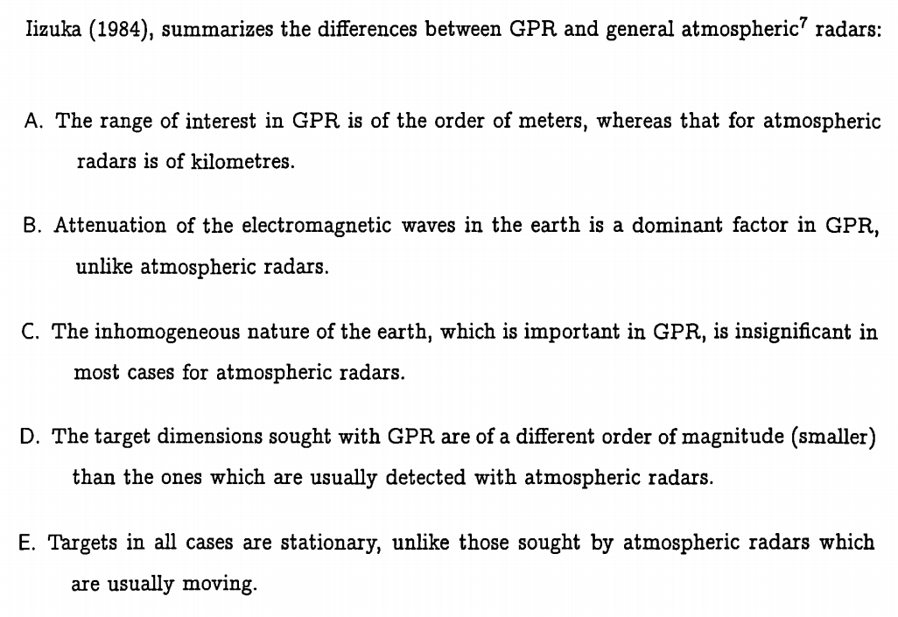

---
layout: page
permalink: /notes/fwi/old-vault/old-vault-010/index.html
title: GPRMax04 Basic principles of GPR
---

> Imported from old Obsidian vault on 2026-07-06. Source: `GPRMax04 Basic principles of GPR.md`
### radar equation
serves as a mathematical description of radar's detection mechanism:
$$P_r=\frac{P_tG_rG_t\sigma^2\lambda^2L_s}{(4\pi)^3R^4}$$
where $P_r$ is the power received by the radar(watt)
$P_t$ is the transmitted power
$G_r,G_t$ are the gain of the transmitting and receiving antennas respectively
$\sigma$ is the radar cross-section(RCS)(square metre)
$\lambda$ is the wavelength of the electromagnetic wave(metre)
$L_s$ is a factor representing the average losses of the  system
$R$ is the distance to the object

the gain of an antenna is a measure of the increased power radiated in a given direction as compared with the power with which an isotropic antenna would have radiated

RCS is a measure of the size of the object as seen by the radar

noise is always present, the signal to noise ratio(SNR) is defined as the power received over the power of the noise present
$$SNR=\frac{P_r}{P_n}$$ An estimate for the maximum range could be obtained from:
$$R=[\frac{P_rG_rG_t\sigma^2\lambda^2L_s}{(4\pi)^3(SNR)P_n}]^{1/4}$$
Resolution is defined as the minimum distance between objects in order that both can be detected as individual entities by the radar
if a radar transmits a pulse of duration $\tau$, 
$$\Delta R=\frac{c\tau}{2}$$
The higher the frequency content of t he transmitted pulse, the greater the accuracy of the range measurement.

Bandwidth(B) is used as a measure of a radar system's ability to accurately determine range:
$$B=\frac{1}{\tau}$$
The pulse repetition frequency(PRF) is selected at the design stage,

### General principles
GPR is designed to locate discontinuities in  the electrical properties of the subsurface
介质中雷达波存在衰减attenuation, GPR雷达方程为
$$P_r=\frac{P_tG_rG_t\sigma^2\lambda^2L_se^{-\alpha4R}}{(4\pi)^3R^4}$$
$\alpha$是一个衰减常数

### GPR systems
two main categories: continuous wave systems and carrier-free systems

in CW, a pulse--usually a single tone--is transmitted continuously from the GPR antenna and the amplitude and phase of the reflected signal is recorded. 

in carrier-free, the signal is transmitted without being modulated into a carrier. large bandwidth. superior ranging abilities
its relative bandwidth is $n=\frac{f_h-f_l}{f_h+f_l}$,where $f_h,f_l$ are the highest and lowest freq transmitted

FM-CW GPR frequency modulated continuous wave

## 论文 2006 James Irving
Surface-based reflection GPR is modeled using a transverse magnetic(TM-) mode formulation. 
Crosshole and vertical radar profiling(VRP) geometries are modeled using a transverse electric(TE-) mode formulation.

To introduce an electric field source: Add a source pulse function to the update for the $E_y$ field component at the desired spatial location. This amounts to adding the source function to the y-component of the current density term in Max-well's equations.
即对surface-based的数据，用一个垂直平面方向的电流密度来模拟激发源。

