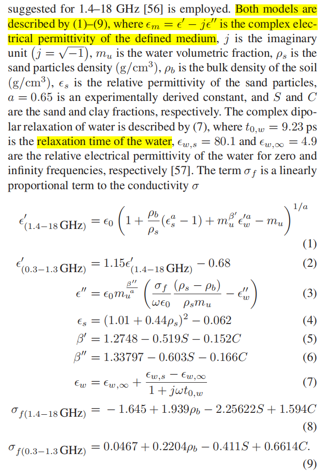
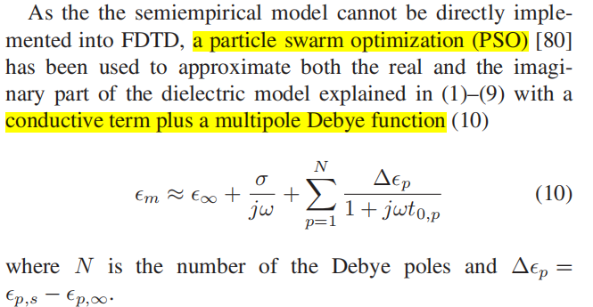

---
layout: page
permalink: /notes/fwi/old-vault/old-vault-011/index.html
title: GPRMax05 Iraklis 2016
---

> Imported from old Obsidian vault on 2026-07-06. Source: `GPRMax05 Iraklis 2016.md`
Use gprMax to numerically solves Maxwell's equations by using a second-order FDTD algorithm

one challenging problem: accurately implement the dielectric properties of the soil, its frequency-dependent electrical permittivity

use generic bowtie high-frequency GPR transducers 

模型设定：

Model setting
$\Delta x =\Delta y =\Delta z =1mm=0.001m$
$1000\times400\times300$ cells model 
