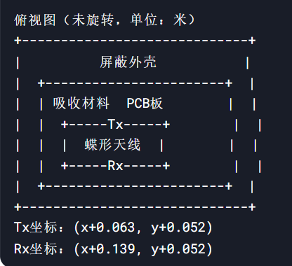
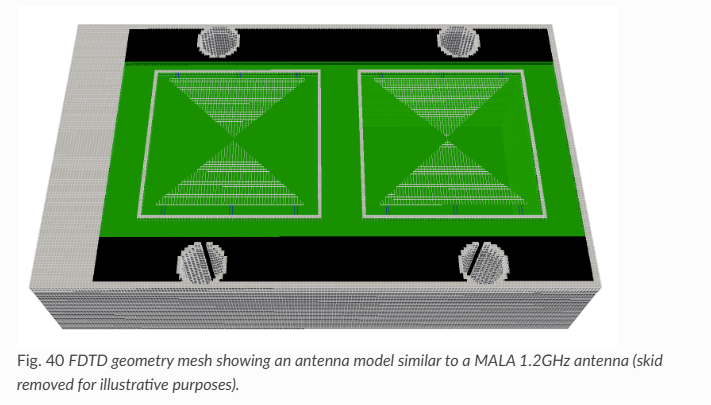

---
layout: page
permalink: /notes/fwi/old-vault/old-vault-012/index.html
title: GPRMax06 bowtie antenna setting
---

> Imported from old Obsidian vault on 2026-07-06. Source: `GPRMax06 bowtie antenna setting.md`
[[GPRMax01 InputFile commands]]

天线外壳尺寸为184mm×108mm×46mm
不设置旋转时，接受的电场方向为$E_y$ 
发射点和接收点水平间距0.076m

