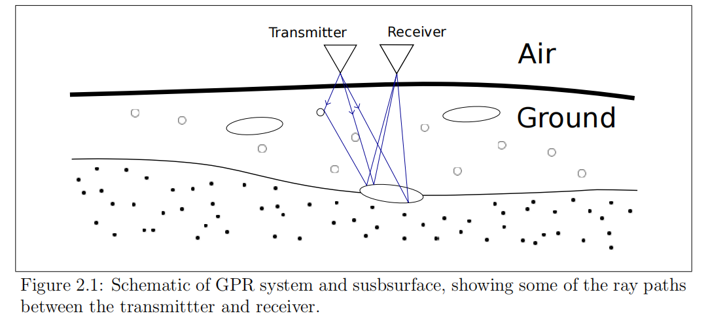
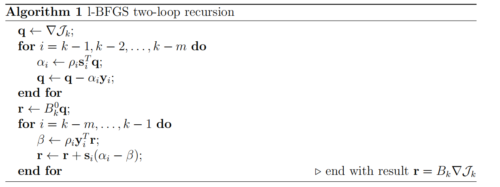
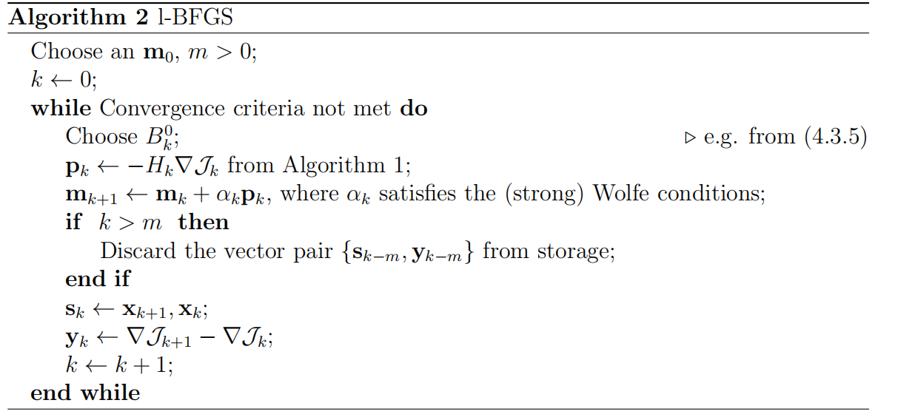

---
layout: page
permalink: /notes/fwi/old-vault/old-vault-014/index.html
title: GPRMax08 Book Landmine detection
---

> Imported from old Obsidian vault on 2026-07-06. Source: `GPRMax08 Book Landmine detection.md`
## Chapter 2 FWI of GPR data
Ground penetrating radar equipment consists of one or more transmitting antennae and one or more receiving antennae either on or above the ground surface or buried in boreholes; a processor; and a display

Most GPR systems use an impulse signal, with the reflections being recorded by a sampling receiver in the time domain

Commercially available GPR systems either monostatic or Bistatic

A-scan is a single recorded waveform, a Bscan is an ensemble of waveforms in one surface coordinate direction, and the C -scan is an ensemble of waveforms over both surface coordinate directions for a fixed time (or depth)

"Inverse Crime"?? simulation and inversion not same grid  Kaipio and Somersalo[81]

