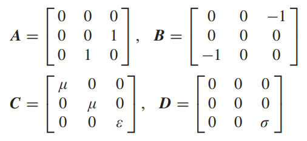
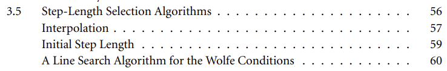

---
layout: page
permalink: /notes/fwi/old-vault/old-vault-016/index.html
title: GPRMax10 2019 Multiscale on-ground GPR FWI
---

> Imported from old Obsidian vault on 2026-07-06. Source: `GPRMax10 2019 Multiscale on-ground GPR FWI.md`
### Forward Problem
TM波 2D nondispersive medium
$$Lu=j$$
$L$是微分算子，$u$是波场矢量，$j$是源矢量
$$
\begin{align}
	L & \equiv A\partial_x+B\partial_z-C\partial_t-D\\
			u & = \begin{pmatrix}H_x&H_z &E_y\end{pmatrix}^T\\
			j& = \begin{pmatrix}0&0 &J_y\end{pmatrix}^T
\end{align}$$
系数矩阵定义如下：

FDTD: second-order accuracy in both time and space, staggered-grid
激发源都是软源：soft sources; 这里相当于hertzian dipole
with CPML边界

### Inverse Problem
我们的目标函数：
$$S(m)=\frac{1}{2}\sum_{i=1}^M\sum_{j=1}^N \int_0^T[E_i(m,\vec{r_j},t)-E_i^{obs}(\vec{r_j},t)]^2dt$$
其中$M$是number of sources;$N$是number of receivers for each source，T是时窗，$\vec{r_j}$是第j个receiver对应的坐标；
$$m=[\mu(r),\varepsilon(r),\sigma(r)]^T$$
#### L-BFGS algorithm
对iteration k:
$$m^{(k+1)}=m^{(k)}+a^{(k)}p^{(k)}$$
$a^{(k)}$指search step length, determined by an inexact line searching method with the Wolfe conditions. **???**

$p^{(k)}$是update direction

需要计算Frechet导数
$$S'_m \delta m = \sum_{i=1}^{M} \sum_{j=1}^{N} \int_{0}^{T} v_i^T(m, r_j, t) \delta E_i(m, r_j, t) dt$$
where
$$
\begin{align}
\delta m &= (\delta \epsilon(r), \delta \sigma(r), \delta \mu(r))^T \\
v_i(m, r_j, t) &= E_i(m, r_j, t) - E_i^{obs}(r_j, t)
\end{align}$$
$\delta E_i$就是第i个source相应的电场分量的导数

初始条件：$\delta u_i(m,r,0)=0$ 

考虑:
$$\begin{align*}
&A \partial_x u + B \partial_z u - C \partial_t u - Du = j \tag{10} \\
&A \partial_x (u + \delta u) + B \partial_z (u + \delta u) \\
&- (C + \delta C) \partial_t (u + \delta u) - (D + \delta D)(u + \delta u) = j. \tag{11}
\end{align*}$$
$$\begin{align}
A \partial_x \delta u + B \partial_z \delta u - C \partial_t \delta u - D \delta u =\\ \delta C \partial_t u + \delta Du + \delta C \partial_t \delta u + \delta D \delta u \tag{12}\end{align}$$
where 
$$

\delta C = \begin{bmatrix}
\delta \mu & 0 & 0 \\
0 & \delta \mu & 0 \\
0 & 0 & \delta \epsilon
\end{bmatrix}, \quad
\delta D = \begin{bmatrix}
0 & 0 & 0 \\
0 & 0 & 0 \\
0 & 0 & \delta \sigma
\end{bmatrix}. \tag{13}
$$
忽略高阶项$\delta C\partial_t\delta u, \delta D \delta u$ 
$$L \delta u = \delta C \partial_t u + \delta Du. \tag{14}$$
定义adjoint operator $L*$, defined by:
$$\langle L^* w, \delta u \rangle = \langle w, L \delta u \rangle \tag{16}$$
where $w = (H_x^*,H_z^*,E_y^*)^T$ is an adjoint field. 
可以推出
$$\int_0^T \int_V (L^* w)^T \delta u \, dv \, dt = \int_0^T \int_V w^T L \delta u \, dv \, dt. \tag{17}$$
##### 证明
(17)式的右手边：
$$
\begin{align}
& \int_0^T \int_V w^T L \delta u \, dv \, dt =\\
&\int_0^T \int_V \left( w^T A \partial_x \delta u + w^T B \partial_z \delta u - w^T C \partial_t \delta u - w^T D \delta u \right) \, dv \, dt. \tag{A1}
\end{align}$$
右边积分第一项作分部积分：
$$\begin{align*}
&\int_0^T \int_V w^T A \partial_x \delta u \, dv \, dt \\
&= \int_0^T \int_V \frac{\partial (w^T A \delta u)}{\partial x} \, dv \, dt - \int_0^T \int_V \frac{\partial (w^T A)}{\partial x} \delta u \, dv \, dt \\
&= \int_0^T \left( \int_S w^T A \delta u \, dy \, dz \bigg|_{x=-\infty}^{x=+\infty} \right) dt - \int_0^T \int_V \frac{\partial (w^T A)}{\partial x} \delta u \, dv \, dt. \tag{A2}
\end{align*}$$

考虑到电磁波的衰减性质，无穷远处$\delta u=0$
$$\int_0^T \int_V w^T A \partial_x \delta u \, dv \, dt = - \int_0^T \int_V \frac{\partial (w^T A)}{\partial x} \delta u \, dv \, dt. \tag{A3}$$
类似对第二项做变换：
$$\int_0^T \int_V w^T B \partial_z \delta u \, dv \, dt = - \int_0^T \int_V \frac{\partial (w^T B)}{\partial z} \delta u \, dv \, dt. \tag{A4}$$
对第三项做分部积分：
$$\int_0^T \int_V w^T C \partial_t \delta u \, dv \, dt = \int_V (w^T C \delta u \bigg|_{t=T}) \, dV - \int_0^T \int_V \frac{\partial (w^T C)}{\partial t} \delta u \, dv \, dt. \tag{A5}$$
根据初始条件$\delta u|_{t=0}=0$
并设定伴随波场终止条件$w|_{t=T}=0$
上式等于：
$$\int_0^T \int_V w^T C \partial_t \delta u \, dv \, dt = - \int_0^T \int_V \frac{\partial (w^T C)}{\partial t} \delta u \, dv \, dt. \tag{A6}$$
代入原式：
$$\begin{align*}
&\int_0^T \int_V (L^* w)^T \delta u \, dv \, dt \\
&= \int_0^T \int_V \left[ -\frac{\partial (w^T A)}{\partial x} - \frac{\partial (w^T B)}{\partial z} + \frac{\partial (w^T C)}{\partial t} - w^T D \right] \delta u \, dv \, dt. \tag{A7}
\end{align*}$$
最终得到：
$$L^* = -A^T \partial_x - B^T \partial_z + C^T \partial_t - D^T. \tag{A8}$$
##### 
伴随波场应当满足微分方程和终止条件：
$$\begin{align*}
L^* w_i &= i_y \sum_{j=1}^N v_i(m, r_j, t) \delta(r - r_j) \tag{18} \\
w_i(m, r, T) &= 0 \tag{19}
\end{align*}$$
其中$i_y$是y方向的单位矢量,即在每个检波器的位置上放残差项

we have 
$$\int_0^T \int_V \left[ i_y \sum_{j=1}^N v_i(m, r_j, t) \delta(r - r_j) \right]^T \delta u_i \, dv \, dt = \int_0^T \int_V w_i^T (\delta C \partial_t u_i + \delta Du_i) \, dv \, dt \tag{20}$$
左侧把delta函数积分：
$$\sum_{j=1}^N \int_0^T v_i^T(m, r_j, t) \delta E_i(m, r_j, t) \, dt = \int_0^T \int_V w_i^T (\delta C \partial_t u_i + \delta Du_i) \, dv \, dt. \tag{21}$$
代入Freche导数：
$$S'_m \delta m = \sum_{i=1}^M \int_0^T \int_V w_i^T (\delta C \partial_t u_i + \delta Du_i) \, dv \, dt. \tag{22}$$
上式重写为：
$$S'_m \delta m = \langle g_\mu, \delta \mu \rangle + \langle g_\epsilon, \delta \epsilon \rangle + \langle g_\sigma, \delta \sigma \rangle \tag{23}$$
得到梯度公式：
$$
\begin{align*}
g_\mu &= \sum_{i=1}^M \int_0^T \left( H_x^* \frac{\partial H_x}{\partial t} + H_z^* \frac{\partial H_z}{\partial t} \right) dt \tag{24} \\
g_\epsilon &= \sum_{i=1}^M \int_0^T E_y^* \frac{\partial E_y}{\partial t} \, dt \tag{25} \\
g_\sigma &= \sum_{i=1}^M \int_0^T E_y^* E_y \, dt. \tag{26}
\end{align*}
$$
取相对介电常数相对电导率，化归到同一量级
归一化因子$\beta$ ? 2014 Lavoue

model vector显式表达：
$$m = \begin{pmatrix} \varepsilon_r \\ \sigma_r / \beta \end{pmatrix}, \quad g(m) = \begin{pmatrix} \varepsilon_0 g_\varepsilon \\ \beta g_\sigma / \eta_0 \end{pmatrix} \tag{27}$$
其中$\varepsilon_0,\eta_0$是常数，$\beta$是可调整的参数

### GPR FWI 策略与优化算法

#### TV正则化
#### Multiscale

