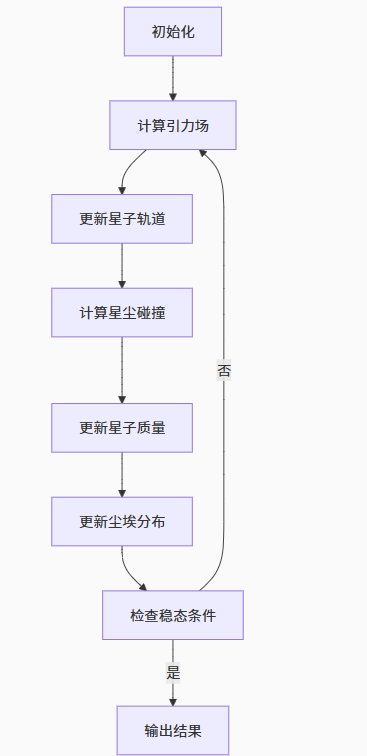

---
layout: page
permalink: /notes/fwi/old-vault/old-vault-035/index.html
title: 行星形成模拟方案
---

> Imported from old Obsidian vault on 2026-07-06. Source: `行星形成模拟方案.md`
## 基本想法
和刘讨论完后根据deepseek的回答：

打算考虑一个薄盘柱坐标系中，给定恒星引力场，给定细小尘埃颗粒分布，然后在这个系统内投入若干相对尘埃较大的“星子”，模拟“星子”逐步吸收尘埃质量增大直到整个系统收敛到稳态的过程。

初始的尘埃盘范围在0.5~5 AU。

设定开放边界，大于逃逸半径的物质将消失。

#### **尘埃分布初始化**

- 面密度分布：$Σ(r) = Σ₀(r/1  AU)^{-p}$ (p=1.5-2.0 符合观测)
    
- 垂直分布：$ρ(z) = \frac{Σ(r)}{\sqrt{2πh}} * exp(-z²/(2h²))，h=0.05r$ 
    
- 速度场：$v_θ = \sqrt{GM/r}*(1 - (h/r)²)^{1/4}$ (考虑压力支撑)
    
- 质量离散化：将尘埃划分为N个超粒子，每个代表1e18 kg质量 （这里有待讨论，用网格质量追踪法还是用N体模拟）

#### 星子 尘埃相互作用模型

 - 碰撞截面：$σ = π(R_s + R_d)²(1 + v_esc²/v_rel²)$ (考虑引力聚焦效应)
    
    - R_s: 星子半径
        
    - $v_{esc} = \sqrt{2GM_s/R_s}$: 逃逸速度
        
    - v_rel: 相对速度
- 吸积效率
```python
	def accretion_efficiency(v_rel, v_esc):
    if v_rel < 0.5*v_esc:
        return 0.8  # 高效吸积
    elif v_rel < v_esc:
        return 0.3*(v_esc - v_rel)/(0.5*v_esc)
    else:
        return 0.0  # 无法捕获
```


完全非弹性碰撞假设，耗散能量转化为热能（不考虑辐射）

- 星子演化方程：
	- 质量增长：$dm/dt = Σ(r) * σ * v_rel * η$ (η为吸积效率)
	- 轨道演化方程：
			$$d²r/dt² = -GM/r² + (F_{drag} + F_{grav})/m_s$$
$$F_{drag} = 0.5*C_d*ρ_{gas}*A*v_{rel}² (气体阻力)$$
$$F_{grav} = Σm_d*G/(r^2) (尘埃集体引力)$$
- 采用Leapfrog 积分器进行运动学更新


### 更新尘埃分布 
$$ ∂Σ_d/∂t + ∇·(Σ_d v) = -S_{acc} $$
$$S_{acc}​=\sum_i​\sigma_i​ v_{rel,i}​\eta_i ​f(r_i​)$$
尘埃分布的演化受以下主要机制支配：
1. **轨道漂移**：尘埃在恒星引力作用下的开普勒运动
    
2. **湍流扩散**：气体湍流引起的尘埃随机运动
    
3. **碰撞吸积**：与星子的碰撞导致尘埃质量损失
    
4. **边界效应**：盘边缘的尘埃逃逸

从质量守恒定律出发：  
$$ \frac{\partial ρ_d}{\partial t}+∇⋅(ρ_dv)=S $$
其中：

- $ρ_d$​：尘埃质量密度
    
- $\vec{v}$：尘埃流速场
    
- S：源项（吸积损失）

引入湍流引起的扩散过程，修正流速场
$$V = V_{drift}-D\nabla(ln\rho_d)$$
其中$V_{drift}$是系统性漂移速度,$D$是湍流扩散系数

得到
$$ \frac{\partial ρ_d}{\partial t}+∇⋅(ρ_dV_{drift})=\nabla \cdot (D\nabla \rho_d)+S $$

吸积损失项：
$$S_{acc}​=−\sum_i^{N_p}\sigma_i​ ​V_{rel,i} ​η_i​ρ_d​(r_i​)$$

### 检查稳态条件
星子质量变化率、尘埃面密度波动、系统角动量变化

#### 流程
单步迭代流程伪代码：
```python
def simulation_step():
    # 更新星子动力学
    compute_gravity()  # 恒星+尘埃引力
    update_orbits()    # Leapfrog积分
    
    # 处理碰撞事件
    build_spatial_tree()  # 建立空间索引
    detect_collisions()   # 快速碰撞检测
    
    # 计算吸积过程
    for each collision_pair:
        compute_accretion()
        apply_momentum_transfer()
    
    # 更新尘埃分布
    advect_dust()       # 漂移+扩散
    apply_boundary()    # 开放边界处理
    
    # 诊断输出
    record_diagnostics()
```


#### 引力场耦合
建立多层网格体系：
- 恒星引力：直接N体计算
    
- 尘埃引力：采用树形算法（Barnes-Hut）加速
    
- 星子引力：粒子-粒子(P²)直接计算

### 其他有关ideas

##### 质量追踪法？（对数网格）——尘埃用概率密度函数f(r,t)描述
求解Boltzmann方程：$$ ∂f/∂t + v·∇f + a·∇_v f = C[f] (碰撞项)$$
$$C[f]=\int \sigma v_{rel}​[f'f_1'​−ff_1​]d^3v_1$$

##### 高速碰撞(v_rel > v_esc) 触发撞击破碎

##### REBOUND N体模拟软件的使用？sim = rebound.Simulation()

##### 相空间离散化策略——网格法、粒子法

##### 误差监测、自适应相空间加密、星子引力软化（加入软化长度避免奇点）

##### 迁移力矩？


