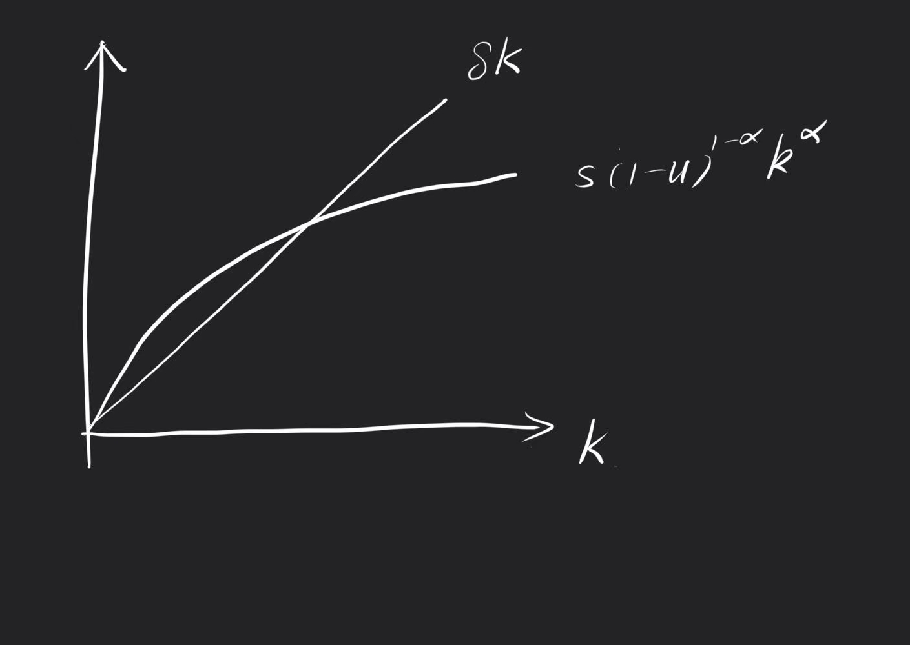
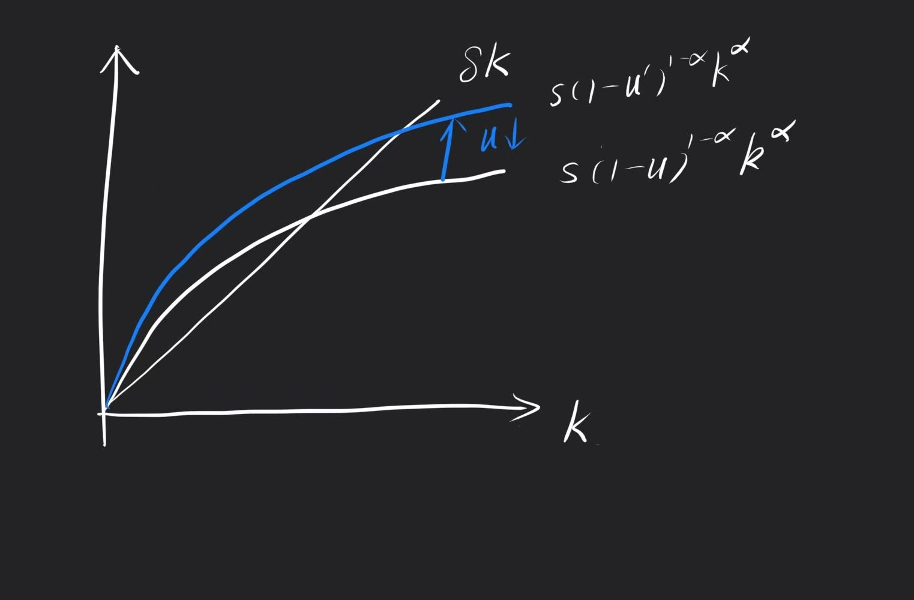
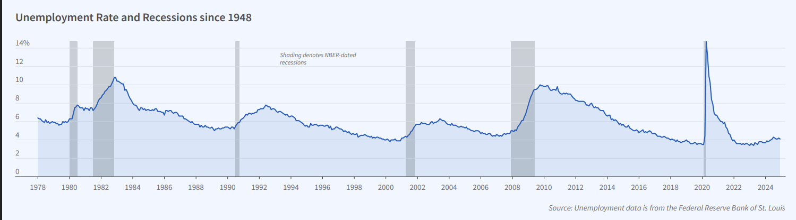
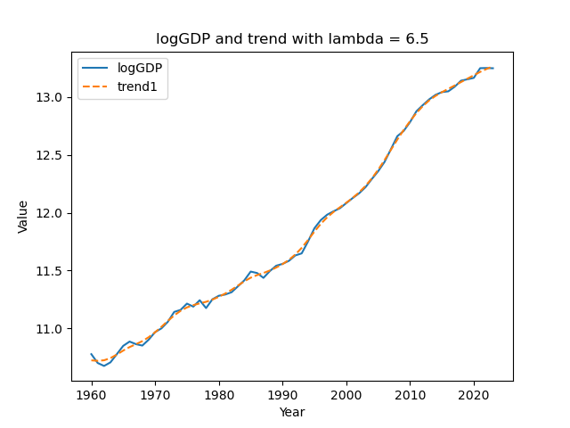
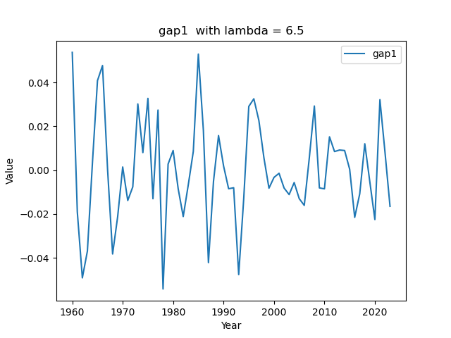
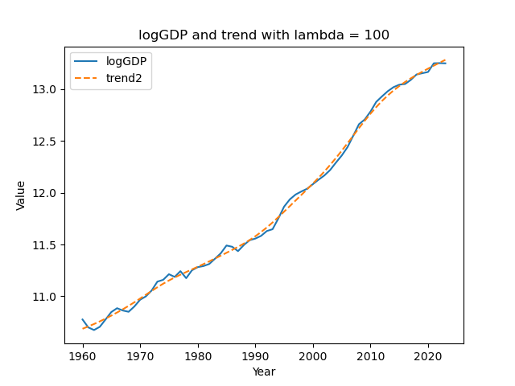
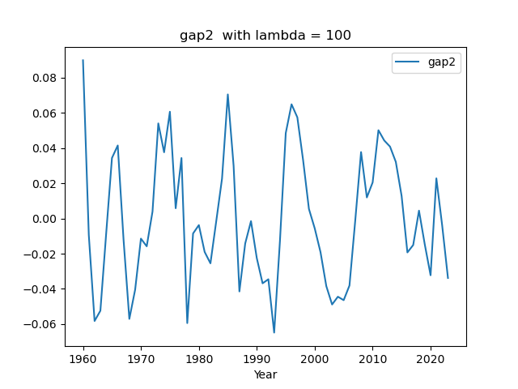
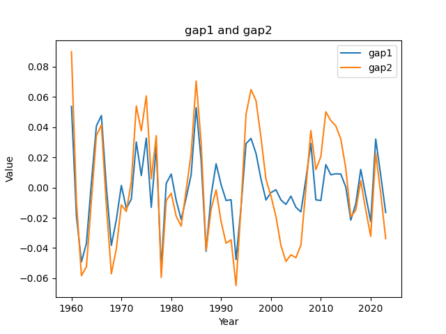
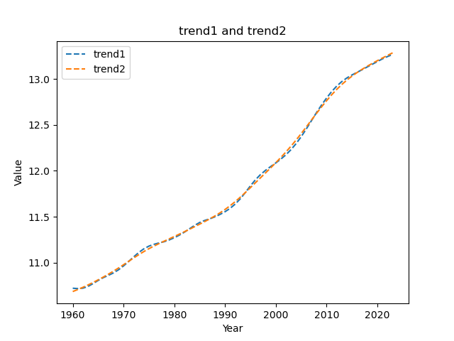

---
layout: page
permalink: /notes/复习笔记/old-vault/old-vault-021/index.html
title: 中宏Hw3
---

> Imported from old Obsidian vault on 2026-07-06. Source: `中宏Hw3.md`
### Choice Questions
1-5 DAADA
6-10 CBCDC
11-15 DACCC
16-20 BACDB
21-25 ABDCD
26-30 BBCAD

### Essay Questions
1. 生产函数$Y=K^{\alpha}[(1-u)L]^{1-\alpha}$ 
	a. $y=Y/L=(k)^{\alpha}(1-u)^{1-\alpha}$
	b. 稳态方程:$sf(k)-\delta k =0$ 
	equivalent to $s(1-u)^{1-\alpha}k^{\alpha}-\delta k =0$
	
	c. 当自然失业率u降低，1-u增大，投资曲线上升
	
	产出即刻增大，随着时间的推移收敛到新的稳态$k*$
	对产出的即刻影响百分比为$\Delta y/y =[\frac{1-u'}{1-u}]^{1-\alpha}-1$
	对稳态的影响的百分比变动为：$\Delta k^*/k^*=\frac{u-u'}{1-u}=\frac{1-u'}{1-u}-1 >\Delta y/y$ 
	所以对稳态的影响大于对产出的即刻影响
2. 人口增长的下降，在索洛模型中被解释为人口增长率n的下降。使得新稳态的资本存量$k^*$增大，人均产出$y^*$永久提高，总产出增长和人均产出短期内提高。向新稳态过渡的过程中，增长率逐渐减小直到收敛至稳态
3. 富国：Japan
	 穷国：Armenia
	 人均收入：用PPP指标衡量——Armenia 6.1 PPP ; Japan 3.6 
			 GDP per capita  Armenia $8k  ; Japan $33.77k 相差很大
	影响收入的指标：投资率Gross Capital Formation: Armenia 21.30% GDP  ; Japan 26.18% GDP
					（年度）人口增长率： Armenia 0.73%  ; Japan -0.49%
					中学入学率： Armenia 95.12%  ; Japan 102.34%  （%gross)
	利用Solow模型解释：
			 - 在Solow模型的稳态条件下，人均产出取决于人均资本水平。日本由于投资率更高，在长期稳态下，其人均资本 k∗ 会比Armenia高。根据生产函数，人均产出 y=f(k)，所以日本的人均收入（用GDP per capita衡量）会高于Armenia。从数据也可以看出，GDP per capita Armenia是8k美元，Japan是33.77k美元，差距明显。
			 - 对于Armenia，其人口在增长，这会导致在稳态下，人均资本水平相对较低。因为新增的人口需要分配一定的资本，从而降低了人均资本。而日本人口出现负增长，这在一定程度上有利于其保持较高的人均资本水平，因为不需要为新增人口分配资本，反而可能会使人均资本增加，进而进一步巩固其高人均收入的地位。
			 - 日本较高的中学入学率反映了其较高的教育水平，这有助于提高技术水平A。在生产函数中，技术水平A的提高会增加总产出。从Solow模型的视角看，这相当于提高了效率单位劳动的产出，从而使日本在稳态下能够实现更高的人均收入。同时，教育程度高也会影响投资的质量和效率，进一步促进资本的有效积累和利用，有利于经济增长和收入提升。
4. NBER上公布的失业率和Recession since 1948
 
	美国最近一次衰退发生于2020年2月~2020年4月，并且失业率飙升，是从扩张到紧缩。
	自我出生2003年以来
	有2008年1月~2009年6月，持续时间很长
	和2020年2月~2020年4月的短期衰退。
5. 选取了worldbank.org中 GDP (current US$)中的中国1960~2023年的年度数据（取完10的对数后）。
	选取$\lambda =6.5,100$ 分别做了两次HP滤波。得到结果如下：
	当$\lambda =6.5$时：
	
	
	当$\lambda =100$时：
	

从两个滤波的gap结果来看，lambda的影响并不大。两者都呈现了较大波动的周期性成分，表明中国经济在这期间经历了多次明显的扩张与紧缩阶段，经济活动围绕长期趋势有较大幅度的起伏。例如在20世纪60年代初核80年代初以及21世纪初都有较大的波动幅值，这与新中国历史中遇到的“大跃进”、三年饥荒、改革开放、亚洲四小龙的崛起、加入世贸组织、08年金融危机、四万亿刺激计划等大的经济历史事件相吻合，这些政策和国际环境因素会导致较大的经济波动，导致经济部分偏离长期趋势。

观察周期性成分的波动，可以发现其大致呈现一定的周期性规律，但具体的周期长度并非完全固定。每个完整的经济周期（从波峰到波峰或波谷到波谷）大约持续几年到十几年不等。

这种相对稳定的周期性特征可能与中国经济发展过程中的一些内在规律有关，如固定资产投资周期、库存周期等。同时，政府的经济政策调控也在一定程度上影响了经济周期的长度和节奏。例如，在经济衰退期，政府可能会采取扩张性财政政策和货币政策来刺激经济增长，缩短衰退时间；在经济过热期，又会采取紧缩性政策来抑制通货膨胀和经济过快增长。

通过对比“gap1 with lambda = 6.5”和“gap2 with lambda = 100”两图可以发现，使用不同的λ值进行HP滤波得到的周期性成分在细节上有所不同。lambda=6.5时，得到的gap1波动较为剧烈，反映出经济周期中更短期的波动特征；而lambda=100时，得到的gap2波动相对平缓，更侧重于捕捉经济周期中较长期的波动趋势。λ值越大，对趋势成分的平滑程度越高，相应的周期性成分中包含的短期波动就越少。
