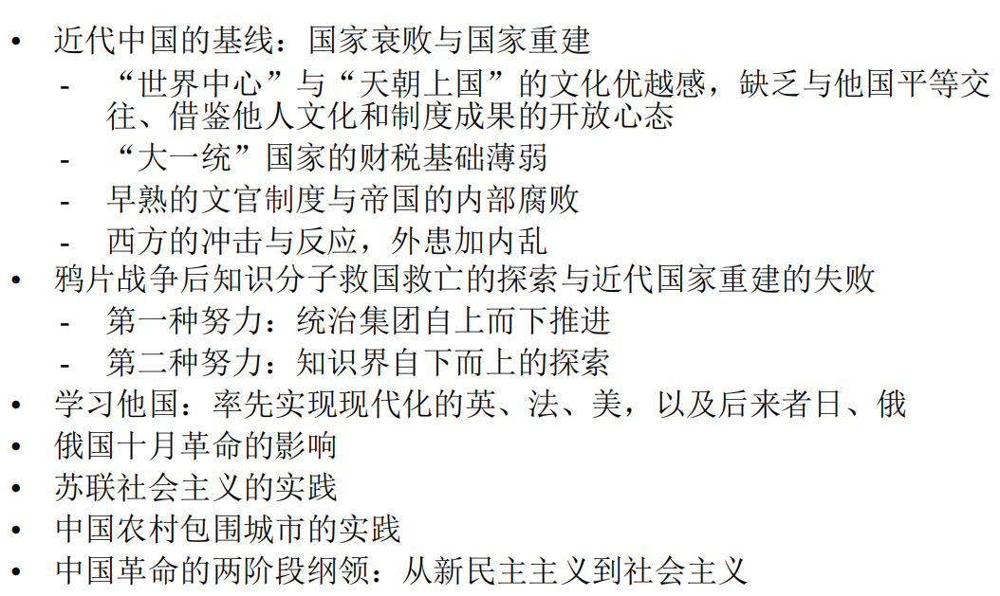
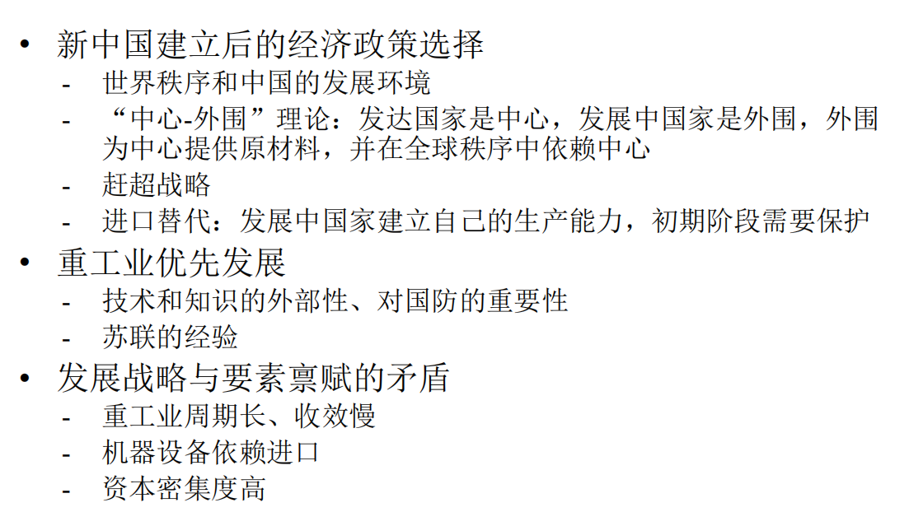
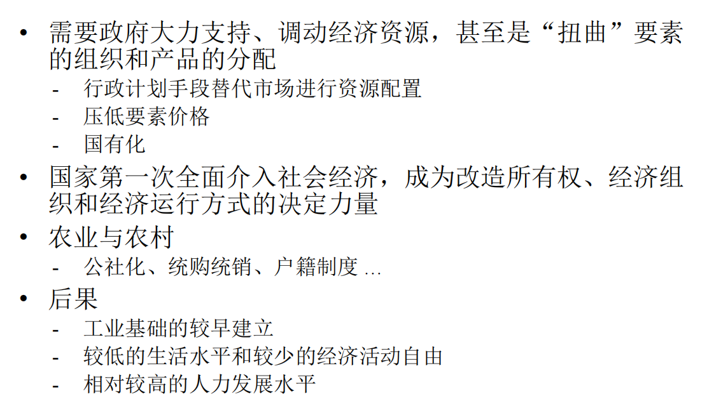

---
layout: page
permalink: /notes/复习笔记/中国经济专题/old-vault/old-vault-037/index.html
title: 第一讲 绪论
---

> Imported from old Obsidian vault on 2026-07-06. Source: `中国经济专题\第一讲 绪论.md`
[[第二讲 农村改革]]
#中国经济专题
## 经济学原理
- 人们面临权衡取舍
- 某种东西的成本是为了得到它而放弃的东西
- 理性人考虑边际量
- 人们会对激励做出反应
- 贸易能使每个人状况更好
- 市场通常是组织经济活动的一种好方法
- 政府有时可以改善市场结果
- 一国的生活水平取决于它生产物品和劳务的能力
- 当政府发行了过多货币时，物价上升
- 社会面临通货膨胀与失业之间的短期权衡取舍

## 课程知识体系时间轴
- 工业革命与李约瑟之谜
- 近代国家重建与中国的现代化
- 计划经济时期：赶超战略，重工业优先发展
- 改革开放
- 放权让利
- 全球化与中国奇迹：比较优势与分工深化
- 工业化与城市化
- 劳动力转移、人口转型、老龄化
- 企业家精神
- 国际失衡与全球化面临的挑战
- 技术进步的影响
## 李约瑟之谜
问题：科学革命（工业革命）为什么没有发生在中国？
	- 前现代社会：四大发明、活跃的市场经济与繁华的城市
	- 现代社会的中国成为技术落后国
解释：
	- 文化决定论：儒家文化、中庸之道
	- 国家竞争、专利保护、科举制度
	- 高水平均衡陷阱（技术满足需求后失去革新动力）与内卷
	- 航海大发现与殖民地

## 近代国家重建与中国的现代化

## 计划经济时期：赶超战略与重工业优先发展

经济管理：

