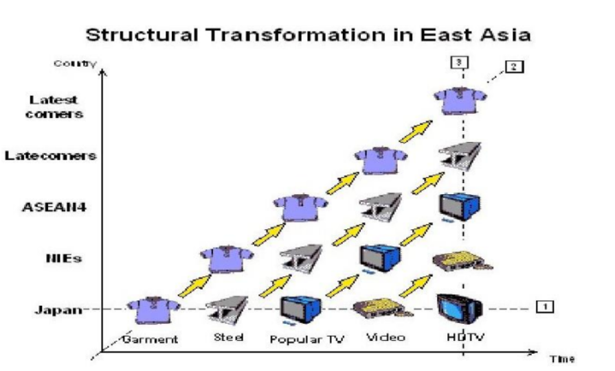
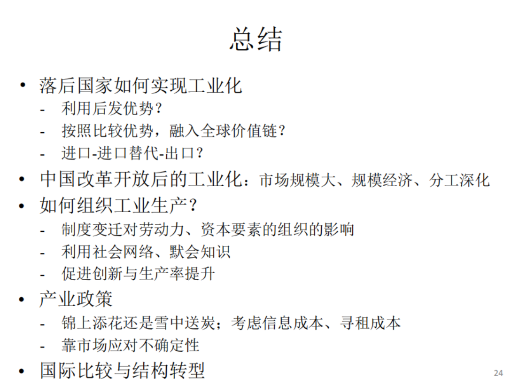

---
layout: page
permalink: /notes/复习笔记/中国经济专题/old-vault/old-vault-038/index.html
title: 第七讲 工业化
---

> Imported from old Obsidian vault on 2026-07-06. Source: `中国经济专题\第七讲 工业化.md`
[[第八讲 对外开放]]
[[第六讲 金融改革]]
工业可以实现规模经济，能够有巨大的市场，能够贸易，与农业非常不一样。

## 工业革命后的现代工业化
三次工业革命。内燃机、电、信息

#### 技术与产品研发愈发复杂
新技术不可预测
技术进步方向需要尝试
复杂工业品对错误低容忍性——不能有瑕疵
技术碎片化——不同公司掌握不同技术
例子：芯片
#### 现代工业化三大力量
工业实验室：规模经济
大型现代公司组织：分工细致
全球化：市场扩大、多国合作、全球供应

从科技创新到“干中学” 

现代工业化就是依靠科技进步、产生不同技术路线，经过大规模尝试，推向市场后消费者反馈、市场筛选，经过股权债权投资，经过国家政策等，形成大规模公司......
## 发展中国家的工业化
#### 选择：进口替代vs 出口导向
中心外围理论。
跻身中心国，替代从工业国家进口的产品，自主生产
另一种想法：出口原材料为主，升级那些具有比较优势的产品——木材、劳动力。生产这些要素密集、能源密集、自然资源密集的产品。
#### 后发优势理论：
如果先发国家积累大量技术经验和管理知识，引入到后发国家，复制过程，实现进口替代。
比如德国意大利，通过马歇尔计划，吸收西方资金和技术，成功追赶赶超。
先发国家愿意引进？可能是技术不存在壁垒。也需要后发国家富裕起来形成更大的购买力，成为消费品的购买者。资金：资金要素在先发国家的回报率降低后，会自发去寻找有高回报率的国家。

#### 东亚奇迹与雁阵理论
日本韩国、亚洲四小龙为代表，在工业化过程中进口工业品，逐渐自己模仿替代进口，逐渐用于出口，依次从汽车、纺织品、电子产品，逐渐过渡到先进产品，将落后产品传递到后发国家。依次递进的雁阵模式
“进口-进口替代-出口”的方式承接产业转移
驱动产业在国际间转移的是要素成本的相对变化。要素：资本、劳动力相对价格
日本开始有纺织业的比较优势相对于欧美，人力贵起来之后转向钢铁；
东亚模式劳动密集产业逐渐聚集到中国，90年代中后期的纺织业大国，“纺织女工”，巨大车间内每人一个缝纫机。中国也逐渐升级，再转向东南亚。

更多强调：遵循自己国家的要素禀赋，出口为主。

## 计划经济时期的重工业优先发展
• 新中国建立后的经济政策选择
	-“中心-外围”理论
	-赶超与进口替代：发展中国家建立自己的生产能力，初期阶段需要保护
• 重工业优先发展战略与要素禀赋的矛盾
	-重工业周期长、收效慢，机器设备依赖进口，资本密集度高
	-需要政府调动经济资源，控制要素的生产组织和产品的分配
	-宏观上扭曲价格信号、行政上计划配置资源、微观上剥夺企业自主权
• 后果
	-工业基础的较早建立；例：三线建设留下的长期遗产——赶超战略下产业转移的例子，受于军事威胁的原因。新建了很多铁路，交通基础设施，吸引了很多人力资源投入，留下了产业集群。早期产出更多，但产业结构偏老，偏重工业，改革开放后期民营企业活跃后立刻落后。
	-较低的生活水平和较少的经济活动自由
	-相对较高的人力发展水平

## 改革开放时期的农村工业化

• 1970年代农村社队企业兴起
	-沿袭农村手工业、加工业传统

• 1978年之后，农业产出增加，出现**劳动力富余**，农村分工深化，**乡镇企业兴起**
	- 1993年：5万个乡镇，平均8.2个企业; 80万个村，平均1.4个企业
	- 150万个乡镇企业，职工5千2百万人，工业产出占比27%

农村的工业——乡镇企业生成轻工业消费品，符合比较优势，能够填补消费品缺口。

• 符合比较优势，以劳动密集型产业为主，填补消费品供应巨大缺口

• 典型：苏南模式（强调集体）、温州模式（强调民营）、珠三角模式（强调外向型）

• 1996年后大规模市场化转型

#### 乡镇企业与适宜产权
• 国有企业——所有权和控制权分离，工人不觉得是企业的主人，活力有限
	-委托代理问题、利税不分、激励不足、政府干预 …
• 私营企业——私有，意识形态方面存在阻挠。
	-因为所有制原因，担心被“掠夺”，有隐藏利润的动机
• 乡镇企业——介于国有和私有之间
	-名义上为村集体/乡镇政府所有、实际上由私人控制   名义上公有，实际私有
	-为地方提供就业、税收、利润
	-地方政府帮助获得贷款等金融支持
	-被称为“红帽子”企业，具有“模糊产权” ——保护色
	-例：在合作能力 较高的社会中，产权可能不需要定义得那么清晰

• “适宜”的产权安排
	-既能避免被掠夺，又能提供激励
模糊产权——拖带问题——扎根于乡土社会、利用基于位置，熟人社会的信用社会网络，非正规制度替代了正规制度产权。一大特点
## 产业集群与经济开发区
### 产业集群
组织形式：小规模私人控制。生产劳动密集型产品
本土特色的工业化 通过传统地域上的集聚实现
• 经济学原理：经济集聚
	- **马歇尔外部性**：技术和信息外溢、提供共享的中间投入品和市场服务、形成专用性劳动力市场，区域内规模报酬递增。
	- 技术工人能很快找到工作，企业能很快用人。

• 后发经济体：缺少上下游行业配套，缺少基础设施和公共品，缺少专用技能人才，金融发展差，制度环境不佳
	比如生产家具，需要供应木材，很可能就缺乏。生产衣服就需要布——棉花，就需要棉花种植业。还需要交通运输，道路等公共品。缺少全球化的加持。

• 产业集群
	- 通过精细的分工降低进入门槛-反“纵向一体化”
	- 依靠社会网络：传递商业机会、便利非正规合约及商业信用，替代正规法律/金融
	- 面对地方政府，形成集体谈判能力，有助于提升营商环境
	- 集群形成期(从0到1)、数量扩张期(从1到N)、质量提升期(从N到Q)
		非正规制度促成了早期转变

• 当集群规模增大后，对正规制度的需求上升，社会网络的作用相对降低，政府政策的作用相对变大
	集群发展后期对正规制度的需求比较大。
	律师事务所、上市公司等等现代化的措施，支持从N到Q
### 经济开发区——基于地理位置
地理位置上的集聚。地方政府主动促进企业集群的集聚。
经济开发区最早用于吸引外资，后期用于企业集聚。

• 早期因吸引外商直接投资而生
	- 1979年深圳蛇口工业区破土动工（对外开放的起点）
	- 1990年上海外高桥**保税区**设立（自由贸易）
	- 1994年苏州工业园项目启动（中国和新加坡合作）
	- 1992年共设立144个省级开发区和70个国家级开发区
	- 2006年新设立661个开发区
	- 含经济技术开发区、高新技术产业开发区和出口加工区等

• 提供税收优惠、基础设施、公共服务、劳动力和市场环境
	- 集中提供紧缺要素
	- 促进经济集聚
	- 节约制度成本
	- 提供政策试验
后发经济体中，劳动力缺乏，只能划一小块地方支持优厚的开发营商环境，集中提供紧缺的要素。
• 可视为一种基于位置的产业政策
## 产业政策——主体是政府——为发展某些产业
政府干预市场——纠正外部性、提供公共品

• 实施产业政策的经济学逻辑
	-某些产业具有**正外部性**（如研发、国家安全）
		比如美国二战时期曼哈顿计划——《奥本海默》。
	-多重均衡下的协同失效（如产业链上下游互相敲竹杠）
		现代工业——复杂——上下游供应链密不可分——敲竹杠问题——资产专用性，我的东西只能给你那，要挟，坐地起价——很有可能是双输、多输的均衡
	政府需要介入干预。

• 广义的产业政策手段包括
	-中央或地方政府
		中央处于领先地位；地方更有私心。
	-针对研发的补贴、税收优惠
		专利补贴；or高新技术企业的企业所得税可以减免，或者研发投入可以抵扣。
	-融资支持、土地优惠、公共品的有偏提供
		政府提供资源的倾向。
	-关税和贸易保护、政府采购、投资目录、强制规定
		政府的国有企业可以购买出租车，让本地租车都采购本地的车。
	第一类是狭义的补贴和税收 第二类是政府控制的资源 第三类是行政命令
	
• 实践中主要讨论的产业政策
	-保护幼稚产业实施进口替代——针对后发国家
	-促进战略性新兴产业的发展——出口导向性，为领先占领全球市场——光伏、新能源汽车、锂电池
	-对复杂产业的协调——第四代移动通信、大飞机、通信，需要多部门协调合作的产业
	
• 例：研发补贴与税收优惠
	-科学基金、科技型中小企业创新基金
	-专利资助政策
	-高新技术企业享受优惠税率、研发费用加计扣除
		比如研发费用达销售额的3%~5%，会计计算中有蹊跷
		购买专利

• 例：投资目录——行政命令限制性
	-发改委产业目录（鼓励类、限制类、淘汰类）、外商投资目录、开发区产业目录
	比如“绿色” 标签——特殊优待
	
• 常见诟病——高度不确定的市场环境，价格机制能比较好地传递信息。政府难以识别行业的潜力，无法在事前找到合适的资助对象。
	-信息不足，无法做到**雪中送炭**
	-事后奖励，**锦上添花** ——不适合高风险的创新支持，激励不足。
	-产生寻租——寻租空间，假专业但被支持；研发费用哪些算研发哪些不算，税务部门的操作空间。
	-不利于市场竞争
• 国际比较：全球化视野下的产业政策实践

### 战略性新兴行业
• 出口新三样：光伏电池、锂电池、新能源汽车

• 以及新材料、生物医药、高端装备、人工智能相关应用品等

• 市场应用前景清晰、资本密集、研发周期长、投入大

• 政府补贴和保护在实践中起到了作用

### 政府引导基金——国有背景的VC PE

• 针对创新的融资方式：风险投资(VC)与私募股权(PE)
高度风险不确定性，不适合政府投资。

• 政府引导基金(GVC)作为一种采用金融手段的产业政策
	-政府背景的有限合伙人出资
	-股权投资方式发挥杠杆作用——放大政府有限财政资金；成立基金事前支持。
	-对基金所投资的地域、行业、公司施加限制——优先满足政府需要
• 促进工业发展的优势
	-支持重点领域发展——实现政府意志
	-信号作用——政府号召大家投资，更明显的信号
	-更快的监管审批和更大的税收优惠

• 潜在问题
	-偏好低风险、快回报的项目——和创新活动不匹配（政府还有任期限制，希望任期内得到回报，是矛盾的）
	-对普通合伙人产生更多限制，影响业绩——扭曲行为
	-额外的政策不确定性风险——政府态度转变容易加剧波动（偏好转变、领导变更）
## 工业化与结构转型
• **结构转型：农业、工业、服务业占比的相对变化**
	-农业、工业、服务业的特点
		农业：靠天吃饭、附加值低、不能提供稳定就业、长期高速经济成长
		服务业：成本病、不可贸易、难以进行全球化的协作
		工业：能实现规模经济、提供稳定工作；社保体系医保体系依附其上

• 中国工业化过程中的结构失衡：工业化超前、城市化滞后，需求不足
	供给过剩、需求不足；
	早早实现高水平工业化，但结构不理想。

• 随着成本上升，制造业向低成本地区转移
	-东部向中西部转移、向国外转移
	
• 后工业化阶段
	-发达国家：消费率上升、技术进步变缓、经济增速下降
	-收入分配改善

• 过早的去工业化
	-尚未达到高收入阶段：拉丁美洲和非洲
	-从较高生产率的制造业工作岗位转向较低生产率的工作岗位

