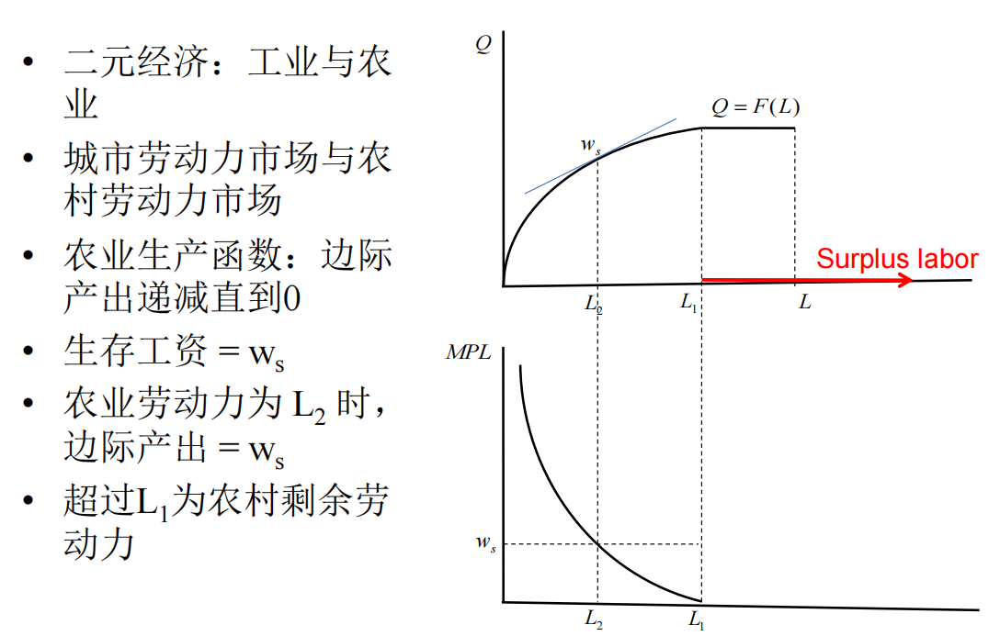
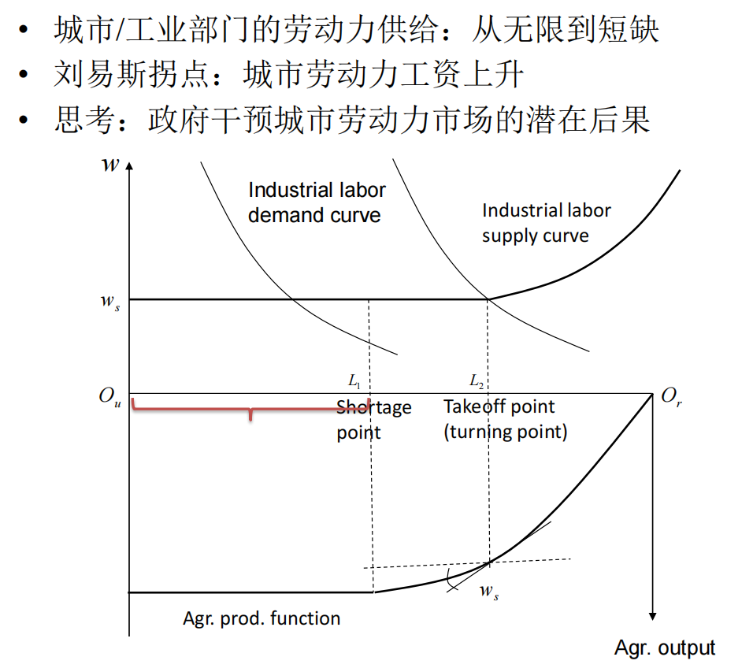
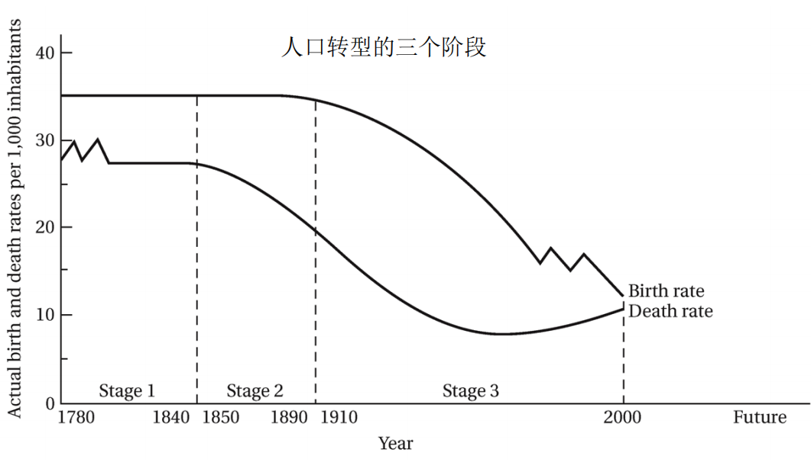
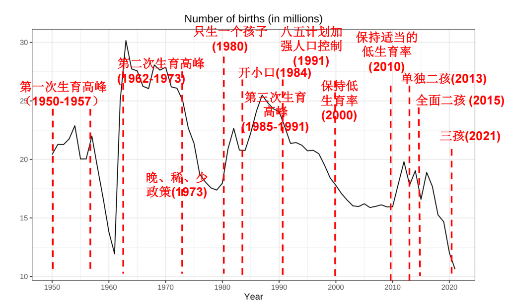
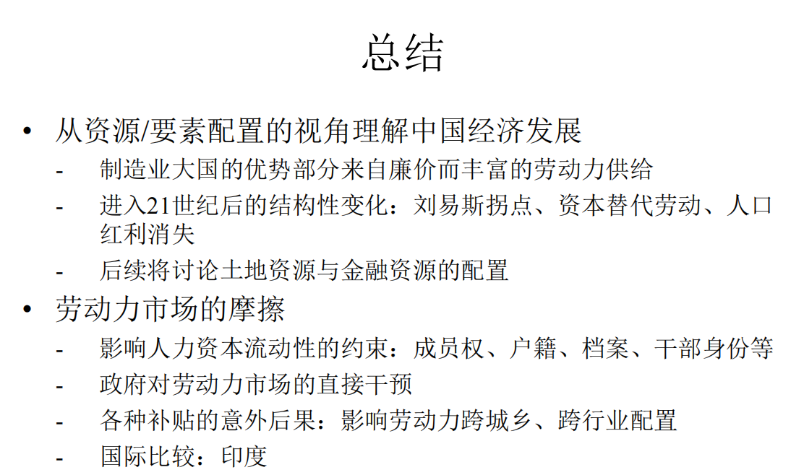

---
layout: page
permalink: /notes/复习笔记/中国经济专题/old-vault/old-vault-039/index.html
title: 第三讲 人口与劳动力
---

> Imported from old Obsidian vault on 2026-07-06. Source: `中国经济专题\第三讲 人口与劳动力.md`
[[第四讲 土地制度与城市化]]

研究两个劳动力市场：城市于农村
## 刘易斯模型

横轴代表劳动力L的投入。纵轴时产量Q是劳动力的生产函数
下图是边际产出MPL的曲线
超出L1时进一步投入劳动力，边际收益为0
但一个人的边际产出低于其生存工资，农业为何要吸收这么多？那人靠什么存活？
决策者是谁？如果决策者是集体，接纳所有劳动成员参与劳动是硬性约束。每个人不是独立的，共济的模式。只要**平均产出能够超过平均存活成本，那集体决策时就会选择接纳**。
​

工业发展可以**吸收农村的剩余劳动力**，有机会时他们会移民去打工。考虑旋转180度后的模型。
Ou+Or=L；工业部门面对一个劳动需求曲线，取决于工业发展长度。供给曲线的前部是=生存工资的，无弹性，可以以Ws雇佣几乎所有剩余劳动力。
**L2点被称为起飞点**，一旦继续雇佣，农村劳动力继续减少，边际产出会上升，需要付更多工资以吸引农业劳动力，也称为**刘易斯拐点**。
​
城市工业部门的劳动力供给：从无限到短缺。
​
政府干预：**对数量和价格。限制低工资。工业能招到的农村劳动力有限**。
58年工业扩张，一下子招了1000多万工人，后两年面对饥荒时一下子又辞退1000多万。
​
工业化时期政府对干预：比如德国皮斯迈的社会保障体系，给劳动者最低保障。
最低工资制度：要求一个W高于生存工资，在拐点前的曲线变化，上移，使得工资上涨，劳动需求降低，延迟工业化，不利于那些没找到工作的工人。这一干预可能阻碍工业化，阻碍城乡移民的进程等等。

户籍制度：享受当地户口能够享受到一些福利保障，也是干预了劳动力市场。
​
富士康落户成都。12年出现招工困难情形，公务员在政府要求下顶包进厂。（跨国刘易斯拐点的现象）

## 人口转型与人口红利
刘易斯模型没有考虑人口变化。
从高生育率高死亡率过渡到低生育率和低死亡率
除了饥荒时期的波峰波谷，中国人口出生率和死亡率大致趋势接近，通过较短的时间完成了人口转型。
但目前2024年面临严重的人口老化现象

工业革命之后，科技和医学的进步，使得死亡率下降，但生育率基本不变。人口增加。随后人们的生育观念转变，生育率下降。

### 人口红利
#### 抚养比

- 人口中非劳动年龄人口对劳动年龄人口数之比

- 劳动人口比例= 1/抚养比（2000年约70%）

- 抚养比在2013年由下降转为上升
		人口老化开始出现

#### 人口红利：低抚养比/高劳动人口比例为经济发展创造了有利的条件
红利来自于人口结构的有利比例
较多劳动、较少耗费
有高剩余、高剩余率、高投资、产出中高比例用于再生产、经济增速便快

- 劳动力供给充裕

- 高储蓄率

- 高投资

- 高增长

- 例：1982-2000年间，中国人口抚养比与经济增速之间的弹性估计值为0.115

## 城乡二元劳动力市场
#### 计划经济时代的劳动力市场

- 超级国家公司下辖的大型公共就业体系：城市部门vs.农村部门
	超级国家公司：以国家政权形式去组织生产
	农村部门：
		公社化、集体在公社中劳动。经济组织存在比城市更多的激励
	城市部门：
		国有企业中也有集体企业，政府部门、事业单位。按所有制可分全民所有制和集体所有制。按行业可分重工业、轻工业、手工业、不同部门中劳动力可以配置。
		劳动力配置主要依靠行政。价格信号被扭曲。
			如58年大跃进，感觉粮食收成不错，可以维持吃饭，大量招工。
			饥荒产生后很多地方又开始削减城市人，大幅度动员人退回农村。

- 劳动力在不同部门之间的流动：大跃进期间的大规模招工、大跃进后精减职工及减少城镇人口、知青上山下乡和返城、国企改革期间的大规模下岗和在就业

#### 城市部门的就业

- 国有企业、集体企业、机关事业单位；外企、民企；个体户

- “铁饭碗”与“政策性负担”

	68年开始知青“上山下乡”，对城市混乱状态的治理，更多原因是没有就业机会，平息他们。
	到76年，少部分人安家落户，大部分人等待城市就业机会。80年代初有大规模知青返城。
	这些都是行政配置劳动力资源在不同部门之间的流动
	90年代中后期，国有企业改革，大规模劳工下岗，被下岗配置到集体单位、个体经营等私营部门。是极大规模的部门流动。

### 农村劳动力市场
#### 剩余劳动力：在何种意义上属于“剩余”？

- 劳动力要素的流动与配置范围

约束下的全局最优vs 局部最优

劳动力流动范围越大，配置越宽广，劳动力的配置效率集越有可能实现更高

#### 广义的农业：农、林、牧、副、渔

#### 农村中的工业部门

- 乡镇企业：离土不离乡、进厂不进城
		乡镇企业的人为什么不进城? 租房成本、工人保障、粮食配置（粮票），选择是约束之下的最优解（次优解）。制度总是有不尽人意的地方。

- 劳动力市场的三元结构：城市部门、农业部门、**农村中工业部门**

- 劳动力市场上的“次优制度安排”

- 思考：什么样的经济组织形式能促进劳动力的资源配置效率？
		回答这一问题需要看比较的对象：如果允许乡镇企业进城办厂、农村人民进城获得户籍等制度，那乡镇企业形式不一定是最优的

#### 资本、土地与劳动力要素的关系

- 互补与替代；制度安排：金融制度、土地产权、户籍、财政、 …
		财政补贴：农药、化肥；如果互补可能增加对劳动力的需求。
		耕地保护制度，政府设立基金去奖励保护耕地的人
- 例：农地确权与农业生产率中的劳动力再配置效应
		农地确权：产权越稳固，越要投资？ 有了产权的资产变活。但实际中劳动生产率发现不降反升，比较有生产效率的农民会配置到进城打工。土地产权稳固，不再是基于使用的土地产权。可以堂而皇之地租出。农地确权会造成有能力的人愿意离开。
- 纪录片《三姐妹的故事》1997-2013年间的城乡移民与就业创业

## 城乡移民与户籍制度
### 城乡移民
#### 不同的称呼：农民工、进城务工人员、流动人口

#### 城乡移民：拉力和推力

- 规模：2020年达到2.86亿

- **拉力**：城市的经济状况、对特定人力资本的需求

- **推力**：农村的机会成本（如农业产出的好坏）、产权稳固程度、资本积累，以及寻找就业机会的社会网络等
	

#### 福利含义：公共服务与保障、家庭

#### 经济增长的含义：生产 vs. 消费
重生产、轻消费；一人进城务工，维持农村的消费方式。户籍城市化率远低于人口城市化率。

#### 农民工回流、反向移民
经济波动，也有农村劳动力回流问题。产业转移、回乡创业等。劳动力市场动态流动变化。

### 户籍制度
#### 户口制度的由来

- 1958年：大跃进背景下户籍制度的建立
		精简城市人口，办不了户口就得回去。控制人口的手段

- 1980年代早期：小城镇发展战略
		大量农民去打工。小城镇可以小量接纳人民，拿钱买户口。双轨制
- 1990年代：户籍限制小幅放松

- 2003年：孙志刚事件
		没户口人收容遣送制度酿成悲剧，废除。
		

- 2012年：中小城市解除户籍限制

- 2014年：《关于进一步推进户籍制度改革的意见》

#### 社会福利和公共服务依附于户口

#### 居住证制度
城市的社会福利和公共服务依附于户口。进一步开启居住证制度，部分享受城市福利。
#### 积分落户制度
选拔吸收精英人才，这些人对城市的税收贡献高于成本
#### 户口的支付意愿
有些可以自带口粮转移证明，粮食自备不给城市添负担。

## 非正规就业
中国的非正规群体不大。
农民直接进城，找不到正式工就是非正规。技术进步后：不需要人力资本积累的零工大量出现——平台经济的发展。人们可以脱离于就业单位，依附于平台独立就业。使得很大一部分人从事该类非正规就业。他们不用交社保，也没人替他们交社保。依附关系没那么强。
#### 传统的城市非正规就业：小摊贩、临时工、灵活就业

#### 发展经济学理论：非正规经济向正规经济的转变

#### 劳动力市场三元结构：农村就业、非正规就业、正规就业

#### 技术进步对劳动分工的影响

- 制造业：自动化生产线、工业机器人

- 服务业：众包、零工平台、副业平台、机器人家政、无人配送

#### 愈发庞大的零工群体

#### 劳动力市场的分层

- 按照所有制、按照技能水平、按照工作稳定程度、按照福利保障

- 劳务派遣、劳务外包

- 日结

- 纪录片《 三和人才市场:中国日结1500日元的年轻人们》

## 劳动力市场的摩擦

摩擦：达不到均衡，往往是由于政府的管制。需求和供给不匹配
#### 概念：市场均衡与摩擦、资源/要素的配置效率

#### 城市国有部门的刚性就业：冗员、缺乏流动

#### 压低或增加劳动成本的政府干预

- 计划经济时期低工资；2004年最低工资规定、2008年劳动合同法及2013年修订、2014年劳务派遣暂行条例

- 刘易斯模型中的影响：影响工业增长和吸收剩余劳动力的能力

#### 其他干预

- 补贴农村与农业的政策：耕地保护金、种粮补贴、农机补贴

- 对技术进步的补贴：允许机器设备抵扣增值税、促进工业自动化

#### 劳动力市场摩擦的后果

- 要素错配带来的经济效率损失

- 非货币衡量的福利后果（失业影响健康和犯罪、留守儿童问题）

- 劳动力市场的非竞争性会打击教育投资积极性

