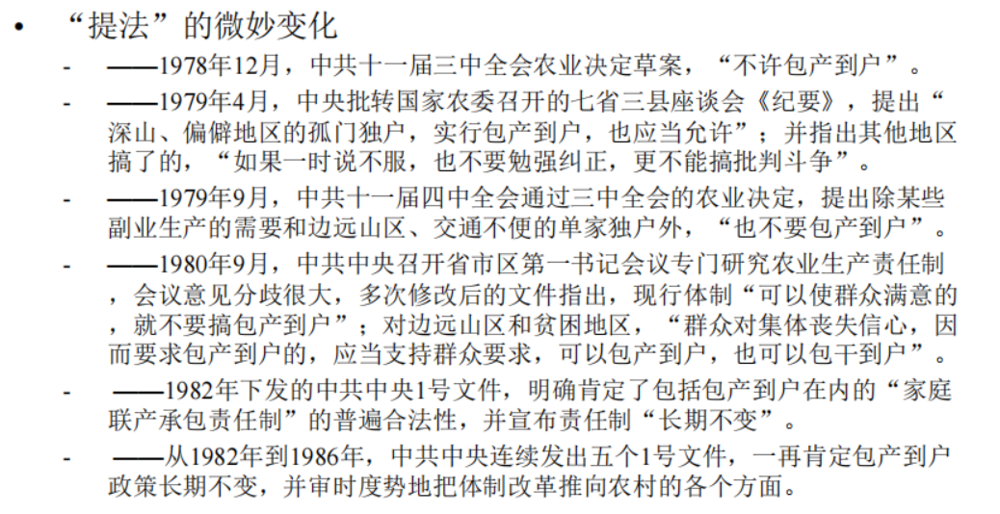
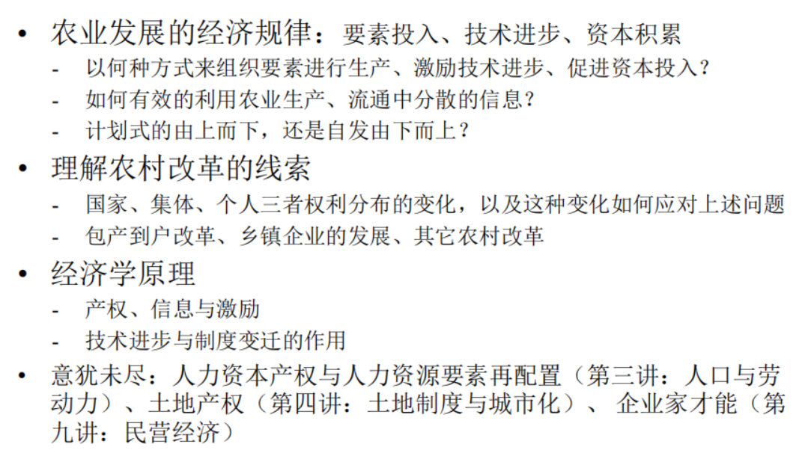

---
layout: page
permalink: /notes/复习笔记/中国经济专题/old-vault/old-vault-040/index.html
title: 第二讲 农村改革
---

> Imported from old Obsidian vault on 2026-07-06. Source: `中国经济专题\第二讲 农村改革.md`
[[第三讲 人口与劳动力]]

## 中国的农村集体经济
### 农村土地集体所有——农村经济离不开集体
三级所有：三个级别，以生产队为基础。
家庭联产承包责任制
农村集体经济组织

#### 跨国比较
· 国有经济
· 合作经济：强调以个人的所有权，合作
· 英国信托制——信托制度不灵活，但能保证弱者能持续获得收益，以不灵活来换取稳定——矛盾：市场经济要求灵活。
· 土地公有制：越南、诶赛俄比亚
	越南社会主义国家，改革开放之后，土地使用权分配到个人，买卖土地很随意。零星住房居多。土地所有权会影响城市面貌。
	埃塞俄比亚：集体成分更浓。

三个层级：国家——社会/集体/社区——个人
个人社保，国家不直面个人。公共服务、社保医保一般通过集体单位。缺乏直接连接。
国有企业：把国家个人捆绑在一起
市场企业：更贴近个人

#### 国家如何实施发展战略
· 经济权利分配？进行有效的经济组织？
##### 国家的特点
国家是合法拥有暴力的唯一主体
国家通过实施合约降低交易费用
超级“国家-公司” 社会主义圆形，并不一定能降低交易费用
诺斯：使统治者租金最大化的所有权结构与降低交易费用促进经济增长的有效制度之间存在持久矛盾

##### 重工业优先发展战略需要政府调动经济资源、压低企业投入要素（资本、劳动力）的价格
超级国家公司如何面对5亿中国农民？
	落后的小农经济
	建国前后的土改，面对的是刚刚土改分下去的土地所有权。土改按人口平均分配了地租，如何筹集地租用于支持重工业优先发展？利用国家合法拥有暴力，进行收税筹集。这能否转化为工业化的原始积累？

## 农产品统购统销与农村集体化
### 农产品统购统销
#### Q： 能靠税收将农业剩余转化为工业化的原始积累吗？
· 日本明治维新前后的重租重税政策
· 工农业产品“剪刀差”：寓税于价，以交换实施抽税。——工业品卖得贵，农产品便宜。从农民身上抽走租金——隐性的税收

##### 53年10月开始统购统销
剥夺定价权利，按照国家意愿定农产品价格。计划定价。价格一直被控制
	从粮食、棉花开始，拓展到各种产品
	统购压低成本，统销支持城市低工资，提高工业利润。
国家统一收购农产品、统一加工再供给、工业劳动力低工资、降低工业成本，支持工业发展
· 进一步压低农业生产的机会成本
	实施城乡隔绝的户籍制度，不允许农民进城。
	剥夺百姓就业机会，不让农民进城。城市能够容纳的就业机会有限，内生的一系列制度安排、发展战略。
· 农民生产积极性下降——农民偷懒对抗
	国家应对措施：剥夺农民生产自由性，避免去生产乱七八糟的产品。要控制微观生产、维持积极性，实施集体化、公社化

### 农村集体化
· 国家政权直接改造农民所有权
· 从土改到完成农村集体化
	- 1947-1950年全国土改：3亿无地少地农民分得地主富农7亿亩土地，296.74万头耕畜，免除700亿斤粮食地租；实现“耕者有其田”的民主革命目标
	- 1950年《中华人民共和国土地法》：“承认一切土地所有者自由经营、买卖及出租土地权利”
	- 1953年开始农业合作化运动，要求走由初级合作社到集体所有制的高级社的社会主义改造道路
	- 1953-1956：全国完成农业集体化
	- 1958年：经过“一平（贫富拉平）、二调（无偿调拨）、三收款（银行贷款收回）”，完成人民公社化
· 从承认小私产的“合作”，到消灭私产的集体

#### 集体经济的特点
· 传统意义上
	士绅主导、皇权不下县
	个人所有为基础形成的合作经济
· 50年代的集体化不是农民自发运动的产物，更不是农民们基于私产的自愿合约，而是国家权力深入农村社会、全面干预和改造农民私人产权的结果。
	不是传统的集体经济，是自上而下的。基础不是个人私有产权。土改时个人产权是国家意志的结果，所以老百姓能够接受。
	财产权利的来源不同，会导致产权的强度的不同
	国家控制之下的国家意志的贯彻执行者
	缺乏“剩余索取权”的所有权

#### 人民公社
· 一大二公（三平四调）：调——公社之间无偿调拨生产资料；平：平均化
	规模大
	公有化程度高。原属于农业社员的一切土地连同耕畜、农具等生产资料以及一切公共财产都无偿收归公社所有
	修建了大量的水利基础设施。
· 管理机构：管理委员会、生产大队、生产队
· 集体经济下的工分制与搭便车问题：出工不出力
· Lin: **退社权**作为解决监督难问题的农民之间的一种自我监督机制——形成可置信的威胁，激励每个人都努力。可以解决搭便车的问题，当退社权丧失，人民公社强制加入，会造成生产困难。
· 大饥荒（1959-1961） 1700-3000w人
	近代饥荒不是因为生产不足，而是因为分配的问题
	成因：天气、浪费资源、公共食堂、退社权、浮夸风与过渡征购、政治动机

## 政策调整与包产到户改革

### 政策调整
零散信息只能通过个体自发决策才能有效利用信息。比如土地何时施肥浇水。信息传递过程存在扭曲。
不再一味强调规模经济，转而强调要素投入，认识到积极性和激励的重要性

· 政策退却
	批判“共产风”和“浮夸风”，强调“三级所有、队为基础”
	恢复自留地、局部的包产到户。 ——分清自留地、责任公田...恢复积极性
	“部分退出权”：农民的努力和责任心从公田退出，留到自留地里发挥作用——政策宽松期会容忍。但62-78年，政策不断反复，直到78年安徽凤阳县小岗村的事情。（基于18户农民自我意愿、自主决策的合约）
· 政策反复
· 底层改革
	长期贫困与农业危机
	多地自发的包产到户尝试
	休养生息政策：农民的自留地扩展到总耕地面积的15%
	地方政治领导人的倾向
	分权决策
· 提升产量的简单经济逻辑——剩余索取权才是真正的产权。
	激励与剩余索取权：“交够国家、留够集体、剩下都是自己”
## 改革的政治经济学
政治经济学是讨论稀缺资源生产分配、消费过程中加入权力的影响。权力的来源等。**危机驱动**国家决策者不得不让步，有变革的需求，需要缓解国家统治阶层面对的困难。粮食危机促成了包产到户能在部分地区发生。小岗村故事前提是当年欠收，分配粮食不够吃，危机是源动力。
具体的经济决策不会一蹴而就，**渐进改革**通过帕累托改进的方式推进。——前期改革成果有助于说服更多人支持

· 自发的体制创新活动如何获得合法化的承认？
	从政策文件到法律
	形成稳定预期
	不合法的要让它合法起来——邓小平
	包产到户签订协议是一年一签，需要有较为稳定的预期让人们愿意做中长期的投资。比如化肥的投入。政治文件主要是纲领性的愿景。

· 信息成本与制度变迁
上面的决策如何影响下级。下级的改革信息如何传递到上层。逐级传达信息的成本很高。
“要理解人们的决策，我们必须把现实世界与行为者所理解的世界加以区分”，为此必须关注“行为者能够得到的信息，以及他们接受到的、作为其选择结果的不完全反馈”(诺斯)——需要考虑行为者决策时面临的真实约束。

· 中央文件制度改革。
	
官方提法：家庭联产承包责任制、统分结合双层经营体制。
	实际上是“包”、“分”，集体的弱势延续
农村改革的主线：经合约而成的产权
	产权的多样性：占有权、使用权、收益权与转让权
土地的再调整：成员权vs 产权
	贵州湄潭
承包合约的期限
	02年 农村土地承包法
	13年 三权分置改革
	历年中央一号文件
分工深化后的多种经营、乡镇企业、农民进城
	合约自由——身份自由

## 集体经济在中国
城市部门中相对于“全民所有制”而存在的集体所有制企业、二轻企业

• 乡镇企业：“地方政府所有制”、“红帽子企业”

• 校办企业

• “集体”的干部更靠近国家还是更靠近个人？

• 名义上的集体所有制与现实中普遍的集体虚化
	-增加还是降低交易费用？
	-例：农地流转、非农建设项目中集体的功能
	-例：没有虚化的集体

## 总结

