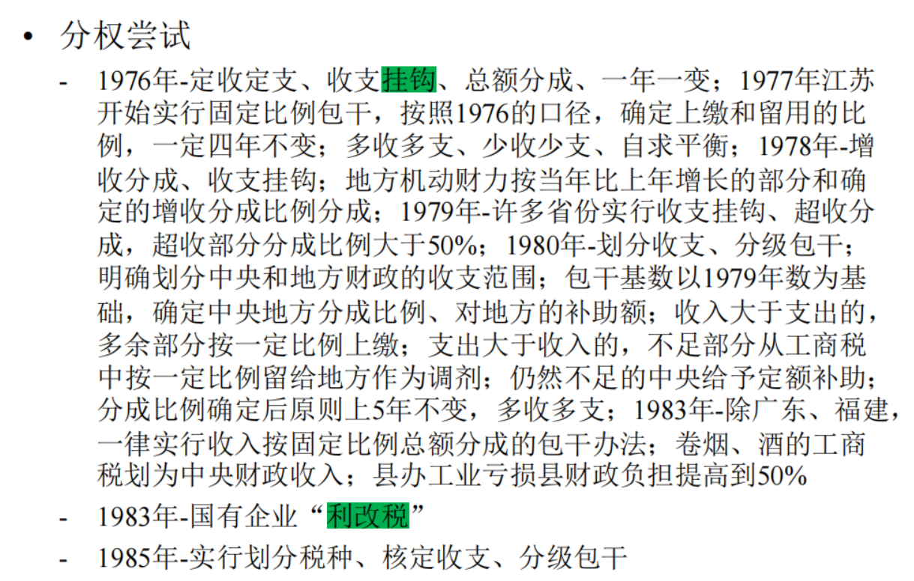
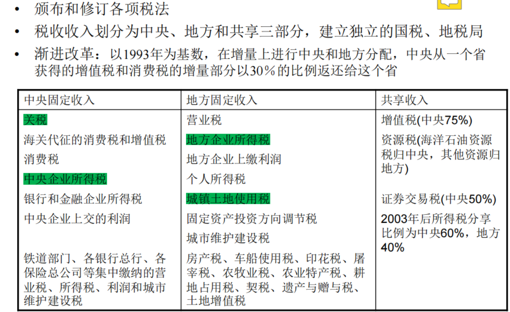
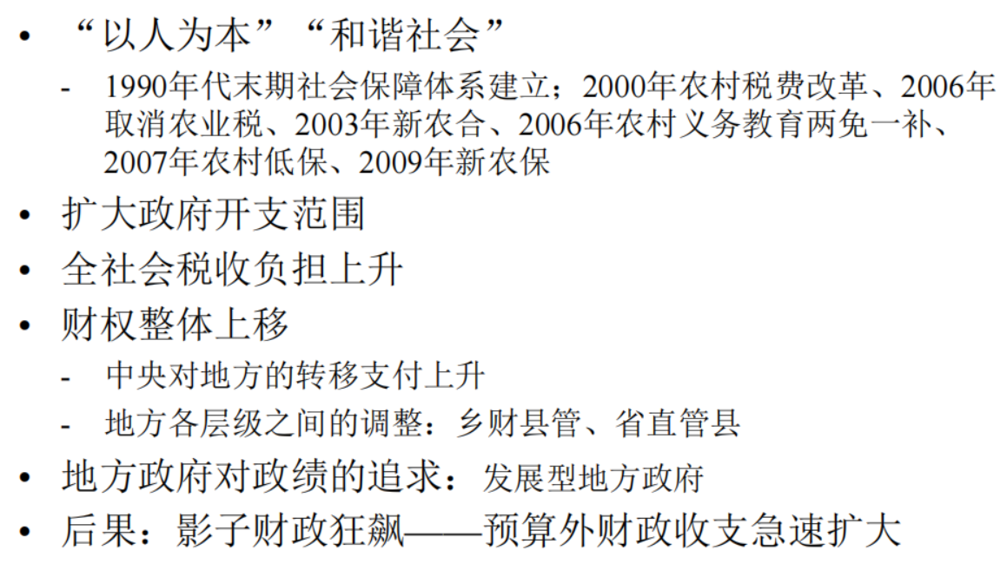

---
layout: page
permalink: /notes/复习笔记/中国经济专题/old-vault/old-vault-041/index.html
title: 第五讲 财政体制
---

> Imported from old Obsidian vault on 2026-07-06. Source: `中国经济专题\第五讲 财政体制.md`
[[第六讲 金融改革]]

## 财政体制
#### 公共财政： 政府为市场提供公共服务的分配活动或经济活动
政府的目的是为公众提供公共品，不是为了盈利。
	政府的收入、支出、经济行为

#### 财政体制： 公共财政的责任与权力的划分
1
	收入与支出
	各公共部门之间
	各级政府之间
	公共部门与市场之间
## 财政分权
#### 公共部门的组织结构：多层级政府（中央、省市县乡）
集权vs分权； 单一制vs 联邦制
矩阵结构： 块块（地方政府）为主导 vs 条条（行业部委）为主导
	块是区域型的 ；； 如果是工业局来主导，就是条条为主
	块块属分权型；；条条是集权型，财政权利集中于中央部门
	今天的社会主义模式下以条条为主

#### 财政分权
政府的经济职责和响应的财政收支权力的下放
从中央到地方、从省市到县乡
#### 财政分权理论：当各地对公共品的偏好存在差异时，进行财政分权、由地方政府承担更多的公共品提供职能，可以提升社会福利

#### 经济学原理：基本面——激励、信息和规模经济
激励：
在包产到户、家庭联产中，农业生产的权力和责任从大队分配到每一户，
如果把权力分配到金字塔末端，县政府乡政府会有更大激励
信息：
各地方面临较大差异，比如有地方老年人比较多，需要养老服务，有地方年轻人比较多，需要教育
采集民众信息，上传下达，这样的信息传递在较为分权的组织结构中更有效率
规模经济：
分散提供不具备规模经济，县办大学就不具有规模经济。大学复杂的教育服务需要有一定规模才能提供。

#### 地方竞争：在居民自由流动的前提下，“用脚投票” 的机制可以通过刺激区域政府间的竞争、改善公共服务的供需匹配，提升效率。
竞争劳动力。
**重要手段：房产税**。吸引高质量劳动力进驻，提供更好公共服务——需要收税——常见税收手段就是房产税——如果大家都来居住，就有能力收较高的房产税——比如学区，调善好一个学区，就有更多人愿意来买房入住，形成良性循环。

#### 分权的弊端： 地方保护主义、“逐底竞争”、地区差距拉大
逐底竞争：就是内卷。
给好处，底线都不要了，收税竞相压低。恶性竞争——争相降低标准。

地区各自为政，出现极化现象。由于初始禀赋不同，出现多重均衡。有的地方陷入贫困陷阱，有的地方比较富裕。

地方保护主义：为了获得税收，对辖区以内的企业特别友好。本地产品偏好现象

烟酒品牌的本地市场占有率就会很高。
新能源汽车。——出租车品牌的使用。
司法地方保护主义——本地公司赢得更多判决。
### 财政分权之下的中央政府的角色

多层次体系中，分权能够提供激励。但也存在弊端。

中央政府需要用行政命令来打破分权的弊端。比如打破地方保护主义的门槛。行政命令来消除区域间的**贸易壁垒、进入门槛**

司法地方保护，通过高级法庭、巡回法庭打破地方保护主义。

对具有**跨区域正外部性的公共品**提供补贴，比如高校，教育部部署高校会要求多招收外地生源。

对具有**负外部性**的公共品，消防隐患、食品安全不达标的商品，需要设立统一标准，避免地方逐底竞争制定过低标准。

对**流动要素**施加中央税，中央统一收税标准，避免恶性竞争。

经济学原理概括：
出现弊端、资源配置不有效
最一般的概念——约束下的极大化
均衡中资源配置应该是有效的
不有效——相对价格没有反应稀缺性。
出现了某种约束或摩擦，使得边际成本和边际收益没有相等。相对价格没有等于边际替代率。
中央政府的决策——使得边际成本=边际收益——的努力，针对做决策的主体，采用税收、补贴、惩罚、提拔等手段

例子：环境规制
河北的废气污染了北京。中央环保干预。
水污染会顺流而下——企业处于区域边界上，排放污染由下游承担，边际收益与边际成本就不等，而本地政府没有动机去惩罚。

## 财政体制的演变——五个阶段
### 计划经济时期：高度集中、统一管理
重工业优先发展，行政配置资源，不存在市场，全盘国有。
财政就是全盘国有化的超级国家公司进行理财，相当于会计角色，是内生于发展战略的

财政要收税，向国有企业收税？税和租金的区别。
国有企业通过压低农产品价格要素价格，积累了剩余，上缴利润和税收差别不大。**利税合一**。

农业方面，公社化集体管理，公社获得粮食收成是要上缴国家的，交公粮——农业剩余无偿交给国家。“吃大锅饭”
“条条专政”——中央工业部门管省工业厅管县工业局

58年：以收定支。企业和家庭都是收在前
但政府是反过来的，先计算预算，要干多少事，需要多少钱，来决定要收多少钱。是一个预算平衡问题。61年调整：回收权力。来来回回，激励不相容。
问题：“一收就死，一死就放，一放就乱，一乱又收”
道德风险：因为不对称信息，一方不能观测到另一方的行为，从而有动机背离当初的承诺。
地方有动机多花钱，中央会帮忙买单。地方并不是独立的主体，有动力去负盈利而不负亏损。

### 改革初期：分灶吃饭、财政包干

利改税：税收归国家，利润归企业所有。并且不是所有利润都要立刻上缴，有些可以用于企业再生产

#### 88年 6种财政包干方法
1. 总额分成(fixed sharing): 收入按照固定比例留成

2. 总额分成加增长分成 (Incremental sharing): 收入在某一限额以下的部分，按固定比例留成；收入超过该限额，留成比例提高

3. 收入递增包干 (sharing up to a limit with growth adjustment):按照前一年的收入确定一个限额，当年收入在限额以下的按固定比例留成；收入超过该限额，可以保留全部

4. 定额上解 (fixed quota delivery): 每年上交同一个固定数额，其余保留

5. 上解额递增包干 (fixed quota with growth adjustment): 每年上交一个固定数额，该数额按照约定每年增加

6. 定额补助 (fixed subsidies)

经济学原理： 地方政府逐渐成为**剩余索取者——强激励**

财政收入占GDP比重下降
财政收入中，中央的占比也在下降。

### 94年分税制改革
背景：92年南巡讲话迎来经济活力。
利税合一——分开。建立国税和地税。
收入划分为三类——中央、地方、共享

**渐进改革**，不要一下从地方拿走太多。保证地方至少是帕累托改进。使得地方的收入下降。地方收入比例出现先下降（~84年）后上升（~94年）陡降后再缓慢上升。但地方的支出94年后维持在高水平。有明显漏洞。

中央收权

### 2000-2014：财政扩张
经济发达、加入WTO、政府职能扩张。政府有钱，提供更多公共服务。
取消农业税。
乡财县管：相当于取消乡级的权力，并且跳过地区和市，县级直面省

宏观税负：税收收入占GDP的比重——小口径，中口径：财政收入/GDP 大口径：政府收入/GDP

### 土地财政的形成——预算外财政

#### 传统——“要么给钱、要么给政策”
政府以支定收，激励不足，在预算外多搞点钱。预算是立法机构批的，不让其批，偷偷在外搞小金库。法外区域的存在取决于上级是否默许。
	给钱： 中央对地方的转移支付不足、限制性强
	给政策：预算外财政——允许预算外资金存在，允许下级单位设立不与上级机构分享、甚至不让上级知情的“小金库”。 
	经济学原理：**可置信承诺**。事前承诺不会与下级争夺这块资金，构成强激励。
	80年代银行存款是匿名的。银行是政府手里的，匿名即政府主动承诺不会对那些收入特别高的进行查处的可置信承诺，激励大家多搞钱。
#### 94年预算法：禁止地方政府举债、严控财政赤字规模
#### 预算外财政特点——中央监督弱、地方自主性强
国企利润留存、罚没、行政收费，摊派、提留、统筹

例：民航基金、港口建设费、水利基金、土地出让收入、彩票

1990年代末开始设立各项政府性**基金预算**；直到2009年后才真正**纳入预算进行管理**，成为财政的第二本账

2014年新预算法，规范地方举债，将隐性债务置换为显性债务

### 财政体制的变化与地方财政激励的变迁
• 1980年代：财政承包制，留存的财政收入

• 1990年代早期：乡镇企业利税、地方国有企业利税，“藏富于企”

• 1994年：分税制改革减少了增值税，地方依赖营业税、农业税、财产类税收等地方税和预算外收入

• 1990年代末期：县乡财政困难，转移支付变得更重要，“跑部钱进”、“钓鱼工程”

• 2002年：所得税分享改革，地方收入被拿走

• 2003年后：土地出让招拍挂、国企改制完成、取消农业税
	-土地收入变得更重要

• 2004年后：房地产相关税收在地方财政中占比上升
	-综合性的“土地财政”

• 2008年后：财政刺激政策之下信贷扩张
	-地方融资平台（城投）举债成为重要的财政手段
	直接收税很痛苦、卖土地有限，想办法套取银行信贷，地方政府控制下的国有企业，可以举债、发行债券、借钱，可以用于政府提供公共品。
• 经济学原理：地方政府“公司化”。面临约束下如何融资。追求地方发展、官员追求政绩，如同公司在运营。

### 第五阶段——综合财政改革
09年四万亿刺激计划，平台融资，平台发债之后，杠杆比较高
• 2012年后：全面减税。财政收入占比最高。宏观税率最高。
	降低老百姓税收痛苦
	土地财政很多、借债很多。降杠杆、去泡沫

• 2014年：新预算法——不能乱借钱。压低杠杆。
	-控制预算外收入、控制地方债务增长
	-“开前门、堵后门”，允许地方发债，严控新增隐性债务

• 2015年：营业税改为增值税

• 2016-17年：增加中央政府责任、国税地税合并

• “雷声大、雨点小”
	-公共服务的责任和资金来源不够清晰
	-控制地方融资面临现实压力：逆周期调节
	-债务置换加重了道德风险——城投信仰
	-对事实上存在担保的债务，地方政府被迫继续举债还本付息

• 当前：新一轮财税体制改革

### 地方政府经济行为的多样性
收入
	税收、出售国有资产、租金、发行政府债
	以城投公司作为平台进行债务融资
	公私合营 (Public-Private-Partnership)

• 支出：公共品提供、基础设施建设、补贴、股权投资
	一般性的营商环境的改善
	针对特定区域的经济活动的补贴——开发区
	针对特定行业的管制或补贴扶持、针对特定公司的扶持
	设立普通国有企业、设立城投类国有企业
	设立产业引导基金进行股权投资，撬动商业投资
	其他
思考：政府与市场的边界

## 总结
权利再配置视角
	农村改革：在农村集体土地使用权的再配置
	人口与劳动力：人力资源要素的再配置
	土地制度与城市化：国有土地上发展出可转让的使用权
	本讲：在国有财政之下，发展出的地方政府财政收支权

• 本讲主线
	-财政体制作为约束，地方政府经济行为不断变化

• 国际比较：中国财政分权程度高（支出分权程度最高）、从财政体制的角度解释经济发展中的现象
中国比较大，层级比较多。
