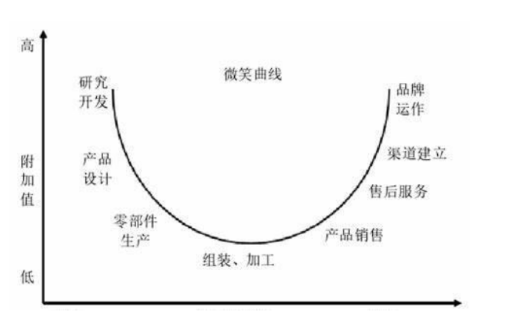
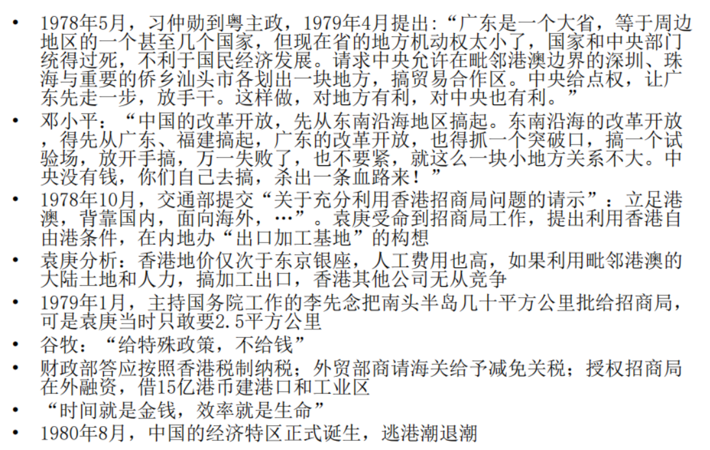
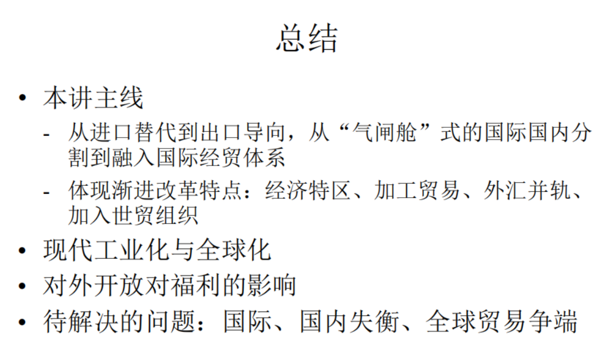

---
layout: page
permalink: /notes/复习笔记/中国经济专题/old-vault/old-vault-042/index.html
title: 第八讲 对外开放
---

> Imported from old Obsidian vault on 2026-07-06. Source: `中国经济专题\第八讲 对外开放.md`
工业化和全球化的关系非常密切

## 全球化

现代工业化三大力量之三——全球化：市场扩大、多国合作、全球供应
全球贸易中的**中心-外围分工**从“初级产品-制成品”转变为**产业链**三阶段：研发设计-生产制造-营销服务(微笑曲线)
	中心-外围理论：外围国处于原材料供应，中心国制成品。
微笑曲线：
	
中心国家掌握上游和下游，外围国家只能掌握中游的生产制造。

## 计划经济时期的经济开放
目的：建立自己的工业、产业体系。国外工业品有巨量的产出。直接进口可以享受较为低廉的产品，但直接进口就不能建立自己的产业体系——要建立壁垒
#### 设置进口壁垒、保护国内工业，实施进口替代
同时需要进口重工业产品——机床等机器设备——建立**专营的外贸公司**购买——移交卖给国有企业，价格无所谓，都是国有——但不进口基本的消费品。
外贸专营公司同时从国内收购产品（纺织品、食品）高价卖给国外，赚得的资金用于国有，支持工业化。
外贸专营公司在两条售卖道路中可以赚取价差，但都能够转化为国有。

国有外贸公司垄断外贸——内生于发展战略
#### 外贸专营体制：由国有外贸公司垄断外贸
- 高度集中、政企不分、统负盈亏，为工业化提供原始积累
- 将国内经济和国际经济分离 - 类似飞船的“气闸舱”
- 进口钢材、机器等，出口纺织品、加工食品等
- 出口商品的外销价和进口商品的采购价 - 国际市场定
- 进口商品的内销价和出口商品的采购价 - 由计划定

#### 实施外汇管制：外贸企业外汇收入全部上缴，不可自由兑换
- 人民币币值高估（1980年1美元兑换1.5元人民币）
换汇问题：对外美元，对内人民币，需要交换。汇率由国家制定。租金由外贸专营公司获得。
为了多出口赚取外汇，用于工业化，使用高估人民币币值的策略，出口品的价格高，可以多换回机器设备。
#### 其他：国际援助（如156个苏联援华项目）、技术引进（如一汽从德国购入奔驰车，经东德进口西德薄钢板）、人才引进（1949到1960年间聘请来华专家2万多人，派遣留学生、实习生1万人）
有条件的开放服务于工业化

#### 特点：外贸依存度低（进出口总额占GDP比重；1970年仅5%），大量通过香港进出口
对外开放有限。对外开放主要目的是实现工业化。（闭关锁国——为了独立自主的工业化）

## 逼出来的开放

#### 长期脱离国际经济体系，经济发展落后

- 1950年中国的GDP等于日本的1.5倍，1960年两国总量相当，1980年日本经济总量等于中国的4倍

国外技术进步突飞猛进。而我们自然落后。形成国内国外差异。
#### 深圳“逃港潮”

- 1957、1962、1979、1980几拨逃港高峰

- 1961年，宝安向香港开放小额贸易，出售稻草河鲜，购入化肥农药等

深圳河隔开。深圳人发现香港中赚钱更多，就出现很多人偷渡到香港——造成灾难、危机

而我们的改革就是危机驱动的。

#### 危机驱动思想解放

- 1972年，美国总统尼克松访华，中美联合公报发表

- 1978年，副总理**谷牧**率团访欧洲5国，回来决定引进技术、借钱搞建设、尽快争取时间

- 1978年，邓小平访日（新干线）、见德国新闻代表团（首次提出开放）、访新加坡

- 1979年，邓小平访美

- 1979年，中美建交——意识形态上扫除闭关锁国的障碍

## 双轨制度：经济特区、加工贸易——不改变原有外贸体系

#### 鸦片战争带给中国的约束：主权与开放的矛盾
坚持主权、闭关锁国就落后于世界。

#### 经济特区——现代版本的通商口岸。渐进式改革

- 提供税收优惠、基础设施、公共服务、劳动力和市场环境——产业政策

- 提供政策试验的场地

- 吸引外商直接投资

- 发挥“气闸舱”的作用——外贸专营公司改为一个区域，起到内外开放的桥头作用
	- 1980年批准设立4个经济特区：深圳：327.5平方公里；珠海：6.81平方公里；汕头：1.6平方公里；厦门：2.5平方公里
	- 1983-1991年间多次扩大特区面积
	- 1988年海南设省，成为最大的经济特区
案例：蛇口
	

### 加工贸易——另一种渐进改革的形式
内外打通的冲击——需要过渡——经济特区+加工贸易

将国外资金引入内地，利用内地的土地和劳动力资源加工产品，再卖出去，不影响国内市场的内循环。

内外之间：**出口加工区** 
#### 加工贸易：
- 区别于一般贸易：企业原材料经加工装配后，将制成品复出口
- **双轨制**逻辑：不打破原有的外贸专营体制，不影响国内市场
#### 三来一补（来料加工、来件装配、来样加工和补偿贸易）
- 由外商提供设备、原材料、来样等，由中方提供工地、厂房、劳动力，按照外商要求组织生产、加工装配，全部产品外销，中方**收取加工费**；产品不得内销；**企业不具有法人资格**，由外资公司的分公司等
- 例：香港企业将布匹航运到大陆农村，将布匹做成衬衣再运回香港，大陆企业获得加工费，布匹和衬衣都由香港企业所有
	原料所有权并没有转移。
- 避开对一般贸易的复杂的进口管制和行政垄断

同时学习国外管理经验、技术。
自贸区是免除海关监督、给外资准入权的。不涉及通关和进出口指标的问题。

出口加工区的最高级——自由贸易港
#### 出口加工区：进口的原材料和中间品在加工区内进行生产并出口，不收取进口关税

#### 特点：低生产率、低附加值、大进大出

加工贸易的占比在01年前最高到55%左右，很高，后下降。

例子iPhone生产，起初China只占最后3.6%的组装部分——深圳富士康——处于微笑曲线中游。
2018年 有 25.4%
附加值提升了很多倍。

另一种方式：派遣工人体系。运劳动力过去做组装。劳动力不是作为政治移民、不享受任何福利体系。

区域分割、制度差异，特殊形式，把最缺的要素运过去结合产出结果。
## 外贸体制和外汇体制的改革

### 改革外贸体制
承接东亚四小龙淘汰下来的劳动密集型产业
现在为了出口本国产品，需要贬值人民币，使得更有竞争力。
#### 人民币贬值、鼓励出口（1986年人民币与美元汇率下滑到1:3.5）

#### 恢复外汇留成，提供出口激励
恢复留成——各地外汇企业的钱不必全部上缴中央。官方汇率和市场汇率的租金差，租方就是租金所有者。
- 1958年，地方外贸企业外汇收入可以留成6%；1978年恢复并扩大为中央部委、地方和企业全面留成，留成比例提高为20％和40％(地方)，有的甚至提高到80％至100％

#### 1984年外贸体制改革

- 改革外贸专营体制，实施**外贸代理制**，许多地方政府和工业部门获准设立外贸公司；1988年达到5000家——有外贸资格能够赚外汇。只要有内外价差就能有利润。

- 政企分开、简化计划审批——专营外贸的企业
买办——利用国内外贸易价差赚的租金

- **进口商品定价改革**：按国际价格加进口佣金进行定价，可低于国内计划价格进行销售，鼓励外贸企业寻找商机

- **工贸结合、技贸结合**：让生产企业获得出口权，或者外贸公司与国内厂商进行合同转包、合办企业等，以降低成本；
	获得外贸资格的批文，这种权力就能变现，贸易起家——联想
	

#### 1988-1991年：实施外贸承包责任制，取消对外贸出口的财政补贴，

外贸企业**自负盈亏**；改变按地区实行差别外汇留成比例的做法，实行按不同商品大类全国统一的留成制度——分权 + 竞争

国际贸易能够产生巨大的租金——分散+竞争——扩大贸易

### 改革外汇体制
一直以来是按照计划配置资源定汇率。
#### 外汇双轨制
- 计划轨：官方汇率，高估人民币
- 市场轨：外汇调剂中心 + 场外交易——汇率更高，1美元值7-8人民币。催生了外汇调剂中心
		外汇的额度——是一种行政许可——一般是不让交易的——但这是唯一合法允许交易的
	

#### 外汇调剂中心：合法买卖外汇额度
- 外汇留成的形式主要是“外汇额度”——即企业可以按照官方汇率购买外汇的权利
	出口企业赚的外汇额度卖给进口企业
	
- 1980年，允许中国银行办理外汇额度的调剂业务，在北京、上海等地设立12个外汇调剂中心，允许按照内部结算汇率（高于官价汇率）上浮10％的范围内（仍然低于市场价格）交易外汇额度
		
- 1985年后，由外管局监管外汇交易，从深圳开始实行外汇额度自由定价，并扩大到全国100多个外汇调剂中心；1987-1992年，约90个外汇调剂中心成为公开市场，成交量从47亿美元扩张到228亿美元，占全国用汇量的50%

#### 1993年底，外汇双轨制并轨：官方汇率（1: 5.8）并入外汇调剂中心的公开市场汇率（1: 8.7），经常账户实现自由兑换
- 盛洪“外汇额度交易——一个计划权利交易的案例”《中国制度变迁的案例研究（第1集）》
## 加入世贸
国际国内打通后需要进一步改革，过渡阶段。国际商品进入国内有较高的关税。15年的谈判。
核心——把较高的关税降低到9.8%，很多行列0关税，并且能够便宜的购买其他国家的商品。

谈判中：需要保护弱势行业，谈一个较慢的进城。让农业服务业知识产权等继续发展一段时间。
机电轻工纺织消费电子等可以卖，但国外优势行业——汽车、农业、高端服务业（银行保险）就会涌入中国，中国国内的一些就会垮掉。
加入WTO是有得有失的。

对齐到区域——有些是机电轻工纺织密集的区域，有些是其他。
对齐到技能——机电轻工纺织对应的技能
最后到个人

这种冲击就称为渗透
#### 世贸(WTO)协定：政府间关于市场开放的协定
- 要求缔约国实行市场经济，开放市场、降低关税、消除贸易壁垒

#### 为保护国内工业，此前构筑了各种关税与非关税壁垒

- 平均关税税率已从46%降低到15%左右（汽车超过100%）；进口配额；外贸经营权；设立外企的经营范围和地点受限 …

- 经历15年谈判，2001年12月正式加入世贸：关税(承诺降到9.8%)、非关税措施、农业、知识产权、服务业开放——争取渐进开放

- “狼来了”的预言：增加1000万失业、民族工业垮掉 …

#### 加入世贸的后果

- 获得巨大的国际市场，发挥比较优势、实现规模经济：机电、轻工、纺织、消费电子、建筑、旅游等

- 汽车、银行、保险、电信、农业等行业受到冲击
	银行保险大部分后来退出，因为有很多其他的规定和制度壁垒并没有完全开放。
	通过这个过程电信巨大发展。

- 影响“渗透”到个人：差异化影响产生巨大的收入分配效果

- 对外开放**促进国内制度正规化变革**
	非正规制度的方式过渡
	加入WTO就不一样了。需要主动靠拢接受国际制度的特征。国内企业需要转型到现代——促使法律、金融各行业的正规化转变。

## 外商直接投资

#### 从国际贸易到外商直接投资（FDI）
- 本土化
- 解决就业、增加资本投入
- 带来技术、管理经验、营销渠道
	后发国家希望通过FDI本土化，国内成本可以被打下来，最终实现国内国外平衡。
	还希望外资能投基础设施。
#### 中国FDI特点

- 早期FDI主要来自东亚国家，以及中国香港/台湾，依靠侨民网络
		早期依赖社交网络、宗族的直接投资

- 早期以合资企业(joint venture)为主，后期独资企业多
		中国制度环境比较复杂
		同时有很高的技术需求。
		比如汽车需求，要求外商投资进入和两家公司合作各占50%。
		后期外商有知识保护，独资企业为主。

- 大部分流入制造业
		
- 从“外商投资产业指导目录”，到“外商投资准入负面清单”
	目录——产业政策————开放后变为清单，不在清单上的都可以投。
#### 鲶鱼效应：带来竞争
外商的技术带来技术和管理经验，并且通过竞争促进国内企业的发展。

- 例：上汽通用、天津摩托罗拉、汇丰银行、沃尔玛、巴斯夫、特斯拉

### 渐进开放的几个阶段
#### 第一阶段：从点到面渐近开放
设立开发区开放城市、加工区，改革外贸专营体制

- 1980-81，广东福建的四个特区；1984年5月，14个沿海开放城市；1985年2月，长三角、珠三角、厦漳泉三角洲和辽东半岛、山东半岛；1988年4月，海南设省，最大的经济特区；1990年4月，上海浦东；1991年，满洲里、丹东、绥芬河、珲春四个北部口岸；1992年，上海沿长江6个沿江城市；4个边境和沿海的省会城市；3个沿边城市；11个内陆省会城市；2000年，西部开发、西部开放

#### 第二阶段：加入世贸，成为“世界工厂”

- 外贸依存度高

- 伴随劳动力成本上升，产生产业升级的压力
		往价值链的高处移动，往微笑曲线的上下游移动。
- 纪录片《中国梵高》
		油画服务业的发展

#### 第三阶段：2017年之后，逆全球化时代。外贸依存度降到30%多

- 贸易保护抬头、中美贸易战、逆全球化
## 国际失衡
长期出口导向，压低汇率

#### 贸易顺差

- 出口导向、压低汇率

- GDP = C + I + G + NX；2008年，净出口占GDP 7.9%，但外贸依存度有60%。
		顺差国——以外汇储备的形式积累起来，我们挣钱别的国家就有赤字。
		

#### 贸易顺差获得的外汇去哪里了？

- 央行发行人民币购汇，形成外汇储备(2014年达到38430亿美元)
		把多挣来的美元换回人民币
#### 巨额外汇储备的影响
巨大劳动力资源、环境损耗为代价。挣来的是美元，是买不到国内的商品

- 获得外汇的代价：投入劳动力、资源

- 外汇储备买不到国内的商品与劳务

- 用外汇储备购买国外的商品和劳务？导致人民币升值、影响出口
		理论上可以，但一买就变成进口。
		内生于目标的，不会买。
		只能用于投资美国国债

- 国内影响：人民币被动超发
		造成通货膨胀——抵消原来购买

#### 国际失衡
很多逆差国欠钱，制造业流失，工人失去工作。
酿成了2017年之后的全球贸易争端。

## 中国企业走出去——扭转国际失衡的一种办法

中国资本到国外设厂，在别国挣钱，把GDP变成GNP。少利用国内稀缺劳动力和资源，让别的国家能够平衡。
企业遇到贸易冲突也有走出去的需求。
#### 对外直接投资(OFDI)

- 早期以获取自然资源为主，由大型央企主导；随后是工程建设、制造业产品销售；近年来开始劳动密集型产业的转移

- 2016年，对外直接投资超过内向外国直接投资，其中能源和电力38%；金属矿产16%；房地产10%；运输8%；金融8%

#### 对不同国家直接投资的特点

- 投资落后国家：从倾销低廉产品，到提升当地收入、培育市场

- 投资中等收入国家：本地化，配合基础设施建设

- 投资发达国家：获取被收购企业的技术、利用人才建立研发中心

- 通过并购获得技术和资源备受争议，绿地投资受到东道国欢迎

#### 企业考量：打开新市场、本地化要求、从部件组装到供应链前移

- 例：吉利收购沃尔沃、成为奔驰最大股东、在瑞典设立研发中心

- 纪录片《美国工厂》《出海》《深海》

