---
layout: page
permalink: /notes/复习笔记/中国经济专题/old-vault/old-vault-043/index.html
title: 第六讲 金融改革
---

> Imported from old Obsidian vault on 2026-07-06. Source: `中国经济专题\第六讲 金融改革.md`
[[第七讲 工业化]]
[[第五讲 财政体制]]

这节课讲一般意义上的金融资源配置问题
制度的发展和调整受改革经济学的推动,另一条线。正规制度和非正规制度长期并存。两种制度两种市场。(双轨制)

## 金融体系
### 金融的作用
金融机构发挥中介的作用——将储蓄转为投资
	人力资源有没有中介? 招聘市场;
	土地资源?城市国有土地拍卖：拍卖中心；土地交易所。重庆的地票——土地要素包装成金融产品交易
	人力资本是附着于人的
	金融资源存在完全可分离的属性,所有者可以完全把金融要素分离,金融要素非常适合在市场交易
	自由流动，可以货币化。
	储户转移到投资人,需要经过金融中介或市场面对面(p2p);大部分通过金融中介发挥作用。
	银行是最典型的中介,从储户吸收存款,然后以贷款的方式放贷给投资人。
### 直接融资vs间接融资
资本市场vs银行
	由银行作为资金池,间接融资。
	相对的就是直接融资p2p。合约关系以亲情和宗族等,或人与人直接认识的信用直接达成。而银行通过雄厚的财力，起到信用担保的作用,一方面承诺给利息，另一方面按期收取贷款利息。风险由银行承担了大部分。
	最初间接融资为主，逐渐发展壮大银行；后期像股票市场等直接融资又会出现。
	从效率角度,直接融资效率高,避免中间的步骤;而银行可以解决一对多的**信息不对称**,解决交易费用高的问题。可以从经济的基本面去分析。
风险对比：直接>>间接
发达经济体以直接融资为主，资本市场与金融产品多样化。很多的经济活动能得到经济支持
	提升效率，有别的方式担保风险，能发育出丰富的金融产品，发展出发达的资本市场。
而发展中国家以间接融资为主。

### 金融深化

深化就是deepen，深入。金融体系是为了融通资金促进经济发展，让资金要素从储户到投资人中
当有很多金融要素、产品和资本市场发育后,投资人更容易找到资金支持其投资项目,储户也更容易找到方式让他的资金保值升值。

金融深化度量了一个体系能多大程度的实现融通作用。

M1是指狭义的货币,由中央银行控制。流动的货币M2是广义货币,取决于金融体系的发达程度。

**M2/GDP 可以度量金融深化的程度**。——金融资产与国民收入之比

经济活动可以类比为车轮滚动,货币、金融资产是交易中介,相当于润滑油其减少摩擦。

中国：不断深化但不够“宽化”
另一个概念是“宽化”:M2中有多少种资金的形式,融通资金的方式。——金融产品多丰富？ 
越丰富多样越能满足多样化的需求

e.g. 风险投资创新:银行公司贷款创业公司去研发? 不太合适。风险投资被发展,对创新这种资金活动进行投资。

以银行贷款为主，宽化不够
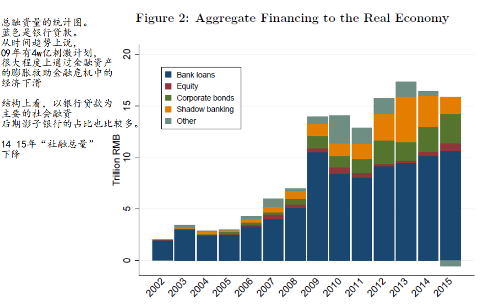
Deepseek
**金融宽化**指金融体系在**覆盖范围、服务对象和产品种类**上的横向扩展，强调金融服务的普及性和包容性，目标是让更多人、更多领域获得基础金融服务。

**金融深化**指金融体系在**效率、功能和市场机制**上的纵向提升，通过完善市场结构、优化资源配置和增强风险管理能力，提高金融对实体经济的支持效率。

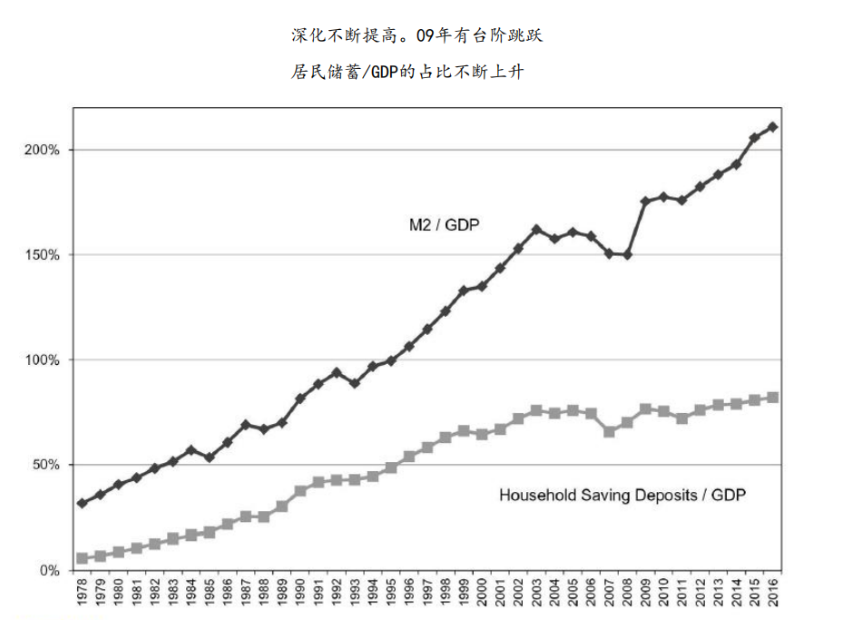
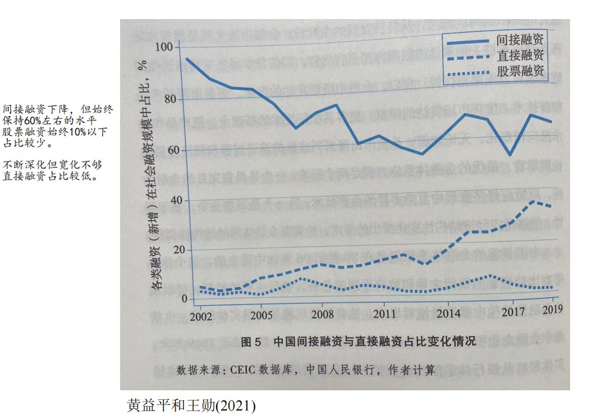

### 正规金融——银行
计划经济时期,服务于重工业优先发展，经济主体的投资活动，中国人民银行就是国家的记账会计。财政资金以中国人民银行贷款的方式调配,中介的作用较小。

改革开放之后,商业银行逐渐发育。资金如何配置给实体经济和投资者靠商业银行。

83年拨款的无偿划拨土地和财政资金、招工名额,
没有成本概念,不利于企业成为自主经营自负盈亏的经济体,改为银行贷款就要付利息。
94年建立公司法、税法,一方面要贷款付利息，另一方面要交税。

其他银行:股份制商业、政策性(需要周期长、利率低的资金,需要政策优待)、外资银行
分为:政策性、全国性商业、股份制、城商行、农村合作金融机构、外资银行、民营银行
• 计划经济时期
	财政部门是经济运转的核心，经济主体投融资活动由财政主导推动
	资金统一调配，金融中介的作用小，人民银行作为国家的会计
	1978年，中国人民银行占据全国93%的金融资产
• 商业银行体系的建立
	-1979年后从人民银行分拆出四大国有商业银行：农、中、建、工
	-**1983年拨改贷：对国企的财政拨款改为银行贷款**
		付利息+交税，让企业自负盈亏。自主经营的主体

• 1987年起陆续成立股份制商业银行：招商、中信

• 1994年成立三家政策性银行：国开行、进出口银行、农发行——支持长期回报低、但有正外部性的基础设施发展性融资，利率低，需要政策优待。

• 1996年**农村信用社**脱离农业银行，城市信用社被改造为城市商业银行

• 2001年加入WTO后逐步开放**外资银行**人民币业务和经营地域限制
	
• 2003年后注资四大国有商业银行，不良资产剥离，改革上市

• 2007年成立中国交通银行、中国邮政储蓄银行

• 2014年成立民营银行：微众、网商、中关村

### 金融抑制

抑制:repression 不让其发展。逻辑类似劳动力市场、土地市场,不让自由流动。追溯到计划经济时期的发展战略,压低这些要素,以**便宜廉价的资本**提供给工业化。租金被国家收取。

金融抑制保证了资源能以廉价的方式提供给工业化

低成本资金从家庭流向国有企业,只能存银行,**金融抑制的受益者是银行和国有企业**。

但有弊端:**金融欠发达,很多经济活动得不到资金支持**。特别是**民营经济和集体经济**就缺乏资金支持。价格扭曲,会出现**资源的错配**。压低利率,若低于均衡利率,会出现供小于求的状态,扭曲投资效率。产业结构失衡,重工业过度发展,轻工业发育不足。

• 逻辑：压低投资成本，补贴资本密集型重工业
	-行政干预金融资源配置：利率、汇率、金融机构、资本流动等方面
	-“拨改贷”后，金融市场成为补贴国企的主渠道
	-类比对其他要素市场的干预（土地、劳动力）
• 以**低利率为主要特征**——避免国有企业成本太高——补贴国有企业——压低利率
	-在以银行为主导的金融体系下，储户没有其他储蓄和投资渠道
	-高通胀年份，居民存款实际利率为负(1987-1989, 1992-1996, 2010-2011)
	-低成本资金从家庭流向国有企业，银行和国有企业是受益者
• 金融抑制的后果
	-**金融欠发达**——不利于经济增长
	-失衡——低效率投资、产业结构失衡、外部失衡
		外部失衡,外汇储备过多。**金融抑制是内生于发展战略的**。
	-不利于收入分配——**家庭部门财富被无形的剥夺**。
		家庭部门财富被剥夺用于支持企业部门,不利于家庭。
	-正面效应：金融稳定
		金融危机的影响不会很大
		不会出现很多高风险的活动
		玩家还没准备好，保护弱者、防止风险

• 国际比较：英美、德国、日韩
	英美发达,日韩与中国相似。德国也是以间接融资为主。越是有政府控制,金融抑制越强。

### 正规金融体系之外——民间金融
抑制下会发育出**非正规金融体系**。比如劳动力:自带口粮进城打工。正规体系给储户的收益太低,供给侧角度储户需要寻找高收益渠道。
从需求侧,缺少资金支持。
“信贷歧视”统计性歧视和偏好性歧视。统计性:收益低、风险高所以收更高的利息。偏好性:怕有审计风险、国有资产流失等,贷款给国有企业还不上也可以说在国有体系内不会流失。

两侧一拍即合——双轨制。

• 逻辑：金融抑制之下，资金在正规金融体系外寻求高收益
	-供给侧：储户寻求高收益的存款渠道
	-需求侧：**民营企业规模小、位置分散、不确定性大**，面临信贷歧视，被排除在正规银行信贷之外，缺资金支持
	-双轨制在金融系统的体现（第十一讲）
• 依赖**社会网络提供信用**
	-孟加拉国格莱珉银行、中国产业集群发展早期
	-“信用合作”社
	-民间金融的各种案例
	-在互联网时代发展出P2P借贷，后于2020年全面退出
	例子：
	比如跑外卖,需要租电动车,跑骑手,先赊一辆车,赚了钱再还。赊账需要多收利息,保证不跑路基于信用。依靠社会网络产生信用。正规金融很多需要靠抵押:房产等。
• 2020年最高法明确民间借贷司法保护上限为LPR的4倍

• 国际比较：发展中国家的小额信贷

Allen et al. (2005)：非银行、非市场来源基于声誉和关系的信贷支持了中国增长最快的私营部门，而正规金融市场的对区域产业集聚的影响甚微。
- 2002年针对江浙沪企业的调查显示，私人信贷占据企业融资的重要部分

· 例子：标会
	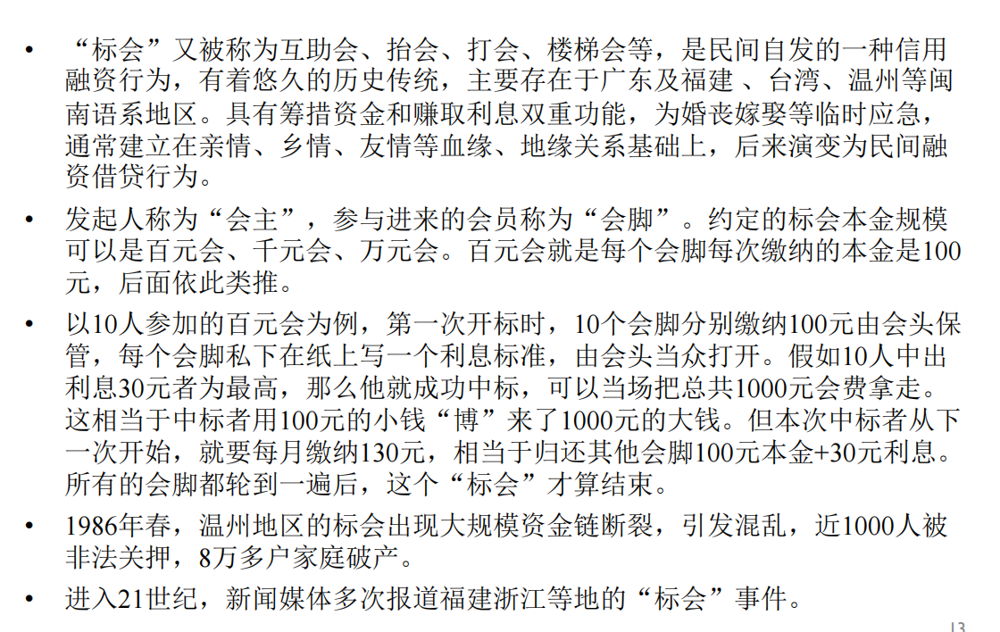

### 影子银行
影子银行不是纯粹的民间金融。是金融中介搞的正规之外的业务。

为欠发达的金融体系提供资金,部分纠正资金错配

是银行传统信贷业务之外的各种业务,绕开了监管,诱发风险。“存款保险”。影子银行忽悠骗钱,出了事故后得不到存款保险的保证。

• **影子银行：正规银行系统以外的各种金融中介业务，通常以非银行金融机构为载体，对金融资产的信用、流动性和期限等风险因素进行转换，提供流动性和信贷转化，扮演着“类银行”的角色。**
	-狭义口径：不接受监管的小贷、融资担保、网贷、不备案私募、第三方理财、民间借贷等
	-中等口径：金融牌照业务下非银行机构的的信托、理财、货币市场基金、资产管理、股票融资等
	-广义口径：银行资产负债表内外的非传统信贷业务

• 国际比较：美国1970年代出现影子银行（如货币市场共同基金）

• 后果
	-把资金转移到更有效率的生产部门，部分矫正了资本错配
	-为私营部门特别是中小企业提供信贷支持：“创业影子”
	-逃避监管，诱发风险

例子：委托贷款
	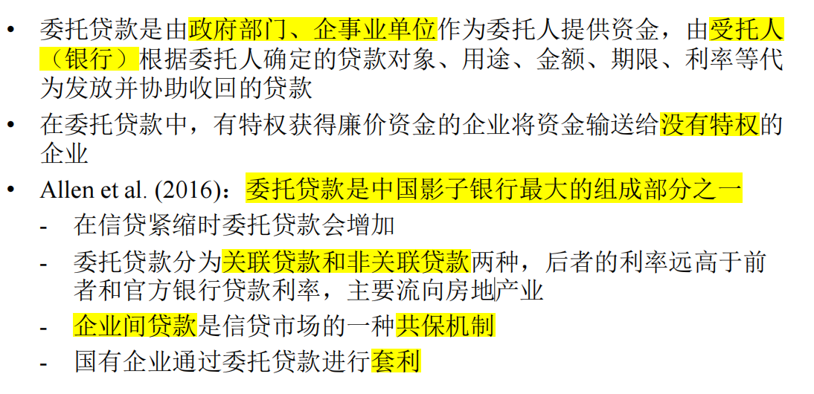

## 金融去管制
高度管制市场下会逐步放松管制。先放开贷款利率再放开储户**利率**:先对弱小的一方实行保护。如果企业能搞外贸,就比较强,可以放开其对外的限制。最后再放开储户的限制,因为储户很容易被高息诱惑

• 在金融抑制下，资金价格受到管制
	-央行制定几百项利率
	-发挥产业政策的作用；例：秸秆养牛享受优惠利率——支持实体经济

• 利率市场化改革
	**先外币后本币，先贷款后存款，先长期大额再短期小额**
	2013年放开人民币贷款利率，创立贷款基础利率(LPR)报价机制
	2015年放开存款利率

• 外汇市场化：1994年汇率并轨，经常项目可兑换
	-保持资本项目管制；2005年有管理的浮动汇率；2015年大幅贬值

• 监管放松与市场准入：2001年WTO外资银行、2009年股份制银行
	分支机构审批权下放、2014年民营银行试点，2015年《存款保险条例》

• 逐步缓解金融抑制、促进金融深化和宽化
	-从商业银行到证券、保险、信托等更多的金融产品
	-数字金融发展的影响

### 地方财政与影子银行
背景就是地方政府公司化,财政分权。
地方政府帮助地方国企获得信贷资源。国企获得利润后交税,给地方政府提供收入。
1. 游说国有商业银行过来
2. 组织本地零散的资金筹集,比如农村合作基金会(准银行,向当地特定群众吸纳股金,利率达到银行同期2~3倍,为当地经济发展提供大量资金,其不受监管,会积累大量风险,97,98年大规模清理整顿)

• **地方政府-国有银行-国有企业的“三位一体”模式**
	-早期：地方政府利用国有银行作为**金融杠杆**，帮助国企获得大规模的信贷资源；国企占据能源等资源，垄断产业上游，获得利润
	-**农村合作基金会、信托投资公司**
	-发展：财政分权之后，银行系统“财政化”；1990年代金融整顿后收缩；2004年后**城商行**成为地方政府新的金融杠杆
	-助推**投资过热与产能过剩**：钢铁、煤炭、房地产、光伏

• **地方政府融资平台的兴起**——缘起于城投公司
	-国开行支持下的“芜湖模式”
	-**城投公司**从进行城市基础设施投资，逐渐演变为地方政府的资产包，起到绕开预算法、为地方政府进行投融资的作用，成为**影子财政**
	-投资：基础设施、市政水暖、特许经营、土地开发、其他投资
	-融资：银行贷款、市场发债，通过各种影子银行融资——政府提供隐性担保，构成**政府隐性债务**——形成**影子银行中的“财政影子”**

例子： 农村合作基金会
	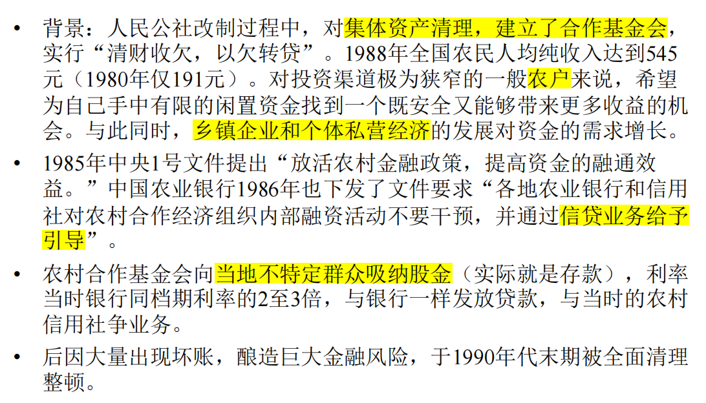
例子：信托投资公司
	中信：超越银行之外的非银行金融机构。着名的有广国投,广东地方政府控制了这样一家巨无霸的信投公司。
	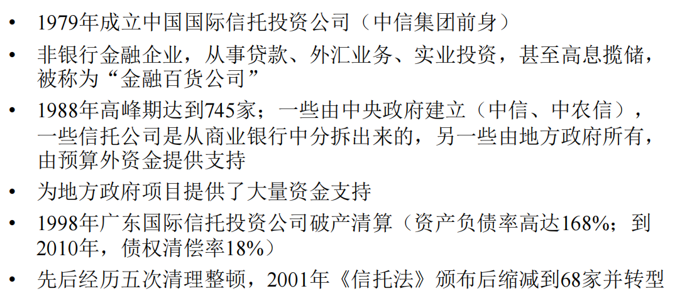
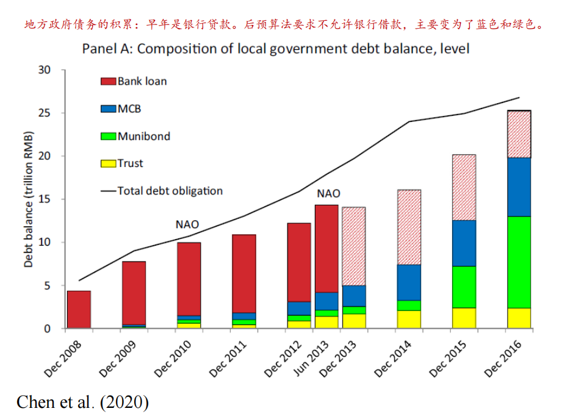

### 影子银行中“财政影子”的壮大
• 2008年全球金融危机后，中国政府实施4万亿财政刺激计划，其中大约3万亿为新增银行贷款
	-债务资金大量流入房地产开发商（房地产）和地方政府融资平台（基础设施建设），考虑到房地产通过土地财政为地方财政收入做出重大贡献，也可算入“财政影子”
• 后四万亿时期
	-地方政府融资平台的债务展期和后续投资融资压力，导致持续的资金需求，助推了影子银行在2012年之后的急速扩张
	- Allen et al. (2023）：超过一半的信托资金流向国企
	- Chen et al. (2020)： 约2/3的城投债被银行表外理财产品购买
	-挤占民营企业的资金来源

• 2014年新预算法允许发行地方债
	-债务置换：从隐性债务变成显性债务

• 影子银行和地方债务之间相互依存，构成中国系统性金融风险的主要来源

### 资本市场发展
• 资本市场：直接融资
• 证券：债券、股票、期货、期权——标准化后的资产

• 债券市场
	- 1981年发行国债，1983年发行企业债（国企），2007年发行公司债（非国企）
	-企业债占比从2003年1.5%提升到2018年12.88%
	-包含银行间债券市场、交易所债券市场和商业银行柜台市场
	- 2020年末，债券市场余额114万亿元，居世界第二

### 股票市场
公司发行股票给自己的股东。股权的交易需要交易所or OTC 中介作用。

国有企业的资产到底值多少钱,大家不敢打包票。大部分国有企业上市的股票是不流通的。非流通的股东掌握企业控制权。与二级市场上一股对一股不等值。

一旦非流通部分允许流通,就对流通部分造成冲击,资金稀释。一碰“大小非”解禁股价就跌。形成价格压力

• 证交所担负为国有部门筹资的职能
- 1990年12月成立上交所、1991年5月成立深交所
	-前十年中，90%的上市公司是国有企业
	-国有企业上市仅出售少量股份进行部分私有化
• 国有股不上市流通（2006年有近2/3的股份不流通）
	-非流通股东实际掌握着企业的控制权，采取账面价值的计价方式，与二级市场上股票的价格无关
	-“大小非”：大额小额非流通股，国有股、法人股
• 审批严格、有配额、流通性差
	-金融系统以银行为主导、间接融资为主
	-直接融资风险高，保护投资者，体现“父爱主义”：供给有限，上市后非流通股有锁定期
	-问题：严进宽出监管弱、市盈率高，时间长，募集资金有限
	-国际股市：投资者风险自担，注册制，基于披露，无锁定期

上市很不容易,需要地方政府争取上市名额,还要辅导期、资格审查、法务调查等等。
是高度被保护的市场,体现“父爱主义”:政府十分关怀,并且上市后还有锁定期。与国际股市形成鲜明对比。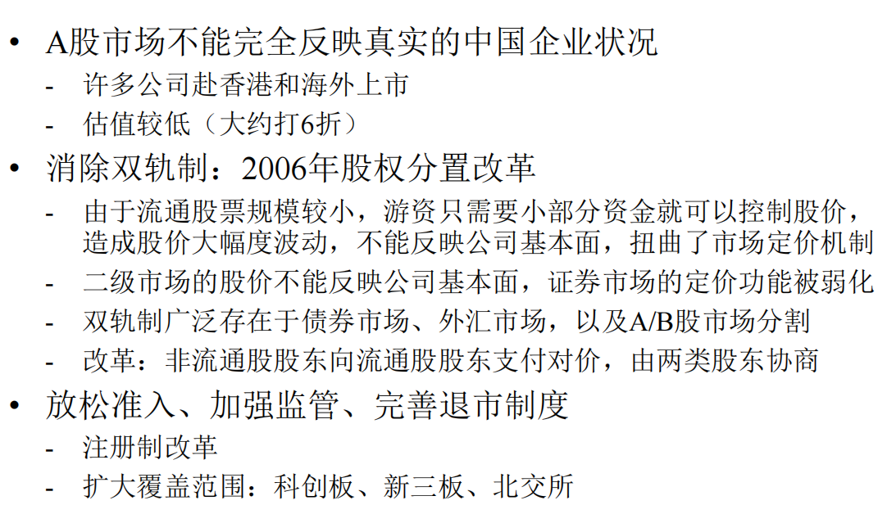

### 私募股权市场
创业高风险:特殊金融手段——私募股权市场,不能匹配传统的间接融资方式,需要那些有眼光能够承受高风险的融资人去匹配。
风险投资(Venture capital) 有限合伙人制 (Limited partner)

出路很重要。最好的是通过IPO上市。
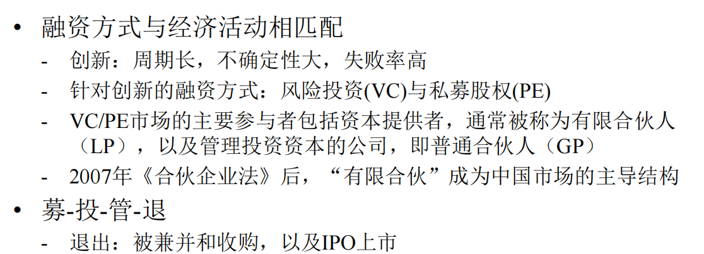

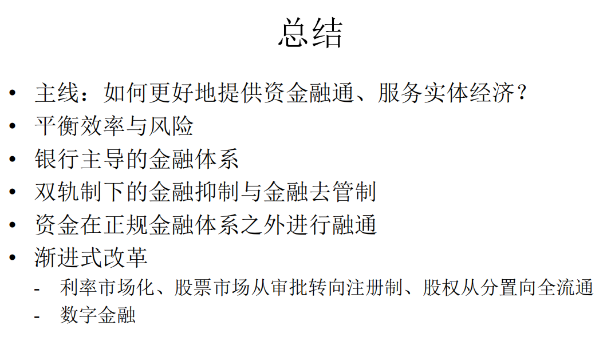
