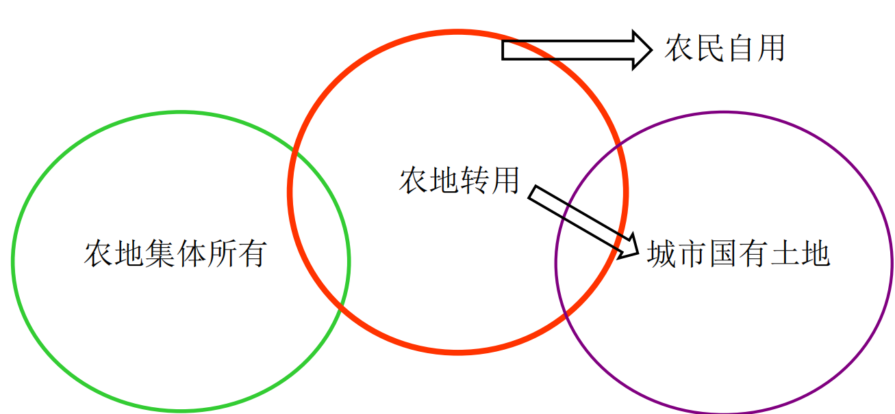
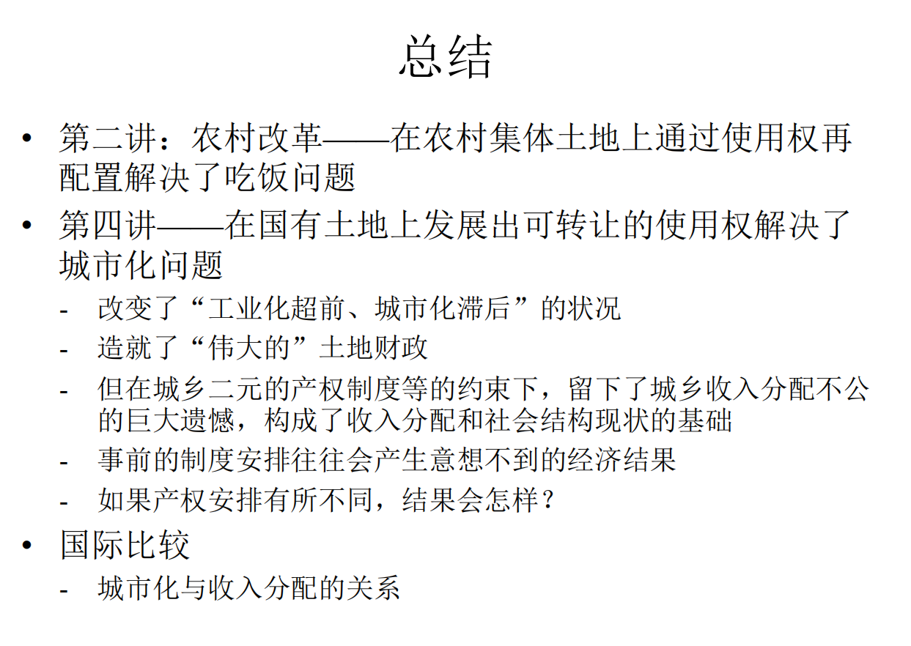

---
layout: page
permalink: /notes/复习笔记/中国经济专题/old-vault/old-vault-044/index.html
title: 第四讲 土地制度与城市化
---

> Imported from old Obsidian vault on 2026-07-06. Source: `中国经济专题\第四讲 土地制度与城市化.md`
[[第五讲 财政体制]]

## 城乡土地产权现状
#### 城市：土地国有
有不动产权证

- 使用权清晰、完备、可转让

- 商品房：完整产权，地随房走，使用权可转让

- 大城市 vs. 小城镇

#### 农村：土地集体所有

- 农用地：家庭承包（可能不定期调地；撂荒等情形下承包权不稳定），经营权可转让（有限制）
		承包经营权证保障

- “基于使用的产权”广泛存在于发展中国家
		工业化尚未完成，农村土地房屋承担重要保障职能

- 建设用地：宅基地（福利分配、不能单独转让、地随房走）、公益用地、经营性建设用地（在村庄权力结构下分配，有限转让）

- 房屋：所有权，有限的转让权（一户一宅）

- 特点：基于集体经济组织成员权分配实物使用权，缺乏合法的转让权
		成员权：得到福利分配等权力，只能转让给集体成员。看谁实际需要，合法对外转让权缺失

- 难以被作为抵押物
		抵押：一旦还不上钱用于赔偿的物品。实物使用权不能用于抵押；因为违约后借款人或银行不能拿走你这块东西的使用权，因为资产不具有流动性，属于集体，所以农村金融不发达。
## 农村土地产权制度的形成
#### 农村土地产权制度的变迁

- 1950年代：土改、集体化与人民公社

- 1962年前后《人民公社60条》等：确立宅基地集体所有与社员使用权相分离、无偿使用且无期限、社员拥有房屋私有权的制度
		饥荒——保障成员生存，权利归还给村民

- 1980年代初：家庭联产承包责任制
		
- 2002年《农村土地承包法》农户承包权和转让权以农业用途为限
		三权分立，只对农业用土地
- 乡镇企业用地安排的形成

- 2004年《土地管理法》：农民集体土地不得出让、转让或者出租用于非农业建设（几种例外情况）
		强调农业用途和非农用途分开
		逐步形成基于成员权的实物土地的权利体系，不尊重转让权并严格限制其变更。这边是农村土地产权制度的形成。

#### 逻辑：土地提供保障

- 保障功能（稳定、不流动） vs. 财产功能 ——冲突矛盾

- 《乡土中国》

- 国际比较：土地公有制，信托制——英国信托制兼顾财产功能和保障功能

## 城市土地产权制度的形成
#### 城市土地国有的形成

- 《中国土地法大纲》和1954年宪法保护私有产权
		城市房屋私有，发城市房屋私有产权证

- 1955年社会主义改造；1982年宪法规定城市土地归国家所有
		新民主主义和社会主义革命两条路线，跳过前者，不尊重私有产权，城市土地逐步被收为国家所有。直到宪法规定。
- 考量：为城市建设提供**用地便利**，建设用地一律**无偿划拨**
		大学建设由国家拨款筹资占地建设；
		高校占地、大院由无偿划拨建立

#### 土地使用权可转让的形成

- 非公有制的发展，深圳、上海浦东的开发开放

- 学习香港土地批租制
		香港割让给英国，九龙半岛和新界是租用的；英国土地产权制度下，所有权和使用权分离，租期最长可达999年、
		土地批租制：不改变所有权，让一定程度的土地可以租用给开发者和投资者。

- 1988年宪法规定土地使用权可以依法转让
		吸引外商投资、发展便利的考量

垄断市场：政府是唯一的供应商——开发商是采购者
- 一级市场（所有者供应土地）与二级市场（使用权再次交易）
		一级市场中的土地是新进入市场的；二级市场是对二手土地的交易
- 一级开发：规划-指标-征收-拆迁安置-补偿-收储-配套建设-出让
		从集体征收、拆迁安置补偿农民。
		土地拍卖：商住、住宅、工矿等用途
- 纪录片《全球变化最快的地方》《中国市长》
	重庆巫峡、三峡工程淹没的县城；新县城的建设占用了好几个村，占用过程中农民对抗要求更多补偿。最终实现城市化
#### 用途管制的加强： “18亿亩耕地红线”

- 耕地转为建设用途需“建设用地指标”，由行政体系配置
	耕地不多；保护粮食安全，保护耕地使用。再想用农用地，需要有很高的指标。变为稀缺资源

农地：农村集体所有的农业用途土地。

#### 工业化和城市化导致土地因位置和用途的差别而价值迥异

- 土地增值的分配取决于产权的安排

#### 农地转用通道1：自行转为建设用地，不受保护

- 法律的三处例外：自用、入股联营、因破产兼并发生转移

#### 农地转用通道2：经过征收转为城市建设用地

- 通常是所有权和用途同时改变

## 土地资本化
#### 定义：土地由于可以带来收益及稀缺性而具有资产特征，经过市场交易使得土地增值的过程叫土地资本化

#### 工业化、城市化需要巨量的基础实施投资从何而来？这是发展中国家面临的共同难题，中国的实践是经由土地资本化面向未来筹资
很多发展中国家依赖国际银行贷款
	
- 四大要点：产权清楚，可以**合法转让**；有需要现金的土地**权益出让方**；有对未来土地收益有较高预期且有现金支付能力的**买方**；双方估值不同
		宪法规定。
		看好的开发商和购房人，或有需要的城市居民；能够撮合产生交易
		
- 与公司融资的对比
		资金需求期限的差异促成交易；公司出让部分股权让投资人较早进行投资。
#### 经过法律法规的演进，逐渐明晰了（城市国有）土地的产权、开启了资本化的进程

- 对产权的细分和确认，促进了土地市场发育，促进了城市基础设施投资，发展出城市房地产市场，带动了地方财政收入的增加

- 重点是**明晰的产权留给了地方政府**！

## 经济集聚、城市化、不动产增值

买方：城市土地价值最终来源经济集聚。经济活动聚集便产生价值，该价值要在未来才能实现。看好中国城市化进程，就投资稀缺资源——土地
#### 城市化的动力：经济集聚

- 集合需求、深化分工、规模经济、信息与知识传播

- 密度的提高增加了生产效率、生活福利水平，稀缺资源产生增值

#### 不动产（土地、房屋）分享增值的必要条件：用途、位置和产权安排
位置：城市中心，能够享受到经济集聚的便利。
- 所有权、用途规划权、使用权
	前两者归政府，使用权需要归属
	学区房，学区是政府规划的；豪宅：住房舒服
	使得购房人和开发商都拥有相应权利，就有愿意掏钱的人。

#### 中国城市房地产市场的形成

- 房改前：福利分房、不可转让

- 1994-1998年房改：商品化、停止福利分房

- 房地产市场黄金20年

#### 经济学原理问题：房价为什么高涨？
取决于相对弹性。
若需求有弹性，需求上升，曲线右移，价格上升
房价上升也会拉高地价。
- 高房价带动高地价，还是高地价推高房价？

- 租金理论

## 土地涨价归公？
土地房屋增值与土地所有者无关；经济集聚城市化是由于公家的投入，应该归公。由此实现社会主义——空想社会主义的代表人物
#### 亨利∙乔治：涨价归公

- 土地价值上升来自公共因素，而非土地主人的投入

- 孙中山：平均地权、限制买卖、涨价归公

#### 租金理论的视角
租金经济学。归公不合理。需要考虑到主人的贡献，存在机会成本。租金应该归主人所有。

- 土地主人“放弃”农地使用权作为对土地增值的贡献
		收益分配按社会主义思路违背经济规律。加约束条件：对土地权力的限制
- 机会成本的概念：假如城市开发不由政府垄断？

#### 现实规定：国家为了公共利益的需要，可以依法对土地实行征收或者征用并给予补偿

- 现实中，征地范围扩展到了非公共利益，如房地产开发

- 征收耕地的土地补偿费为征收前三年平均年产值的6-10倍；每人安置补助费标准为4-6倍，最高不超过15倍；总和不超过30倍
规定原所有人并不享有增值享有权，由政府征收时进行补偿，给你农用土地一年的6~10倍+安置费等补偿，使得人权分离

#### 城市化带来巨大的土地增值，但农地转用通道2（经过征收转为城市建设用地）中租金分配不公

#### 租金构成了巨大的动力源，驱动经济主体做出反应，选择农地转用通道1（自行转让），在合法框架之外攫取租金

#### 例：发展工业

- 长三角、珠三角：南海模式、昆山模式、义乌模式

#### 例：发展商业

- 北京大红门浙江村

#### 例：发展住宅

- 城中村、小产权房

- 北京宋庄画家村、香堂文化村

#### 巨大的法外世界

- 与“非正规经济”概念对应

- 例：深圳违法建筑占比高

### 城市中三种非正规住宅
#### 城中村

- 位于城市当中、以“插花”的形式存在

- 在土地和房屋的产权、基础设施配套水平、公共服务、居民户籍、消费习惯等方面仍然是农村

- 为城市居民提供了廉价居住地

- 国际比较：发展中国家的贫民窟
		贫民窟土地常常是公用土地或无主地；中国的土地不一样，产权清晰

#### 小产权房

- 产权类似城中村

- 建筑标准较高，对外出售

#### 棚户区

- 外观类似城中村
	实际上是国有土地，产权和城中村不一样。

- 位于国有土地之上

## 行为反应：地方政府将合法框架外的用地行为纳入合法框架的主动调整

#### 政策调整以被动调整为主

- 深圳：1992/2004年实施统征/统转，**名义上实现全部土地国有化**；打击违法建筑的成效不大；合法vs.法外的**二元对立长期存在**

- 全国：全国性政策和法律调整缓慢-《土地管理法》修订花了15年

#### 改革的政治经济学：危机驱动、渐进、自发创新的合法化
拆迁暴力对抗危机
政府主动尊重通道1
#### 主动调整的地方试验

#### 理解主动调整

- 经济前提：城市就业的增加、城乡移民的加速

- 土地功能从保障向财产转变；稳定 vs. 流动

- 制度配套：农村产权的稳固、城乡社会保障体系的建立

#### 如何克服诺斯悖论？

- 悖论：使统治者租金最大化的所有权结构与降低交易费用促进经济增长的有效制度之间存在持久矛盾

